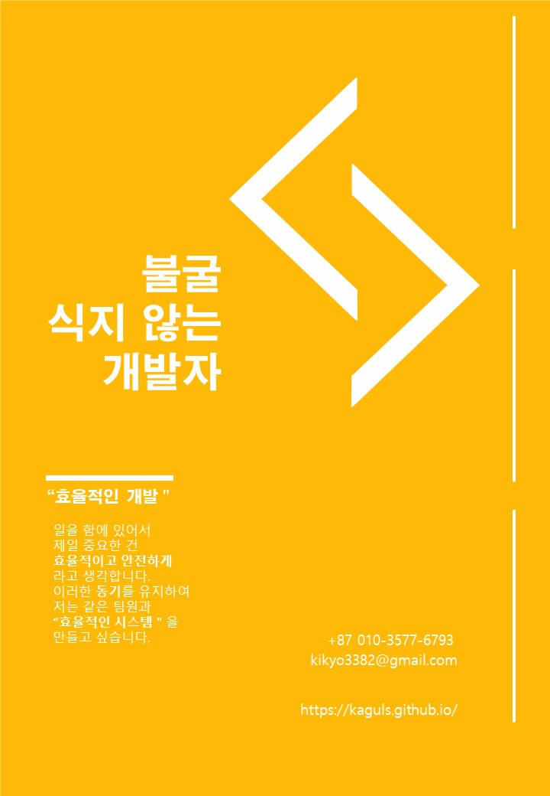

# 소개


## 개발을 즐기고 컴퓨터가 좋은 개발자

<br/>




<br/>

```
1. 코드공부 (C, SQL(MS), C++)
2. 프로그램 공부 (Excel..)
3. 게임에 대한 이모저모
```


네 가지를 올리면서 대학교와 공부 및 알바를 병행하고 있습니다


## 운영중인 것

**첫 번째**, 언어 공부 시리즈 (좌측 C, C++ .. 추가예정)

**두 번째**, [게임 시리즈](https://kaguls.github.io/Game/) (게임 플레이/ 게임에 대한 생각)


## 운영예정

**첫 번째**, 비하인드 시리즈 (취업시?)

**두 번째,** 지식저장고


## 해보고 싶은것


**1**, 게임 만들어보기

- ex)냥코대전쟁(The Battle Cats) 스타일의 캐쥬얼한 미니 느낌

**2**, 유익한 소프트웨어 만들기

- 관리프로그램, 심리건강 관련 어플리케이션

**3**, 딥러닝이나 AI관련 찍먹해보기

- AI를 이용한 관리 예측 프로그램


