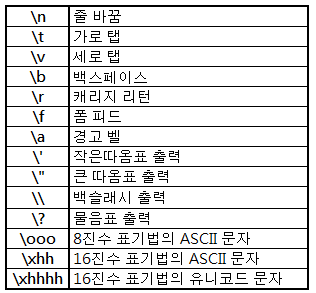

# 백준 C언어 단계별 풀이 : 입출력과 사칙연산

printf를 넣으면 오류가 떠서 

visual studio로 일단 컴파일후 확인용 printf문은 제거했다.


## C언어 [문제번호 : 2557] => Hello World

문제 : Hello World!를 출력하시오.


```c
#include <stdio.h>

int main(void)
{
    printf("Hello World!");
    return 0;
}
```


## C언어 [문제번호 : 1000]  => A+B

문제 : 두 정수 A와 B를 입력받은 다음, A+B를 출력하는 프로그램을 작성하시오.

입력 : 첫째 줄에 A와 B가 주어진다. (0 < A, B < 10)


```c
#define _CRT_SECURE_NO_WARNINGS
#include <stdio.h>

int main(void){
    int a, b;
    scanf("%d %d", &a, &b);
    printf("%d", a + b);
    return 0;
}
```


두 정수 입력 => shortint , int ,long int , long long  중 연산이 빠른 int형

두 개의 정수 변수 = a,b 지정

입력 받는 scanf 로 변수 주소 값 지정

a+b값을 출력한다.


## C언어 [문제번호 : 1001] => A-B

문제: 두 정수 A와 B를 입력받은 다음, A-B를 출력하는 프로그램을 작성하시오.

입력 : 첫째 줄에 A와 B가 주어진다. (0 < A, B < 10)


```c
#include <stdio.h>

int main(void){
    int a,b;
    scanf("%d %d",&a,&b);
    printf("%d",a-b);
    return 0;
}
```


1000번과 유사핟. a+b a-b의 차이..


## C언어 [문제번호 : 10998] => AxB

문제 : 두 정수 A와 B를 입력받은 다음, A×B를 출력하는 프로그램을 작성하시오.

입력 : 첫째 줄에 A와 B가 주어진다. (0 < A, B < 10)

출력 : 첫째 줄에 A×B를 출력한다.


```c
#include <stdio.h>

int main(void){
    int a,b;
    scanf("%d %d",&a,&b);
    printf("%d",a*b);
    return 0;   
}
```


사실 이것도 a+b, a-b, a*b의 차이다.


## C언어 [문제번호 : 1008] => A/B

문제 : 두 정수 A와 B를 입력받은 다음, A/B를 출력하는 프로그램을 작성하시오.

입력 : 첫째 줄에 A와 B가 주어진다. (0 < A, B < 10)

출력 : 첫째 줄에 A/B를 출력한다. 실제 정답과 출력값의 절대오차 또는 상대오차가 10-9 이하이면 정답이다.

``` 
0.33333333333333333333333333333333
```


```c
#include <stdio.h>

int main(void){
    int a,b;
    scanf("%d %d",&a,&b);
    printf("%.9f",(double)a/b);
    return 0;   
}
```


$$
기존과 다른 점은 출력에 10^{-9} 상대 오차라는 것이 생긴 것이다.
$$
소수점을 표현해야되는 것으로 일단 입력은 정수형으로 받아야하니

int a,b를 지정해준다.

그리고 그것에 대한 scanf를 진행 한다.

그리고 출력할때 실수형으로 변경해주는데 여기서 **(double)a/b**로 하며 

상대오차가 -9이니까 **"%.9f"** 를 지정해준다. (소수점 9자리까지 출력)


## C언어 [문제번호: 10869] => 사칙연산

문제 : 두 자연수 A와 B가 주어진다. 이때, A+B, A-B, A*B, A/B(몫), A%B(나머지)를 출력하는 프로그램을 작성하시오. 

입력 : 두 자연수 A와 B가 주어진다. (1 ≤ A, B ≤ 10,000)

출력 : 첫째 줄에 A+B, 둘째 줄에 A-B, 셋째 줄에 A*B, 넷째 줄에 A/B, 다섯째 줄에 A%B를 출력한다.

```
입력
7 3
```

```
출력
10
4
21
2
1
```


```c
#include<stdio.h>

int main(void){
    int a, b;
    scanf("%d %d\n",&a,&b);
    printf("%d\n",a+b);
    printf("%d\n",a-b);
    printf("%d\n",a*b);
    printf("%d\n",a/b);
    printf("%d\n",a%b);
    return 0;
}
```

정수형 자연수 범위가 1~10,000 이니까 int형을 쓴다.

쓰고 기존에서 

printf형에서 (+ , - , * , /, %)을 출력한다.


## C언어 [문제번호: 10926] => ??!

문제 : 준하는 사이트에 회원가입을 하다가 joonas라는 아이디가 이미 존재하는 것을 보고 놀랐다. 

준하는 놀람을 ??!로 표현한다. 준하가 가입하려고 하는 사이트에 이미 존재하는 아이디가 주어졌을 때, 놀람을 표현하는 프로그램을 작성하시오.

입력 :  첫째 줄에 준하가 가입하려고 하는 사이트에 이미 존재하는 아이디가 주어진다. 아이디는 알파벳 소문자로만 이루어져 있으며, 길이는 50자를 넘지 않는다.

출력 :  첫째 줄에 준하의 놀람을 출력한다. 놀람은 아이디 뒤에 ??!를 붙여서 나타낸다.


```
입력 name
```

```
출력 name??!
```


```c
#include <stdio.h>

int main(void){
    char str[51];
    scanf("%s",str); //%s입력받음
    printf("%s??!", str); //%s에 ??! 받음
    return 0;
}
```

이번에는 아이디를 주어진다. 그러면 문자형 정수 char을 써준다.

str[51] 이라는 길이가 51인 배열이다.  (왜냐면 길이는 50자를 넘지않아야 하기에 마지막값은 null이니 51이면 50이다)


[n] [a] [m] [e] 이렇게 넣어지는 것이다. 

scanf에 이 문자 배열을 넣어주고

출력에는 뒤에 ??!을 붙혀준다.


## C언어  [문제번호: 18108] => 1998년생인 내가 태국에서는 2541년생?!

문제 : ICPC Bangkok Regional에 참가하기 위해 수완나품 국제공항에 막 도착한 팀 레드시프트 일행은 눈을 믿을 수 없었다. 공항의 대형 스크린에 올해가 2562년이라고 적혀 있던 것이었다.

불교 국가인 태국은 불멸기원(佛滅紀元), 즉 석가모니가 열반한 해를 기준으로 연도를 세는 불기를 사용한다. 반면, 우리나라는 서기 연도를 사용하고 있다. 불기 연도가 주어질 때 이를 서기 연도로 바꿔 주는 프로그램을 작성하시오.


입력 : 서기 연도를 알아보고 싶은 불기 연도 *y*가 주어진다. (1000 ≤ *y* ≤ 3000)

출력:  불기 연도를 서기 연도로 변환한 결과를 출력한다.


```c
#include <stdio.h>

int main(void){
    int num;
    scanf("%d", &num);
    printf("%d", num-543);//불기를 서기로 
    return 0;
}
```


1998년생이 2541이니 2541 - 1998을 해주면 543이 나오니 서기와 불기는 543의 차이가 난다.

불기를 입력하면 서기로 변환해야되니까 -543을 진행해주면 된다.


## C언어 [문제번호: 10430] => 나머지

문제 : (A+B)%C는 ((A%C) + (B%C))%C 와 같을까?

(A×B)%C는 ((A%C) × (B%C))%C 와 같을까?

세 수 A, B, C가 주어졌을 때, 위의 네 가지 값을 구하는 프로그램을 작성하시오.


입력: 첫째 줄에 A, B, C가 순서대로 주어진다. (2 ≤ A, B, C ≤ 10000)

출력:  첫째 줄에 (A+B)%C, 둘째 줄에 ((A%C) + (B%C))%C, 셋째 줄에 (A×B)%C, 넷째 줄에 ((A%C) × (B%C))%C를 출력한다.


```c
#include <stdio.h>

int main(void) {
    int a, b, c;
    scanf("%d %d %d", &a, &b, &c);

    printf("%d\n",(a + b) % c);
    printf("%d\n",((a % c) + (b % c)) % c);
    printf("%d\n",(a * b) % c);
    printf("%d\n",((a % c) * (b % c)) % c);
    
    return 0;
}
```

세 정수 변수 a,b,c를 지정해준다.

그 값을 scanf에 받는다.


총 넷째 줄이 필요하며 각 필요한 수식을 넣어주면 된다.


## C언어 [문제번호: 2588] => 곱셈 

문제 : (세 자리 수) × (세 자리 수)는 다음과 같은 과정을 통하여 이루어진다.


입력 : 첫째 줄에 (1)의 위치에 들어갈 세 자리 자연수가, 둘째 줄에 (2)의 위치에 들어갈 세자리 자연수가 주어진다.

출력 : 첫째 줄부터 넷째 줄까지 차례대로 (3), (4), (5), (6)에 들어갈 값을 출력한다.


```c
#include <stdio.h>

int main(void) {
    int a, b; // ---472, 385 
    scanf("%d %d", &a, &b); //정수 a b 받음 --- 1 , 2

    printf("%d \n", a * (b%10)); //472*(385%10) = 472*385(5) 일의 자리추출 = 2360
    printf("%d \n", a * (b%100/10)); //472*(385%100(85)/10) = 472*(8) 십의 자리 추출 = 3776
    printf("%d \n", a * (b/100));//백의 자리 472*(385/100) = 472*3 = 1416
    printf("%d", a * b);//전체적으로 곱한것 = 472*385 = 181.720

    return 0;
}
```


입력은 세자리 자연수 2개 a, b를 받는다.

그것을 scanf로 받는다.


이에 출력을 하는데 (3)은 일의 자리 / (4)는 십의 자리 / (5)는 백의 자리 / (6) 총값이다


**(3)은 일의 자리**를 추출한다. 472*5를 표현해야된다.

`472*(385%10)을 해준다. 나머지를 구하는 것으로 10으로 짤라주면 나머지는 5가 남는다.

즉 472*5 = 2360이 표현된다.


**(4)는 십의 자리를** 추출한다. 472*80를 표현해야된다.

472*(385%100/10)을 해준다. 100을 먼저 짤라서 85를 받은후 10으로 나눠서 8이 된다

정수형이라서 소수점 값은 버린다.

즉 472*8 = 3776이 표현된다.


**(5)는 백의 자리**를 추출한다. 472*300을 표현해야된다.

472*(385/100)을 해준다. 100으로 나눠서 3값을 받는다.

즉 472*3 = 1416이 표현된다.


**(6)은 총 값**을 나타낸다. 

그냥 472*385 = 181.720 이다.


## C언어 [문제번호:  11382] => 꼬마정민

문제 : 꼬마 정민이는 이제 A + B 정도는 쉽게 계산할 수 있다. 이제 A + B + C를 계산할 차례이다!

입력 :  첫 번째 줄에 A, B, C (1 ≤ A, B, C ≤ 10^12)이 공백을 사이에 두고 주어진다.

출력 :  A+B+C의 값을 출력한다.


```c
<오답코드>
int main(void) {
    int a, b, c;
    printf("값을 설정: ");
    scanf("%d %d %d", &a, &b, &c);

    printf("%d", a + b + c);

    return 0;
}
```

어 왜 안되는거지? 라고 생각했는데 함정카드가 있었다.

1 ≤ A, B, C ≤ 10^12 간과한 것이다.


정수형 데이터는 `shortint / int /  longint / longlong` 4가지가 있는데.

int형은 4byte를 쓴다.  (1byte= 8bits)


크기는 약 4*8 = 32bits => 2^32의 크기다.

여기서 ^1은 정수구분으로 써야되니 한 개를 빼준다.

2^31는 구하기 어려우니 2^10 x 2^10 x 2^10 x 2^1 = 1024 x 1024 x 1024 x 2이다.

=  2,147,483,648 = 약 20억 이라는 값이 나온다.


그러면 이것은 10^n으로 구분해야되는데..

n이 1씩 올라갈때마다 0이 한개씩 늘어나니까

10^9 = 10억 *2정도가 되는 것이다.

= 20억의 공간에서 +만 쓰게 되면 40억이 되지만 


10^12인 1조라는 수치에는 못 미친다

즉 10^12를 2^n으로 하면 2^40이상 이어야 한다는 것이다.


40bits이상인 정수형태를 쓰면 되니까  40/8 = 5

즉 5byte이상의 형태를 써야한다.


longint는 시스템 컴파일러에 다르기 때문에 제외하기에 longlong을 쓴다.

longlong = 8byte로 공간이 남게 된다.

입력 출력은 `%lld` 로 받는다.


```c
#include <stdio.h>

int main(void) {
    long long a, b, c;
    scanf("%lld %lld %lld", &a, &b, &c);
    printf("%lld", a + b + c);
    return 0;
}
```


이렇게 longlong 변수 와 입력 값

출력 값을 지정해주면 된다.


## C언어 [문제번호:  10171] => 고양이

문제 : 아래 예제와 같이 고양이를 출력하시오.

```c
\    /\
 )  ( ')
(  /  )
 \(__)|
```


이거는 이스케이프 시퀀스를 물어보는 것이다.





이것을 참고하면 지금 필요한 것은 **백 슬래시 출력**임을 알 수 있다.


```c
#include <stdio.h>

int main() {
    printf("\\    /\\\n");
    printf(" )  ( ')\n");
    printf("(  /  )\n");
    printf(" \\(__)|\n");
    return 0;
}
```

띄어쓰기를 맞춰준 후

백 슬래시가 출력되는 곳 앞에 백슬래시를 한개씩 더 붙혀주면 된다.


여기서 띄어쓰기 때문에 상당히 고통받았다..ㅋㅋ


## C언어 [문제번호:  10172] => 개

문제: 아래 예제와 같이 개를 출력하시오.

```c
|\_/|
|q p|   /}
( 0 )"""\
|"^"`    |
||_/=\\__|
```


이스케이프 시퀀스를 물어보는 문제다.

여기서 필요한것은 `"`의 이스케이프 시퀀스 `/`의 이스케이프 시퀀스 `의 이스케이프 시퀀스다.


```c
int main() {
    printf("|\\_/|\n");
    printf("|q p|   /}\n");
    printf("( 0 )\"\"\"\\\n");
    printf("|\"^\"`    |\n"); //문제구간
    printf("||_/=\\\\__|");

    return 0;
}
```

 여기서 복붙에 고통을 받았다.


```
|"^"`    | 이 부분을 복사를 하니 |" ^ " `    | 이렇게 되서 띄어쓰기 오류가 난것. 
```

일단 복붙시 기본적으로 주석에 복붙해서 끌어와야될듯하다.


> C언어 단계별로 풀어보기 
>
> 입출려과 사칙연산을 풀어보았는데 직접 문제를 풀어보니 문제들이 있고 해결하는 과정이 재미있었다.
>
> 언젠간 이 과정이 나를 개발자로 만들어 줄 수 있겠지! 
>
> 생각하는 과정이 재미있으니 더 힘내자
