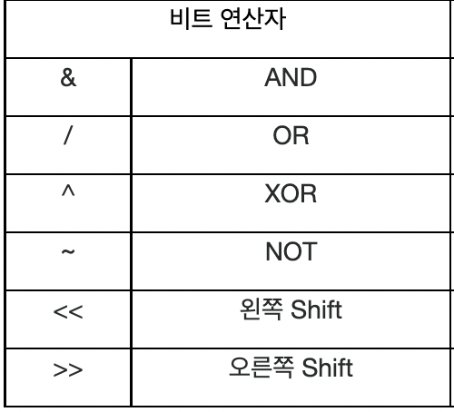

## 데이터 표현방식의 이해

'컴퓨터는 2진수를 기반으로 데이터를 표현하고 연산을 진행한다'

. <br/>

여기서는 진법 자체의 이해를 해보고자 한다.


+ 숫자로 기호에 포함이 된다! 

  : 10진수는 총 열 개의 숫자를 이용해서 수를 표현

  : 10진수는 총 열 개의 기호를 이용해서 수를 표현


* 컴퓨터는 0과 1로 데이터를 표현하니 2진수만 알면된다? 그건 아니다.

  2진수로 데이터를 표현하게 되면 길이가 길어져 표현도 파악하기도 어렵다.

  16진수를 이용하면 2진수를 간단하게 표현 및 파악하기 쉽기 때문이고

  많은 서적이 16진수를 사용한다고 한다.

  그러니까 2진수 10진수 16진수를 열심히 공부하자. <br/>


### 문제

문제1: 10진수 8부터 20까지 2진수와16진수로 각각 표현해보자!

```
10진수 8 = 2진수 1000 = 16진수 8
10진수 9 = 2진수 1001 = 16진수 9
10진수 10 = 2진수 1010 = 16진수 A
10진수 11 = 2진수 1011 = 16진수 B
10진수 12 = 2진수 1100 = 16진수 C
10진수 13 = 2진수 1101 = 16진수 D
10진수 14 = 2진수 1110 = 16진수 E
10진수 15 = 2진수 1111 = 16진수 F
10진수 16 = 2진수 10000 = 16진수 10
10진수 17 = 2진수 10001 = 16진수 11
10진수 18 = 2진수 10010 = 16진수 12
10진수 19 = 2진수 10011 = 16진수 13
10진수 20 = 2진수 10100 = 16진수 14
```

문제2: 10진수 5부터 18까지 8진수로 표현해보자

```
10진수 5 = 8진수 5
10진수 6 = 8진수 6
10진수 7 = 8진수 7
10진수 8 = 8진수 10
10진수 9 = 8진수 11
10진수 10 = 8진수 12
10진수 11 = 8진수 13
10진수 12 = 8진수 14
10진수 13 = 8진수 15
10진수 14 = 8진수 16
10진수 15 = 8진수 17
10진수 16 = 8진수 20
10진수 17 = 8진수 21
10진수 18 = 8진수 22
```

<br/>

### 데이터 표현단위 비트(bit)와 바이트(Byte)

컴퓨터를 하다보면 비트, 바이트에 대해서 많이 듣는다. 비트는 데이터의 최소단위이다. <br/>

그 비트가 8개가 묶으면 바이트라는 단위가 된다. <br/>

 <br/>

### 문제

문제1: 1비트로 표현할 수 있는 데이터의 수는 0과 1이렇게 두개이다.  <br/>

2비트가 표현할 수 있는 데이터의 수는 00,01,10,11이다.<br/>

그렇다면 4비트, 1바이트 그리고 4바이트로 표현할 수 있는 데이터의 수는 몇개인가?

```
4비트: 0001, 0010, 0011, 0100, 0101, 0110, 0111, 1000, 1001, 1010, 1011, 1100 ... 1111 = 16가지
1바이트(8bit) : 00000001 .... 11111111 = 256가지
4바이트(32bit) : 00000000000000000000000000000001 ~ 111111111111111111111111111111111 = 4,294,967,296가지
```

이 문제를 통해 알 수 있는 것은 $2^n$ 이라는 것이다. <br/>

문제2: 1바이트 00000001은 10진수로 1이고, 1바이트 00000010은 10진수로 2이다. <br/>

그렇다면 다음 바이트들은 각각 10진수로 얼마가 되겠는가?<br/>

```
00000001 = 1 
00000010 = 2 
00000100 = 4 
00001000 = 8 
00010000 = 16
00100000 = 32 
01000000 = 64 
10000000 = 128
```

문제3: 문제2에서 얻은 결과를 가지고, 다음 각각의 바이트들이 나타내는 값이 10진수로 얼마인지 계산하자.

```
00010001 = 17 
10100010 = 162
11110111 = 247
```

### 8진수와 16진수를 이용한 데이터 표현

```
int num1 = 10;   //특별한 선언이 없기에 10진수 표현
int num2 = 0xA;  //0x로 시작하면 16진수로 읽음
int num3 = 012;  //0으로 시작하면 8진수로 읽음.
```

+ 16진수중 10은 A로 표현아니까 0x(16진수)A(10) 이라는 것이다.

<br/>

### 예제

```c
#include <stdio.h>

int main(void)
{
    	int num1=0xA7, num2=0x43;
        int num3=032, num4=024;
    
    	printf("0xA7의 10진수 정수 값: %d \n", num1);
    	printf("0x43의 10진수 정수 값: %d \n", num2);
    	printf("032의 10진수 정수 값: %d \n", num3);
    	printf("024의 10진수 정수 값: %d \n", num4);
    
    	printf("%d-%d=%d \n", num1, num2, num1-num2);
    	printf("%d+%d=%d \n", num3, num4, num3+num4);
    	return 0;
}
```

>0xA7의 10진수 정수 값: 167 <br/>
>
>0x43의 10진수 정수 값: 67 <br/>
>
>032의 10진수 정수 값: 26  <br/>
>
>024의 10진수 정수 값: 20 <br/>
>
>167-67 = 100 <br/>
>
>26+20=46 <br/>


### 정수와 실수의 표현방식

1바이트를 기준으로하여 정수형의 표현방식을 설명들었다. <br/>

일단 정수의 가장 왼쪽에 존재하는 비트는 '부호비트'이다.

<br/>

1byte= 8bit 이니까 1바이트가 있다면 앞에 1개는 부호비트, 뒤는 데이터크기이다.<br/>

양의 정수라면 부호비트에 0 , 음의 정수라면 부호비트에 1을 기입한다 <br/>


음의 정수는 어떻게 표현할까? <br/>

음의 정수는 2의 보수를 취해야한다 뭐..이건 학교에서 배웠으니..<br/>

예를 들면 -5가 있다고 하면 부호비트1에 000101 이면 -5아님? 이지만 아니다.<br/>

일단 2의보수를 취하려면 1의 보수 (0과 1의 뒤집기)를 해야된다.<br/>

정수5 비트: 00000101 에서 1의 보수를 취한다 (11111010) <br/>

그리고 1의 보수 취한값에 +1을 해준다 (11111011)<br/>

이 값이 -5가 된다. <br/>


### 문제 

문제1: 양의 정수 01001111과 00110011은 각각 10진수로 얼마인가?

```
01001111 = 79
00110011 = 51
```

문제2: 음의 정수 10101001과 11110000은 각각 10진수로 얼마인가?

```
10101001 = 01010110 = 01010111 = -87
11110000 = 00001111 = 00010000 = -16
```


### 실수의 표현방식

실수가 표현하는 방식은 조금 복잡하다. <br/>

+ 실수를 표현하는 기본방식

: 2바이트 메모리를 가지고 한다는 가정하에 하면 반으로 나누고 반을 소수점이상, 반은 소수점이하 표현<br/>

실수는 소수점이 많기 때문에 모두 표현하면 엄청난 바이트가 소모되게 된다.<br/>

그렇기 때문에 어떠한 정의된 수식이 정의된다. <br/>

 <br/>


컴퓨터가 실수를 이렇게 표기하기 때문에 넓은 범위를 표현할 수 있지만 오차가 발생하게 된다.<br/>

엄청난 정밀도가 아니라 듬성듬성 표현하자는 것이다.<br/>


ex)0.0이 있다고 하면 이미 $2^e$ 이기떄문에 e에 0이 들어가도 0이라는 값은 나올 수 없다.<br/>

그렇기 때문에 근사치를 통해서 실수를 표현하는데 이러한 것을 '부동 소수점 오차'라고 한다. <br/>


### 예제

```c
#include <stdio.h>

int main(void)
{
    int i;
    float num=0.0;
    
    for(i=0; i<100; i++)
        num+=0.1; 
    
    printf("0.1을 100번 더한 결과: %f \n", num); //실수 표현은 float 출력
    return 0;
}
```

>0.1을 100번 더한 결과: 10.000002 <br/>

가 나오게 된다. 즉 0.000002의 오차가 구현된 것이다. 


### 비트 연산자

비트연산자는 하드웨어 관련 프로그래밍에 활용된다<br/>

하지만 비트 연산자를 통해 메모리 공간의 효율성을 높이고 연산의 수를 줄이는 요인이 된다.<br/>


<br/>


### 연산자: 비트단위 AND

AND는 모두가 1일때 1을 반환하는 연산이다. <br/>


```c
#include <stdio.h>

int main(void)
{
	int num1 = 15; // 00000000 000000000 000000000 00001111
	int num2 = 20;  // 00000000 000000000 000000000 00010100
	int num3 = num1 & num2;   // num1과 num2의 비트단위&연산
	printf("AND 연산의 결과: %d \n", num3);
	return 0;
}
```

> AND 연산의 결과 : 4 <br/>

왜 4가 나오는지 알아야한다! num1 (true:1) & num2(true:2)이 아닌 15와 20의 AND이다.<br/>

```
000 01111
000 10100
---------
000 00100
```

두 값이 1 1 인 것만 1이 출력되는 것을 통해 4가 출력됨을 알 수 있다! <br/>


###  연산자: 비트단위 OR

OR은 둘중 하나라도 1이면 1을 출력하는 것이다 <br/>

```
#include <stdio.h>

int main(void)
{
	int num1 = 15; // 00000000 000000000 000000000 00001111
	int num2 = 20;  // 00000000 000000000 000000000 00010100
	int num3 = num1 | num2;   // num1과 num2의 비트단위|연산
	printf("OR 연산의 결과: %d \n", num3);
	return 0;
}
```

> OR연산의 결과: 31 <br/>

이렇게 나오는 것은 위처럼 똑같이 해주면된다! <br/>

````
000 01111
000 10100
---------
000 11111 (00100000-1) = 31
````

### ^연산자: 비트단위 XOR

^연산자는 두개의 비트가 서로 다른 경우에 1을 반환하는 연산으로서 배타적 논리합이라고 한다.

<br/>


```c
#include <stdio.h>

int main(void)
{
	int num1 = 15; // 00000000 000000000 000000000 00001111
	int num2 = 20;  // 00000000 000000000 000000000 00010100
	int num3 = num1 ^ num2;   // num1과 num2의 비트단위^연산
	printf("XOR 연산의 결과: %d \n", num3);
	return 0;
}
```

> XOR연산의 결과: 27

```
000 01111
000 10100
-----------
000 11011
```

### ~연산자: 비트단위 NOT

~(NOT)연산은 0에서 1으로, 1에서 0로 반전시킨다 (1의보수랑 비슷하다고 보면된다) </br>

```
#include <stdio.h>

int main(void)
{
	int num1 = 15; // 00000000 000000000 000000000 00001111
	int num2 = ~num1; 
	printf("NOT 연산의 결과: %d \n", num2);
	return 0;
}
```

> NOT연산의 결과: -16

```
11111111 11111111 11111111 11110000 [NOT을 수행]
[2의보수 진행]00000000 00000000 00000000 00010000 = +16
위의 값이 - 16임을 알 수 있다.
```

### <<연산자: 비트의 왼쪽이동(Shift)

<<연산자는 두개의 피연산자를 요구한다.</br>

* num1 << num2 : num1의 비트열을 num2 2칸씩 왼쪽으로 이동시킨 결과 반환
* 8 << 2 : 정수 8의 비트 열을 2칸씩 왼쪽으로 이동시킨 결과를 반환


```c
#include <stdio.h>

int main(void)
{
	int num=15; 
    
    int result1 = num<<1;
    int result2 = num<<2;
    int result3 = num<<3;
    
    printf("1칸 이동 결과: %d \n", result1);
    printf("2칸 이동 결과: %d \n", result2);
    printf("3칸 이동 결과: %d \n", result3);
    return 0;
}
```

> 1칸 이동 결과: 30 <br/>
>
> 2칸 이동 결과: 60 <br/>
>
> 3칸 이동 결과: 90 <br/>

```
int num 15
= 00000000 00000000 00000000 00001111

result1 : 00000000 00000000 00000000 00011110
result2 : 00000000 00000000 00000000 00111100
result3 : 00000000 00000000 00000000 01111000
```

이렇게 바뀌었다는 것을 알 수 있다. <br/>

비트의 이동으로 인해서 생기는 오른쪽 빈 칸은 '0'으로 채워지고 왼쪽은 버려진다. <br/>

또한 비트의 열을 왼쪽 1칸씩 갈때마다 값이 2배씩 증가한다는 것을 알 수 있다.<br/>

그러면 비트의 열을 오른쪽 1칸씩 갈때마다 값은 2배씩 작아진다는 것을 알 수 있다.<br/>

ex) 30*4 = 30 <<2 <br/>


### >>연산자: 비트의 오른쪽 이동(shift)

위처럼 이면 num1 >> num2은 무엇이 될까? <br/>

num2의 크기만큼 num1의 비트 열이 오른쪽으로 이동한 결과가 반환된다. <br/>

```
11111111 111111111 11111111 11110000 //-16
```

여기서 num1 >>> num2을 하면 CPU에 따라서 값이 달라진다 .<br/>

```
00111111 11111111 11111111 11111100 // 0이 채워진다.
11111111 11111111 11111111 11111100 // 1이 채워진다.
```

CPU에 따라서 0이 채워질 수 있고 1이 채워질 수 있다. <br/>

그렇기에 일반적으로 잘 안쓴다고 한다. 왜? CPU마다 값이 다르니 호환성이 별로라서..<br/>


````c
#include <stdio.h>

int main(void)
{
	int num= -16; // 11111111 11111111 11111111 11110000
	printf("2칸을 오른쪽 이동의 결과 : %d \n", num>>2);
	printf("3칸을 오른쪽 이동의 결과 : %d \n", num>>3);
	return 0;
}
````

> 2칸을 오른쪽 이동의 결과: -4 (2배줄음) <br/>
>
> 3칸을 오른쪽 이동의 결과: -2 (3배줄음) <br/>


### 문제

문제1: 입력 받은 정수 값의 부호를 바꿔서 출력하는 프로그램을 작성해보자 <br/>

-3이 입력되면 3이 출력되듯이 단, 비트연산자를 이용해서 구현해야한다. <br/>

```c
#include <stdio.h>

int main (void)
{
    int num;
    
    printf("정수 값을 입력하세요: ");
    scanf("%d", &num);
    num = ~num;
    num = num+1; //2의 보수를 구하는 과정
    printf("부호를 바꾼 결과: %d \n", num)
    return 0;
} 
```

>정수 값을 입력하세요: -3 <br/>
>
>부호를 바꾼 결과: 3 <br/>

문제2: 다음 연산 결과를 출력하는 프로그램을 작성해보자. <br/>

3x8/4 [단 사칙연산자를 사용하지 않는다.] <br/>

```c
#include <stdio.h>

int main(void)
{
    int num = 3;
    num = num << 3; //8배 곱하기
    num = num >> 2; //4배 나누기

    printf("값은? %d \n", num);
    return 0;
} 
```

> 값은? : 6 <br/>

4칙 연산을 사용한다면 어떻게 할 수 있을까

```c
#include <stdio.h>

int main(void)
{
    int num1=3;
    int num2=8;
    int num3=4;
    
    printf("%d*%d/%d= %d",num1,num2,num3,num1*num2/num3);
    return 0;
}
```

> 값은?: 6 <br/>

하지만 여기서 scanf까지 써본다면?<br/>

```c
int main(void)
{
    int num;

    printf("정수를 입력하세요: ");
    scanf("%d", &num);
    num = num << 3; //8배 곱하기
    num = num >> 2; //4배 나누기

    printf("값은? %d \n", num);
    return 0;
}
```

>정수를 입력하세요: 3
>
>값은? : 6


## 기본 자료형의 이해

자료형은 데이터를 표현하는 방법이다 <br/>

컴퓨터는 묻는다. "정수를 저장할 것인가요? 실수를 저장할 것인가요?" <br/>

대답을 하면 다음은 "정수를 저장하기 위해 몇 바이트를 사용하실 건가요?"<br/>


"정수를 저장하는데 크기는 4바이트, 변수를 num으로 할게요" = int num; 가 된다. <br/>


### 기본 자료형의 종류와 데이터의 표현범위

 <br/>


C언어의 표준 기본 자료형은 이렇게 되어있다. <br/>

"short와 int는 최소 2바이트 이되 int는 short와 크기가 같거나 더 커야 한다." <br/>

라는 말이 있듯이 자료형 별 크기를 정확히 하게는 제한 할 수 있지만 알아두는게 좋다..<br/>


그러면 이런 생각을 한다. "무조건 큰거 쓰면 장땡아닌가?" <br/>

하지만 실수의 소수점 처럼 바이트를 너무 낭비하게 되니 효율적으로 사용하기 위해서는 딱 맞춰써야된다<br/>


### 연산자 sizeof 자료형의 크기 확인

연산자를 통해서 자신이 사용하는 컴파일러의 자료형 별 바이트 크기를 확인 할 수 있다. 

```c
#include <stdio.h>

int main(void)
{
    int num=10;
	int sz1= sizeof(num);
	int sz2= sizeof(int);
	....
}      
```

+ sizeof 후에 피연산자를 ()로 감싼다. 보기 편하게! <br/>


자료별 바이트 크기를 확인해보자

```c
#include <stdio.h>

int main(void)
{
    char ch=9;
    int inum=1052;
    double dnum=3.1415;
    printf("변수 ch의 크기: %d \n",sizeof(ch));
    printf("변수 inum의 크기: %d \n",sizeof(inum));
    printf("변수 dnum의 크기: %d \n",sizeof(dnum));
    
    printf("char 크기: %d \n",sizeof(char));
    printf("int 크기: %d \n",sizeof(int));
    printf("long 크기: %d \n",sizeof(long));
    printf("long long 크기: %d \n",sizeof(long long));
    printf("float 크기: %d \n",sizeof(float));
    printf("double 크기: %d \n",sizeof(double));
    return 0;
}   
```

>변수 ch의 크기: 1 <br/>
>
>변수 inum의 크기 : 4 <br/>
>
>변수 dnum의 크기 : 8 <br/>
>
>char 크기 : 1 <br/>
>
>int 크기 : 4 <br/>
>
>long 크기 : 4 <br/>
>
>long long 크기 : 8 <br/>
>
>float 크기 : 4 <br/>
>
>double 크기 : 8 <br/>

### 정수를 표현 및 처리하기 위한 일반적인 자료형의 선택

"값의 범위만 가지고 int인지 short인지 결정할 수 없다. 상황에 따라 다르다." <br/>

```c
#include <stdio.h>

int main(void)
{
    char num1=1, num2=2, result1=0;
    short num3=300, num4=400, result2=0;
    
    printf("size of num1 & num2: %d, %d \n", sizeof(num1),sizeof(num2));
    printf("size of num3 & num4: %d, %d \n", sizeof(num3),sizeof(num4));
    printf("size of char add: %d, %d \n", sizeof(num1+num2));
    printf("size of short add: %d, %d \n", sizeof(num3+num4));
    
    result1=num1+num2;
    result2=num3+num4;
    printf("size of result1 & result2: %d, %d \n",sizeof(result1),sizeof(result2));
    return 0;
}   
```

> size of num1&num2 : 1, 1 <br/>
>
> size of num3&num4 : 2, 2 <br/>
>
> size of char add : 4 <br/>
>
> size of short add : 4 <br/>
>
> size of result1 & result2 : 1, 2 <br/>

여기서 보면 num1의 크기는 1바이트, num2도 1바이트인데 num1+num2가 4바이트임을 알 수 있다.<br/>

또한 num3의 크기는 2바이트, num4도 2바이트인데 num3+num4는 4바이트임을 알 수 있다.<br/>


CPU가 처리하기 가장 적한 크기의 정수 자료형을 int형으로 정의한다. <br/>

즉, int형의 연산속도가 빠르기 때문에 int으로 연산하기 위해 바꿔주는 것이다.<br/>


"char형, shor형 변수"의 경우에는 연산속도보다 데이터의 크기가 줄이는 것이 더 중요한 것에 쓴다.<br/>


### 실수를 표현 및 처리하기 위한 일반적 자료형의 선택

-1718951883234-11.png)<br/>


실수형의 자료형은 이렇게 있다. <br/>

정수형에서 대표가 int형이듯 실수형에도 대표가 있다고한다. 대부분 double을 쓴다고 한다. <br/>

왜냐하면 float보다는 유효자릿수가 높아 정밀도가 높고 long double보다는 너무 부담스럽다.<br/>


```c
#include <stdio.h>

int main(void)
{
    double rad; //반지름
    double area; //넓이
    printf("원의 반지름을 입력하세요: ");
    scnaf("%lf", &rad); //double형의 데이터의 입력은 &lf
    
    area= rad*rad*3.1415; //넓이 구하는 공식
    printf("원의 넓이 : %f \n", area); //double형의 데이터 출력은 &f
    return 0;
}   
```

> 원의반지름 입력: 2.4 <br/>
>
> 원의 넓이: 18.095040  <float형이라 소수점 6자리> <br/>


### unsigned를붙여서 0과 양의 정수만 표현할 수 있다.

하지만 unsigned를 실행하기 위해서는 조건이 3가지 있다.

+ 정수 자료형의 이름 앞에만 붙일 수 있다.
+ unsigned가 붙으면, MSB도 데이터의 크기를 표현하는데 사용된다. (why? 양의정수만 있으니 필요없자나~)
+ 표현할 수 있는 값이 0 이상의 범위로 두배가 된다(음수가 필요없으니까 2배)

=> 즉 int 는 singed int, short는 singed short인데 앞에 singed가 생략된것 이다 <br/>


단) char형은 예외일 수 있다고한다.  <br/>

char를 unsigned char로 처리하는 컴파일러도 있기 때문에 char 변수 선언해서 음의 정수를 선언하면 singed를 추가하기도 한다.<br/>


</br>


### 문자의 표현방식과 문자를 위한 자료형

컴퓨터는 숫자를 이용해서 무언가를 인식하고 표현하는데 그러면 문자는 어떻게 인식하는 것인가..<br/>

아스키코드(ASCII)코드가 있다! 숫자를 문자에 연결(mapping)시키는 것이다.! <br/>

"문자 A는 숫자65, 문자 B는 숫자 66 정의.." 이렇게 해서 표준화를 시키는 것이다. <br/>

C언어는 ANSI(American National Standards Institute)에 의해서 제정된 아스키코드(ASCII:American Standard Code ..)로 표현한다.<br/>

아스키코드 값은 방대하니 나중에 알아서 찾아보자... <br/>


그러면 문자는 어떻게 표현될까?

```
int main (void)
{
	char ch1 = 'A' //문자열은 "" , 문자는 ''
	char ch2 = 'C'
	...
}
```

우리는 기존의 " "이라는 문자열을 썻다! 하지만 문자이기 떄문에 이번에는 ' '을 쓴다! . <br/>


```
int mian(void)
{
	char ch1 = 65;
	char ch2 = 67;
}
```

컴파일러는 이러한 아스키코드를 알고 있기 때문에 문자를 숫자로 바꿔버린다. 실제로 한번 보자! <br/>


```c
#include <stdio.h>

int main (void)
{
    char ch1='A', ch2=65;
	char ch3='Z', ch4=90;

	printf("%c %d \n", ch1, ch1); //문자 출력 , 10진수출력(숫자)
	printf("%c %d \n", ch2, ch2);
	printf("%c %d \n", ch3, ch3);
	printf("%c %d \n", ch4, ch4);
	return 0;
}
```

> A 65 <br/>
>
> A 65 <br/>
>
> Z 90 <br/>
>
> Z 90 <br/>

이라는 결과값이 나오게된다. %c는 문자의 형태로 출력(입력)하라는 것이다 <br/>

"정수는  출력 방법에 따라 문자의 형태로 숫자의 형태로 출력이 가능하다"라는 것이다! <br/>


중요한점은! 예전에 int형이 빠르다고 했는데 보통 문자는 char형을 쓴다고 한다 <br/>

그것은 int형은 연산특화형이고 char형의 경우는 연산보다는 저장에 특화가 필요하기 때문이다. <br/>


### 문제

문제1: 프로그램 사용자로부터 두점의 x, y 좌표를 입력 받아서, 두 점이 이루는 직 사각형의 넓이를 계싼하여 출력하는 프로그램을 작성해보자. (단 좌상단의 x, y 좌표 값이 우하단의 x, y좌표 값보다 작다고 가정하고 좌 상단의 좌표정보를 먼저 입력 받는 형태로 작성하자. ) <br/>

좌상단의 x,y는 2,4 우 하단의 x, y 좌표는 4, 8 이고 두점이 이루는 직사각형의 넓이는 8이다. <br/>

```c
#include <stdio.h>

int main(void)
{
    int lx1, ly1; // left x , y
    int rx1, ry1; // Right x , y
    int area; //넓이

    printf("좌 상단의 x, y 좌표: ");
    scanf("%d %d", &lx1, &ly1);
    printf("우 하단의 x, y 좌표: ");
    scanf("%d %d", &rx1, &ry1);
    area = (rx1 - lx1) * (ry1 - ly1); // 좌상단 값이 우하단 값보다 작기 때문에 먼저 입력.
    printf("두 점이 이루는 직사각형의 넓이 %d \n", area);
    return 0;
}
```

> 좌 상단의 x, y좌표 : 2 4 <br/>
>
> 우 하단의 x, y좌표: 4 8 <br/>
>
> 두 점이 이루는 직사각형의 넓이 8 <br/>


문제2: 프로그램 사용자로부터 두 개의 실수를 받아서 double형 변수에 저장하자. 그리고 두수의 사칙연산 결과를 출력하자. <br/>

```c
#include <stdio.h>

int main(void)
{
    double num1, num2;
    printf("두 개의 실수를 입력하세요: ");
    scanf("%lf %lf", &num1, &num2); //실수의 입력 lf

    printf("두 수의 덧셈은: %f \n", num1 + num2); //실수의 출력  f
    printf("두 수의 뺼셈은: %f \n", num1 - num2);
    printf("두 수의 나눗셈은: %f \n", num1 / num2);
    printf("두 수의 곱은: %f \n", num1 * num2);

    return 0;
}
```

> 두개의 실수를 입력하세요: 2.4 3.1 <br/>
>
> 두 수의 덧셈은: 5.500000 <br/>
>
> 두 수의 뺄셈은: -0.70000 <br/>
>
> 두 수의 나눗셈은: 0.774194<br/>
>
> 두 수의 곱은 : 7.440000<br/>


문제3: Appendix A의 아스키 코드 표를 참조하여 다음 질문의 답을 해보자. <br/>

질문1) 아스키 코드를 구성하는 값의 범위는 어떻게 되는가? <br/>

질문2) 대문자 A부터 대문자 Z까지 값이 어떻게 증가하는가? 증가의 폭은? <br/>

질문3) 알파벳 대문자와 소문자 간의 값의 차는 어떻게 되는가? 규칙성은? <br/>

```
아스키 코드를 구성하는 값의 범위는 0~127 이다.
대문자 A [65] ~ 대문자 Z [122] 까지 값이 1씩 증가된다.
알파벳 대문자A[65] 소문자a[97]값의 차이는 32이다. 소문자에서 32를 빼면 대문자.

아스키코드에서는 십진수 기준 숫자 (0~9)가 [48]~[57] 할당
대문자(A~Z) : [65] ~ [90] / 소문자 [97]~[122] 이다.
```


문제4: 프로그램을 사용자로부터 아스키 코드 값을 정수의 형태로 입력 받은 후 해당 정수의 아스키 코드 출력을 하는 프로글매 작성하자. <br/>

ex) 프로그램 사용자가 정수 65입력시 문자 A를 출력한다. <br/>

```c
#include <stdio.h>

int main(void)
{
    int num;
    printf("아스키 코드 정수 값을 입력해주세요: ");
    scanf("%d", &num);
    printf("아스키 코드 값: %c \n",num);
    return 0;    
}    
```

> 아스키 코드 정수 값을 입력해주세요: 65 <br/>
>
> 아스키 코드 값: A <br/>


문제5: 프로그램 사용자로부터 알파벳 문자 하나를 입력받는다. 그리고 이에 해당하는 아스키 코드 값을 출력하는 프로그램 작성하자. <br/>

```c
#include <stdio.h>

int main(void)
{
    char ch;
    printf("알파벳 문자를 입력해주세요: ");
    scanf("%c", &ch);
    printf("아스키 문자 숫자 값: %d \n", ch);
    return 0;
}
```

> 알파벳 문자를 입력해주세요: B <br/>
>
> 아스키 문자 숫자 값: 66 <br/>


### 상수에 대한 이해

상수 역시 int, double과 같은 값을 근거로 표현된다! <br/>

상수는 변경 불가능한 데이터를 뜻한다. 예를 들어보면.. <br/>

```
int main(void)
{
	int num = 30 +40; // 30과 40은 고정값 즉 상수이다.
}
```

이것으로 우리는 3가지를 알 수 있다. <br/>

+ 정수와 30과 40이 메모리 공간에서 상수의 형태로 저장된다.
+ 두 상수를 기반으로 덧셈이 진행된다 (30+40연산)
+ 덧셈의 결과로 얻어진 정수 70이 변수 num에 저장된다. (초기화)

즉 상수의 특징으로는 변수 num과 다르게 할당된 메모리 공간에서 이름이 없다 <br/>

### 이렇게 이름이 없는 상수를 리터럴상수, 리터럴 이라고 한다 <br/>


```
int main(void)
{
	int num1 = 1,2,3;
	int num2 = 7+num1;
	double num3 = 2.12 + 7.49;
	...
}
```

여기서 리터럴 상수값은 1, 2, 3, 7, 2.12, 7.49로 5개다! <br/>


리터럴상수의 자료형도 마찬가지로 고민해야된다 정수/실수, 몇바이트 크기 말이다. <br/>

```
int main(void)
{
	int inum = 5;
	double dnum = 7.15;
}
```

정수형 상수는 int형으로 메모리 공간 저장, 실수형 상수는 double형으로 저장됨을 알 수 있다 .<br/>

그러면 아까 위에서 배운 문자는 어떻게 표현되는가..? <br/>

```
char ch = 'A';
```


```c
#include <stdio.h>

int main(void)
{
    printf("literal int size: %d \n", sizeof(7));
    printf("literal double size: %d \n", sizeof(7.14));
    printf("literal char size: %d \n", sizeof('A'));
    return 0;
}
```

>literal int size: 4 <br/>
>
>literal double size: 8 <br/>
>
>literal char size: 4 <br/>

int 4바이트, 더블 8바이트, 문자 4바이트를 알 수 있었다 .<br/>


### 접미사를 이용한 상수의 표현을 해보자! <br/>


```
int main (void)
{
	float num1: 5.789;
	float num2: 3.24 + 5.12;
	return 0;
}
```

> 경고 메세지가 뜬다고 하는데 왜 안뜨지..; "double형 데이터를 float형에 저장하였으니 잘려나갈 수 있다고 한다." <br/>
>
> 이럴때는 뒤에 f를 붙혀주면 된다고 한다! <br/>

```c
int main (void)
{
	float num1: 5.789f;
	float num2: 3.24 + 5.12f;
	return 0;
}
```


<br/>

.png)<br/>


위의 표를 확인해서 정수형, 실수형에 맞는 것을 사용하자! <br/>


이름을 지나는 심볼릭(Symbolic)상수 : Const 상수를 써보자. <br/>

const를 이용하면 변수를 상수로 변신시켜버린다는거다! <br/>

```c
int main (void)
{
	const int MAX=100; // MAX상수 변경불가
	const double PI=3.1415; //PI상수 변경불가
}
```

아까는 이름이 없는 상수를 : 리터럴 상수 <br/>

이번에는 이름이 있는 상수: 심볼릭 상수<br/>

```c
int main(void)
{
	const int MAX; //쓰레기 값 심볼릭 상수
	MAX=100; //변경안됨 why? 상수값이고 위에 초기화 됐으니까.
}
```

+ 상수의 이름은  모두 대문자로 표시한다.
+ 둘 이상의 단어로 연결할때는 언더바(_)로 이용하여 구분한다.


### 자료형의 변환

자료형의 변환이라는 것은 데이터의 표현방식을 바꾼다는 것이고 크게 2개로 나뉜다 <br/>

+ 자동 형 변환(묵시적 형 변환)
+ 강제 형 변환(명시적 형 변환)


### 대입연산의 전달과정에서 발생하는 자동 형변환을 알아보자! <br/>

왼편에 있는 피연산자를 대상으로 형 변환이 자동으로 일어난다(왼쪽이 기준!!! 이라고 외치는 거 ㅋㅋ) <br/>

```
double num1 = 245; //int형 정수 245를 왼쪽(double)기준으로 자동 형 변환
```

```
int num2=3.1415; // double형 실수 3.1415를 int형으로 자동 형 변환 하지만 3만 변환된다.
```

즉 실수형을 정수형으로 변환하면 소수부의 손실이 발생한다는 것이다. <br/>

```c
int num3 = 129; // 00000000 00000000 00000000 10000001
char ch = num3; // int형 변수를 char변수인 1바이트로 변경해야된다 
```

int형 4바이트 변수를 char인 1바이트 변수로 바꾸게 되면 1000001만 남아서 정수로 -127이 출력된다 <br/>

상위 바이트 손실이 발생하게 되면 부호가 바뀔 수 있으니 주의하자! <br/>


+ 정수를 실수로 형 변환 하는 경우: 실수 표현 범위가 더 넓어서 데이터 손실은 잃어나지 않음.
+ 실수를 정수로 형 변환 하는 경우: 소수점 이하를 표현 못해서 소수점 손실이 일어난다.
+ 바이트 크기가 큰 정수를 바이트 크기가 작은 정수로 형 변환하는 경우: 상위 바이트들이 소멸된다.


```c
#include <stdio.h>

int main(void)
{
	double num1= 245;
	int num2 = 3.1415;
	int num3 = 129;
	char ch= num3; //int형을 char형으로 
	
	printf("정수 245를 실수로: %f \n", num1);
	printf("실수 3.1415를 정수로: %d \n", num2);
	printf("큰 정수 129를 작은 정수로: %d \n", ch);
	return 0;
}
```

>정수 245를 실수로: 245.000000 <br/>
>
>실수 3.1415를 정수로: 3  <br/>
>
>큰 정수 129를 작은 정수로:  -127 <br/>


### 정수의 습격(Intergral Promotion)에 의한 자동 형 변환 <br/>

"CPU가 가장 처리하기 적합한 크기의 정수 자료형은 int로 정의하고 int형 연산은 다른 자료형에 연산속도에 비해서 빠르다." <br/>

```c
int main(void)
{
	short num1=15, num2=25;
	short num3=num1+num2;     //연산을 진행하여 short가 int형으로 변환된다.
}
```

이렇게 형이 자동으로 변환되는 과정을 '정수의 승격(Intergral Promotion)'이라 한다. <br/>


### 피연산자의 자료형 불일치로 발생하는 자동 형 변환

기본적인 산술연산에는 두 개의 피연산자가 필요하다. <br/>

```c
double num1 = 5.15 + 19 // (두개의 피 연산자 5.15, 19)
```

여기서 5.15를 5로 바꿔 5+19를 하는게 좋은선택인가? 5.15 + 19.0을 하는게 좋은 선택 인가? <br/>

손실을 최소화 하려면 int형 정수를 double형 실수로 형 변환 해야된다 . <br/>


**피연산자의 자료형이 일치하지 않아서 발생하는 자동 형 변환은 데이터 손실을 최소화 하는 방향으로 진행된다**

<br/>


데이터 손실을 최소화 해야 되기 때문에 정수자료형 보다 실수 자료형이 앞선다 <br/>


### 명시적 형 변환 : 강제로 일으키는 형 변환

```c
#include <stdio.h>

int main (void)
{
	int num1=3, num2=4;
	double divResult; //강제로 형변환시킨다 double로
	divResult = num1 / num2;
	printf("나눗셈 결과: %f \n", divResult); //실수 형변환 했으니 실수 출력 f
	return 0;
}
```

>나눗셈 결과 0.000000 <br/>

근데 여기서 divResult = num1 /num2를 diveResult = (double) num1 / num2 으로 해줘야 된다. 뭐로 변환됐는지 알게 하기위해<br/>

이것을 **형 변환 연산자** 라고 하며 위의 문장은 이렇게 된다. <br/>

```
divResult = 3.0 / num2; //(double)num1을 통해서 num1이 double형으로 변환된다.
```

```
divResult = 3.0 / 4.0 //위의 형 변환 규칙에 의해서 왼쪽 기준으로 바뀐다. num2 => double값인 4.0
```

그리고 3.0 / 4.0이 되고 그 변수가 diveResult 변수에 저장된다.! <br/>

```
int main(void)
{
	int num1=3;
	double num2 = 2.5 * num1;
	...
} //이러면 어떻게 형 변환됐는지 가독성이 구리다.
```

```
int main(void)
{
	int num1=3;
	double num2 = 2.5 * (double)num1; // 이것을 통해 가독성을 높혀준다.
	...
}
```


## Printf 함수와 scanf 함수 정리하기

이번 꺼는 레퍼런스(reference) 성격이 강하다. = 정보를 취합하는 것 <br/>

### printf 함수는 문자열을 출력하는 함수이다.

```c
#include <stdio.h>

int main(void)
{
    printf("I like programming \n");
    printf("I love puppy! \n");
    printf("I am so happy \n");
    return 0;
}
```

>I like programming <br/>
>
>I love puppy! <br/>
>
>I am so happy <br/>


### 특수문자의 출력이 필요한 이유

```
char ch = '\n';
```

특수문자 = 이스케이프 시퀀스(escape sequence)라 불리는 문자들이 필요한 이유는?? <br/>

> 앞집 강아지가 말했다. "멍~! 멍~!" 정말 귀엽다 <br/>

하지만 이걸 그대로 printf로 출력하면 오류가 난다. "멍~! 에서 끝났다고 인식하기 때문이다 .<br/>

```
printf("앞집 강아지가 말했다. \"멍~! 멍~!\"정말 귀엽다.")
```

이렇게 해주면 출력이 되는 것을 알 수 있다  <br/>


여기서 폼피드(/f), 수직탭(/v)는 프린터 출력을 위한 거기 때문에 이상한 문자가 출력이 된다..?<br/>


### printf 함수의 서식지정

printf 는 서식이 지정된 형태의 출력으로서 출력양식이 만들어진 상태에서 출력을 진행한다 .<br/>

```c
#include <stdio.h>

int main(void)
{
    int myAge=12;
    printf("제 나이는 10진수로 %d살, 16진수로 %x살입니다. \n", myAge, myAge);
    return 0;
}
```

>제 나이는 10진수로 12살, 16진수로 C살 입니다. <br/>


### 서식문자의 종류와 그 의미

<br/>

<br/>


### 정수 출력을 위한 서식문자들: %d, %u, %o, %x

위의 표를 보면 8진수 %o, 16진수 %x를 이용해서는 양의 정수만 출력이 가능하다. <br/>

음의 정수를 출력하면서 %d를 사용하여야 하고 8진수와 16진수는 음의 정수 표현을 거의 사용되지 않는다 <br/>

8진수를 8진수답게 표현 하려면 %#o , 16진수를 16진수처럼 표현하려면 %#x를 이용하면 된다. <br/>

```c
#include <stdio.h>

int main(void)
{
    int num1=7, num2=13;
    printf("%o %#o \n", num1, num1);
    printf("%x %#x \n", num2, num2);
    return 0;
}
```

>7 07 <br/>
>
>d 0xd <br/>


### 실수의 출력을 위한 서식문자들 : %f, %e, %g

```c
#include <stdio.h>

int main(void)
{
	printf("%f \n", 0.1234);
	printf("%e \n", 0.1234);
	printf("%f \n", 0.12345678);
	printf("%e \n", 0.12345678);
	return 0;
}
```

>0.123400 <br/>
>
>1.234000e-001 <br/>
>
>0.123457 <br/>
>
>1.234568e-01 <br/>

여기서 나오는 e-01 표기법이 e표기법이라고 하며 '지수 형택의 출력'을 표현 한 것이다.

즉 $1.0X10 ^{-20}$ = 1.0e-20이 되는 것이다.


```c
#include <stdio.h>

int main(void)
{
    double d1=1.23e-3; //0.00123 = -3이면 정수부분이 세번째 부터 시작.
    double d2=1.23e-4; //0.000123
    double d3=1.23e-5;
    double d4=1.23e-6;
    
    printf("%g \n", d1);
    printf("%g \n", d2);
    printf("%g \n", d3);
    printf("%g \n", d4);
    return 0;
}
```

>0.00123 <br/>
>
>0.000123 <br/>
>
>1.23e-005 <br/>
>
>1.23e-006 <br/>

"%g는 소수점 이하의 자릿수가 늘어나면 e표기법으로 출력한다. 대충 6자리 까지 표현되는 듯하다." <br/>


### %s를 이용한 문자열 출력

%s는 오직 문자열만 출력하고 숫자는 안된다. <br/>

```c
#include <stdio.h>

int main(void)
{
    printf("%s, %s, %s \n", "AAA","BBB","CCC");
    return 0;
}
```

> AAA, BBB, CCC <br/>

```c
#include <stdio.h>

int main(void)
{
    printf("%s, %s, %s \n", "AAA", 123, "123");
    return 0;
}
```

> 이렇게 하면 버그가 난다; 123때문이고 "123"은 출력잘됨 <br/>


### 필드 폭을 지정하여 정돈된 출력 보이기

%8d = 필드 폭 8칸 확보, 오른쪽 정렬해서 출력 진행

%-8d = 필드 폭 8칸 확보, 왼쪽 정렬해서 출력 진행


```c
#include <stdio.h>

int main(void)
{
    printf("%-8s %14s %5s \n", "이  름", "전공학과", "학년");
    printf("%-8s %14s %5d \n", "우투리", "겨드랑이학", 3);
    printf("%-8s %14s %5d \n", "김개똥", "반도체공학", 4);
    printf("%-8s %14s %5d \n", "김첨지", "삼계탕학", 2);
    return 0;
}
```

>  이름      전공학과   학년
>
>  김동수    전자공학   3
>
>  이을수    컴터공학   2
>
>  한선영    미술교육   4<br/>

이름은 -로 왼쪽정렬되어있고 학과는 오른쪽 정렬 학년은 오른쪽 정렬이다 . <br/>


### scanf 함수 이야기

scanf 함수를 호출을 위해서는 2가지 (1)입력형식 (2)입력장소가 필요하다. <br/>


%d  10진수 정수의 형태로 데이터를 입력 받는다. <br/>

%o 8진수 양의 정수의 형태로 데이터를 입력 받는다. <br/>

%x 16진수 양의 정수의 형태로 데이터를 입력 받는다. <br/>


```c
#include <stdio.h>

int main(void)
{
    int num1, num2, num3;
    printf("세 개의 정수 입력하세요: ");
    scanf("%d %o %x", &num1, &num2, &num3);
    
    printf("입력된 정수 10진수 출력: ");
    printf("%d %d %d \n", num1, num2, num3);
    return 0;
}
```

>세 개의 정수 입력하세요 : 12 12 12 <br/>
>
>입력된 정수 10진수 출력: 12 10 18 <br/>

+ 주의해야되는건 세 개의 정수 12를 입력했다고 해서 메모리에 12가 저장되는게 아니라 2진 바이너리 형태로 저장된다. 그 값을 10진수로 해석하고 8진수로 해석하고 16진수로 해석하는 것이다. 


### 실수 기반의 입력형태 정의하기

printf 함수에서는 서식문자 %f, %e. %g의미가 있는데 %e, %g는 거의 안쓴다고 한다; <br/>

scanf 함수에서는 세개 다 float형 데이터를 입력 받겠다는 의미를 담고있다 .<br/>

%lf  = double %f에 l이 추가된 형태 <br/>

#Lf = long double %f에 L이 추가된 형태 <br/>


```c
#include <stdio.h>

int main(void)
{
	float num1;
	double num2;
	long double num3;

	printf("실수 입력하세요 (e표기법): ");
	scanf("%f", &num1);
	printf("입력된 실수 %f \n", num1);

	printf("실수 입력하세요 (e표기법): ");
	scanf("%lf", &num2);
	printf("입력된 실수 %f \n", num2);

	printf("실수 입력하세요 (e표기법): ");
	scanf("%Lf", &num3);
	printf("입력된 실수 %f \n", num3);

	return 0;
}
```

> 실수 입력 : 1.1e-3 <br/>
>
> 입력된 실수: 0.001100 <br/>
>
> 실수 입력: 0.1e+2 <br/>
>
> 입력된 실수: 10.000000 <br/>
>
> 실수 입력: 0.17e-4 <br/>
>
> 입력된 실수: 0.000017 <br/>

실수의 입력과정에서 e표기법을 사용해도 가능하다! <br/>

float는 입력  %f, 출력 %f <br/>

double은 입력 %lf, 출력 %lf <br/>

long double은 입력 %Lf, 출력 %Lf <br/>

이라는 것을 알 수 있다.!