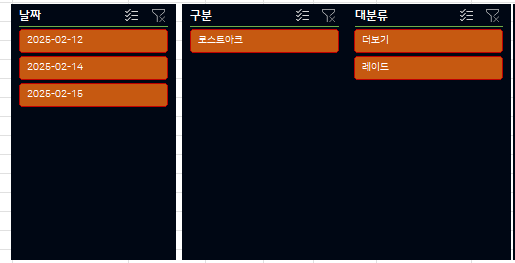

## 엑셀 대시보드 제작

엑셀에서 데이터가 주어지면 그것을 가공하는 느낌으로

오랜만에 데이터를 정규화 시킨 후 그것을 피벗테이블로 가공하고

마지막으로 슬라이서를 이용해서 만드는 대시보드를 연습해보려고 한다.

쉽게 총 3단계로 이루어진다.

>    1.데이터들이 입력된다.
>
> 2. 데이터를 기반으로 피벗테이블을 제작한다.
> 3. 피벗테이블을 기반으로 슬라이서를 제작한다.

이렇게 하여 대시보드에서 데이터를 누적하는 순간 변동하는 것이다.

실제 외주를 받거나 업무에서 사용하는 재료들은 사용할 수 없으니

그냥 게임용 취미로 만든 대시보드로 적으려고 한다.

## 내용

해당 내용은 하는 게임 중 하나인 로스트아크를 기반으로 만들었으며,

순서로는 크게

데이터를 제작한다.

데이터를 분류 시킬 정보를 추가 시킨다. 

그리고 피벗테이블을 추가한 후 슬라이서를 늘린다.

최종적으로는 내가 보고 싶은 데이터가 무엇인가를 구현하는 것이 필요하다.

1. 캐릭터별로 어떤 레이드에서 얼마만큼의 재화를 생산하는가?
2. 캐릭터별로 생산재화 - 소비재화를 합했을 때 어느정도인가?
3. 캐릭터 강화 외, 추가적인 재화
4. 캐릭터 강화 외, 재료 준비 등의  재화

## 데이터 테이블

내가 만든 데이터는 일단 내가 보고 싶은 것을 각 행(row)을 만들어 줍니다.

내가 보고싶은 데이터를 추려본다면

1. 날짜별
2. 게임별
3. 레이드/기타수익 구분
4. 레이드별 구분
5. 솔플/보호자/버스 구분
6. 캐릭터별
7. 소득재화

로 정리해봤다.

즉, 자신이 보고싶은 내용을 데이터로 만들어라

여기서 더 추가 한다면 추가적인 분류를 나눠주는 것이다.

## 피벗테이블

그리고 해당 데이터를 피벗테이블로 만들어서 "보고싶은 자료"를 차트필드에 맞춰준다.

잘 모르겠다면, 범례, 축, 값 3개만 잘 지정해도 추출할 수 있다.

시선의 흐름으로 기억하는게 쉽다.

축은 세로선 좌측에서 기준이 되는 자료데이터다. 

범례는 가로축 하단에서 기준이 될 자료 데이터다

값은 내가 뽑고싶은 것이다.

위 데이터 필드를 실행하면?

하단은 캐릭터이름 이다.

즉, 나는 캐릭터들의 소득재화를 보고 싶다는 차트가 완성된다.

## 슬라이서

피벗테이블을 뽑으면 대시보드를 만드는 슬라이서를 만든다.

그러면 하나의 커다란 필터가 된다.

생성 후 대시보드로 옮겨가면 되는데, 이를 통해서 필터를 걸어서 바로바로 확인할 수 있다.

추가적으로 슬라이서를 읽는 것으로 적용한다면,

회사에서 매출금액(월별/년도별), 손익금액(월별/년도별)

각 년도별 재무상황 등, 구분에서 만들 수 있다.

이떄는 업데이트 날짜 기능이 필요한데

`="마지막 업데이트 : "&TEXT(MAX(A:A),"yyyy년 mm월 dd일")`

이렇게 해주면된다.

그리고 월별 필터를 거지고 재무상황을 확인하는 법은

`=INDEX($범위,MAX(IFERROR(MATCH("*",$범위,-1),0),IFERROR(MATCH(9E+307,$범위,1),0)))`

이렇게 해주면 된다.

