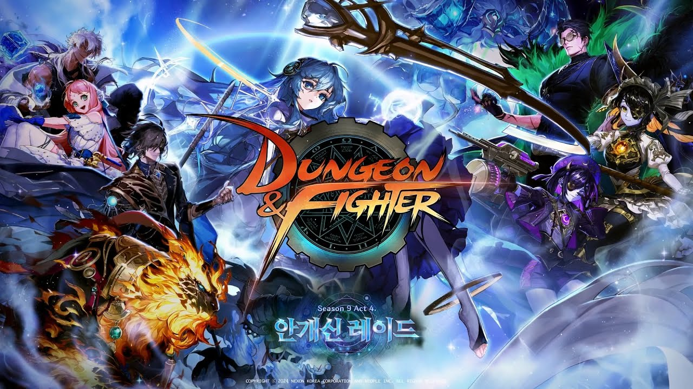
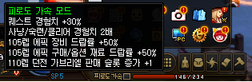
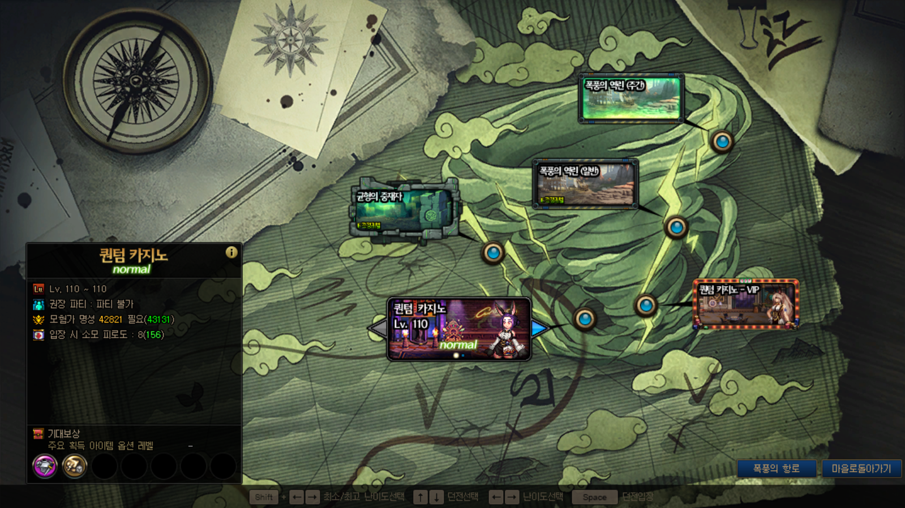
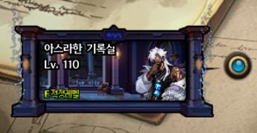
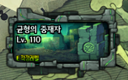
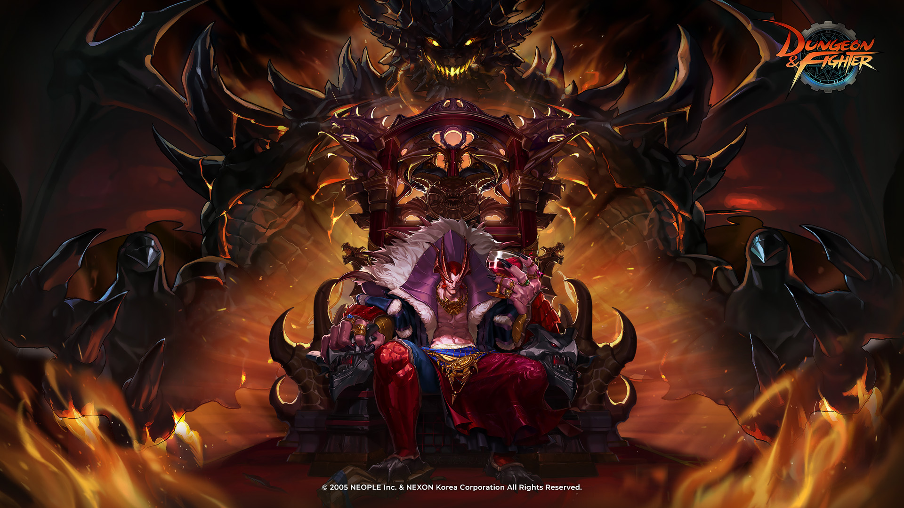
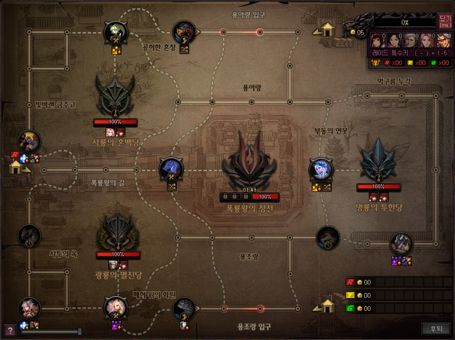
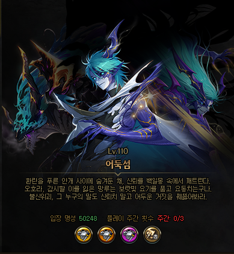

# 던전앤파이터 리뷰

던전앤파이터를 과거에서 하면서 느꼈던 점을 기술하려고 한다.

어떻게 보면 내가 RPG게임인 던전앤파이터를 하면서 느낀 분석같은 것인가?

이에 대해서 당시 플레이했던 컨텐츠들과 분석을 소감을 작성해보도록 한다.

당시 어느정도 현질을 해서 

버프력이 높은 뮤즈, 인챈트리스, 세라핌을 육성하였고

딜러는 여넨마를 하였다.

일단 던전앤파이터의 코어는

1. 던전을 탐험하고 보상을 얻는다. 

2. 횡스크롤 액션게임이고 왼쪽에서 시작해서 나아가는 느낌을 준다.

이것이라고 생각하고 이제 여러가지 덧 붙혀 졌을 것이다.

던전 탐험의 재미를 붙히는 스킬

새로운 재미를 만들어주는 직업 등등..

## 일일할일

던전앤파이터는 당시 일일할일과 주간할일이 있다.

피로도 시스템을 채용하여 매일매일 피로도를 '태운다'고 표현한다. 

아마도 이는 과거부터 피로도라는 것을 수치가 들어가는 것에 있어서 태운다고 표현하는 것 일수도?

던전앤파이터도 다 캐릭터 권장게임으로 느껴졌으나, 

RPG게임은 하나만 한다면 많은 캐릭터도 할 수 있을 정도로 일일 숙제는 빨리 끝날 수 있다.

분명 사람이 살면서 던파를 키지못하거나 짧게 하려고 끄는 날도 고려하여

기획한 것으로 빠르게 태우는 대신 약간의 손해를 감수하는 '피로도 가속 모드'가 있다.

이와 같이 피로도를 더 사용하는 대신 어느정도 배율을 늘려주고

'우리가 시간을 줄여줄께, 하지만 그만큼 손해가 생길거야' 라는 것이지만 솔직히 커뮤니티에서 '손해다'라고 하지 않으면

피로도 대비 이득인지? 손해인지? 따지는게 아니면 상당히 매력적이다.

던전앤파이터의 일일할일은 당시 크게 2가지로 나뉠 수 있다.

1. 스펙업
2. 골드

#### #1 ) 일일 할일 : 골드 생산

당시 던전앤파이터는 부캐릭터들의 골드를 모아서 특정 단계 까지 육성을 하고 물려주는 시스템이다.

그래서 점수가 적은 캐릭터는 퀀텀 카지노 [노말]을 이용하였고 어느정도 기준을 충족한 유저는 VIP에 들어갈 수 있다.

대략 4~5개의 던전을 계속 돌면서 하는 것이다.

반복형 컨텐츠인데 너무 어러번 반복하다보니 재미가..없다

노말 기준 ) 1캐릭터당 일일 100만골드? 정도 버는 것 같다. 

하드 기준 ) 약 2배인 200~250만 골드를 버는 느낌?

아마 골드 생산을 하는 곳이다 보니까 반복형을 넣어서 오히려 재미를 반감시켜 생산율을 낮추려는 기획이려나?

#### #2 일일할일) 스펙업

일일할일 중에서 스펙업 요소로 골드 생산요소보다 피로도를 아마 더 썼던 거 같다.

몇번 들어가면 끝 느낌?

##### 균형의 중재자)

균형의 중재자에서는 저스펙 단계에서 스펙업을 지원하고 낮은 확률로 태초가 나온다.

그리고 천장시스템이 존재하며 일정 이상 나오지 않으면 확정으로 드랍된다.

이거 첫 캐릭터는 입장권 안모자랐는데 나중에 모자란 경우도 있던거 같다.

##### 이스라한 기록실)

당시 최종레이드 안개신레이드에서 나온 것으로 균형의 중재자의 상위 던전이다.

대부분 태초 or 2옵 부위나 2옵 큐브를 먹으려고 다녔다.

생각보다 잘 안나오는데 장점은 방이 적고 몹이 몰려있다.

아마 스펙업 요소다 보니 골드생산량은 적다. 그리고 스펙업 요소다 보니 오히려 소모처?

그리고 당시 티켓이 부족하면 갈 수 없었다...

기록실도 파편 없어서 억지로 골드캐러 간적도?

#### 일일할일 종합

캐릭터별로 일일할일을 적용시킨다. 

하루에 10캐릭터면 골드생산과 스펙업 중에서 선택하여 가는 것이다.

아쉬운 점은, 당시 뉴비에서 캐릭터가 적었다. 

아마 처음 시작했을 때 뮤즈라는 캐릭터였는데 하나로만 육성하니까 

퍼주는 느낌은 나지만 성장이 막히는 느낌도 많고 지르지 않으면 힘들었다.

패스를 구매해도 부족했다. 

왜? 골드 수급을 선택하면 스펙업 수단이 막히니까.

그래서 점핑을 몇번 풀은 후에야 조금 나아졌다

뉴비 입장에서는 ★★☆☆☆ 힘들었다..

던청년 입장에서는 ★★★☆☆ So..So..?

## 주간할일

주간할일이라는 레이드 게임이다 보니까 레이드를 가는 것이다.

당시 레이드를 통해서 할 수 있는 행위다.

(1) 스펙업 재료를 먹는다 (융합재료)

(2) 경매로 던전템을 먹는다

(3) 레이드에서 나온 특정재화로 스펙업 or 골드를 얻는다.

이렇게 크게 3가지로 나뉘어서 진행되었다.

그리고 캐릭터가 성장하는 재료를 드랍하는 상급던전 컨텐츠

흰 구름 계곡, 솔리다리스가 있었다.

(티켓과 피로도를 소모한다.)

#### 상급던전

흰 구름 계곡과 솔리다리스가 있었다.

피로도 30을 소모하며 아마 던요일날 할일을 줄여주는 것에 있는듯?

옛날에 솔리다리스를 가려고 했는데 그냥 흰구름계곡 가라고 했었다.

당시 흰구름은 커스텀 에픽 유효타 or 성장 이었고

솔리다리스는 큐브를 구하러 가는데 뉴비는 에픽이 우선이니까...

그리고 당시 대부분 뉴비 도와 주시는 분들은 휙 밀어버리고 가셔서 패턴공부가 없었다.

뭐랄까... 배우는 재미 보다는 딜로 찍어 눌러버리는 재미만 있는 느낌이랄까?

그러다보니 그냥.. 의무감으로 가는 느낌의 콘텐츠가 되었다.

그리고 난이도 별로 딜폿의 비율이 바뀌면서 정해진 타이밍에 썼다.

그냥 피로도를 녹여주는 컨텐츠 라는 느낌이 강했다.

#### 레이드

당시 안개의 신 업데이트 였지만, 주변 고인물들이 안개신 굳이? 이런느낌이라고 해서 거의 하스라한 +@ 로 갔다.

내가 갔던 레이드는 1)바칼 2)어둑섬 3)아스라한 +@였다.

#### 바칼

도트의 정점이라고 불리는 던전앤파이터라고 느끼는 재목이었다.

폭룡왕에 정전에 들어가서 싸우는 유저들은 바칼의 뛰어난 도트에 감탄스럽고 

게이볼그(?)랑 싸우는 장면은 뉴비에게도 좋았다. (대부분 스킵이지만)

당시 혹평을 받았는지 호평을 받았는지 모르겠으나, 맨 처음에 바칼 적응하기는 어려웠다.

시스템이 유동적으로 바뀌게끔 되어있는거 같은데 아마 이 시스템을 이해하는데 조금 오래걸렸다.

바칼을 조우하기 위해서는 3용(사룡, 냉룡, 광룡)을 처치해야되고 각 용을 잡기 위해서는 버프를 얻고 가야했다.

그래서 3팀으로 쪼개져서 1.바칼 2.사 -> 냉 3.광 or 1.바칼 2.사-> 광 3.냉 이렇게 갔다.

용아랑입구 용조랑 입구에있는 곳에서 시작하고 바칼팀은 폭룡왕의 길로 가기전에 버프를 하나 받고 간다.

그리고 3용을 잡으면 나머지는 쉬거나 폭룡왕의 다음타자팀은 이전 구간에서 대기한다.

그리고 각 팀별로 3점을 흭득해야지 보상을 받을 수 있어서 폭룡왕팀이 강하면 딜컷하고 기다린다.

당시 뉴비일때는 그냥 쫄래쫄래 따라가서 클리어 하고

대부분 딜찍으로 찍었는데 '아몰랑 각성기'느낌으로 버텼다.

인챈트리스는 무적이 있으니까 그거로 버티고(?)

아무튼 시스템이 조금 어려웠던 단점이 있다. 

개인적으로 어둑섬보다 어려운듯..?

당시 바칼은 쉽게 깨는 것도 있었고 골드를 복사하는 느낌의 레이드였다.

나중에 어둑섬이랑 같이 구슬이 사라지긴 했지만..?

아쉬운 점은 뉴비떄 아무렇게 하다가 폭룡왕의 증표같은거 손해나서 템 늦게나온거 정도..?

레이드퀄리티 ★★★★★ : 도트가 좋다

레이드시스템 ★★★☆☆ : 아마 초반에는 재미있을 것 같으나 후반에는 힘든..

#### 어둑섬

어둑섬의 재료를 얻기 위해서 어둑섬 버스를 타는 기이한... (생략)

정직하고 너가 못했잖아를 시전해주는 해방라르고의 추억이 있다.

당시 133 / 333 처럼 명성에 따라서 가게 되었고 뭐 당연히 던담컷이 있었다.

처음에는 뉴비공쩔로 시작해서 그냥 딜찍으로 파바박 클리어해줬다.

그러다보니 패턴을...하나도 모르다보니 적응할때까지 조금 고생했다.

버프력이 높아지고 333만 돌다가 

당시 시민권?느낌의 해방라르고가 있었다.

그래서 선생님 1명과 뉴비셋(나포함)해서 해방라르고를 2시간쯤..컷? 했던거로 기억한다.

첫트에 오라가 나오긴했지만 ㅋㅋㅋㅋ

그냥 '불현듯' 나오면 뇌정지 되고 당시 죽음방지물약도 먹고

죽음에 이른 공격을 받으면 버티게 해주는 장비도 입었다.

그냥 133/333 등 자신의 상황에 맞는 버프를 누르고 들어가서

차례대로 나오는 보스를 부수면 된다.

(해방라르고는 다르다)

레이드퀄리티 ★★★★☆ : 정직하고 너가 못했다 시전가능, 단점은 눈이 부셔서 안보임..

레이드시스템 ★★★★☆ : 난이도를 조절해서 갈 수 있어서 좋다. 

#### 아스라한

.jpg)

짧게 요약하면 안개신이랑 보상은 거의 밀접한 느낌의

안개신 체험판이다.

여기서는 속성 펫 시스템을 사용해서 마지막 보스가 다르게 나온다.

그래서 데리고 가는 펫의 속성을 맞추는 데 그것에 따라서 빌드가 달라졌다.

1. 2번째 보스 2각 
2. 1각 후 2각

크게 두 가지로 나뉘었다 (버퍼기준) 당시 대부분 일찍이었는데 

난이도 자체는 그렇게 어려운 느낌은 아니었다. 

아마 불쏘는 호랑이인 타오르는 신수 세미아니랑 불운의 포르스가 조금 번거로웠다

어려운 정도는 아닌? 난이도는 쏘쏘했다.

유튜브 한번 보고가면 깰 정도?

전체적인 흐름도는

1)증뎀방 : 딜찍으로 첫넴 입장 1각포 보스 패턴 파훼 후 진각포

2)증책열보 : 보통 보스 패턴 파훼 후 진각포 였다.

증책열보/증뎀보는 방에 이미지가 있는데 그 순서대로 간다는거다.

당시 열쇠 팔아서 스펙업을 했는데 몇주 지나니까 그냥 쓰게 되었다는..?

아마 이때 안개신 스토리로 떠들썩했다.

레이드퀄리티 ★★★☆☆ : 그냥 저냥 이었다..

레이드시스템 ★★★★☆ : 속성펫 버프 시스템이 신기했음.

## 총평

일일할일을 나뉘어진것은 장단점이 명확한데 개인적으로 별로 같은..

골드를 선택할 경우 던파 피로도가 너무 높다. 시간이 안가는 느낌을 받을 수 있다.

당시 커스텀 에픽은 옵션 구하기도 힘들고 큐브도 구하기 어렵고 운빨도 심했다.

뭐랄까 그냥 에픽에 매몰되서 할게 없는... 

타협도 보게 되고 반복인데 목표가 안개처럼 흐릿한 느낌이라서 재미가 덜했다.

스토리도 재미있는데, 레이드의 기조가 스킵이 기본이라 

스킵안하면 좀 눈치보인다;

> 주간할일(레이드) ★★★★☆ 4점 : 레이드 퀄리티 좋다. 도트도 신기할 정도 잘 만든다
>
> 주간할일(상던/게볼등) ★★[★☆]☆☆☆ 2.5점 : 뭔가 의무감으로 도는 느낌? 재미는 모르겠다
>
> 일일할일(카지노) ★[★☆]☆☆☆ 2점: 골드는 확실히 매일 돌면 많이 버는데.. 지루하게 만들어서 던접유발
>
> 일일할일(기록실 등) ★★★☆☆ 3점 : SO SO인데 짧고 굵은 느낌 + 득템의 재미(무뎌짐) 

## 개선사항

뭐 지금은 새로운 시즌으로 상당히 방송인들도 많이 한다.

당시 기준으로 생각을 정리해보자

##### 1) 커스텀 에픽

일단 커스텀에픽 시스템은 너무 좋지 않았다고 생각한다.

장비를 맞추는 기간이 사람마다 차별이 너무 심하다. 

그리고 중요한건 진입장벽이 너무 높다.

내가 사용하는 직접의 커스텀 에픽을 확인하려면 정리된 글을 봐야되는데 머리가 터진다. 

공용옵이 있고 고유옵이 있고 그 고유옵에서 무엇을 뽑아야 되고..

미스틱기어라고 하는 확정 옵션도 있지만 모르겠다 

미스틱기어로 갈증은 해결될 수 있지만 맞추고 나서 할게 없다.

##### 2) RPG 특유의 문제 : 반복

RPG장르 특성상 발생하는 반복컨텐츠를 하는 부분은 재미가 없다.

근데 너무 특출나게 재미없었다..

피로도 통은 넓은데 소모 피로도는 적어서 같은 곳을 계속 빙빙도는 작업이다.

캐릭터가 적었을 때도 지루하다고 느껴졌고, 6캐릭터가 되었을 때

3캐릭터만 돌아도 너무 힘들었다. 그리고 그렇게 모은 골드로 스펙업 조금 하면 사라지고..

물론 정말 많은 캐릭터를 하는 사람들은 많은 골드를 얻을 수 있는 컨텐츠다 보니

그럴 수 있겠지만... 이 부분은 좀더 조정을 하면 어땠을까 한다.

피로도 시스템은 1) 수명을 연장시킨다 2) 과몰입을 방지한다. 라고 느껴진다.

하지만 이에 대해서 반복적인 플레이, 비효율적 플레이를 통해서 얻는 지루함을 해결해야했다.

이에 대한 시스템으로 피로도 가속이 있지만.. 결국 반복행위가 힘들다는 안바뀌었다.

기획 입장에서는 어떻게 바꿀 수 있을까?

내 생각으로는 아마..

1.골드 던전 캐릭터 제한? : 반발이 심할수도 있을 거 같은데 구체적인 거는 아마 재화 생산량 감소인데 이에 대한 분산 시켜줄 것이 필요하다.

2.특수보상 강화 : 특수하게 골드주머니 라던가, 특수한 재료들을 통해 럭키펀치를 노릴 수 있게 한다

3.캐릭터 레벨에 따른 던전 보상 차등? : 아마 이건 카지노와 카지노 VIP 느낌..

이 부분에 대해서는 조금 더 생각 해봐야 할 것 같다.

끝.