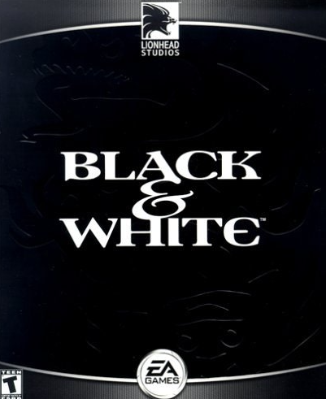
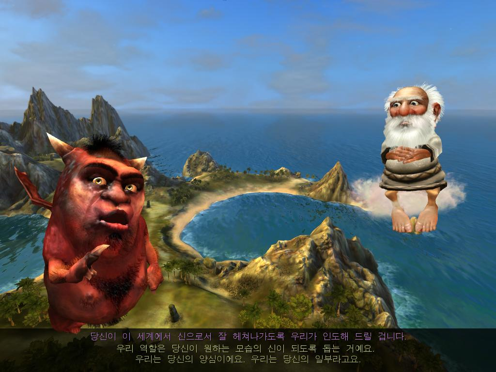
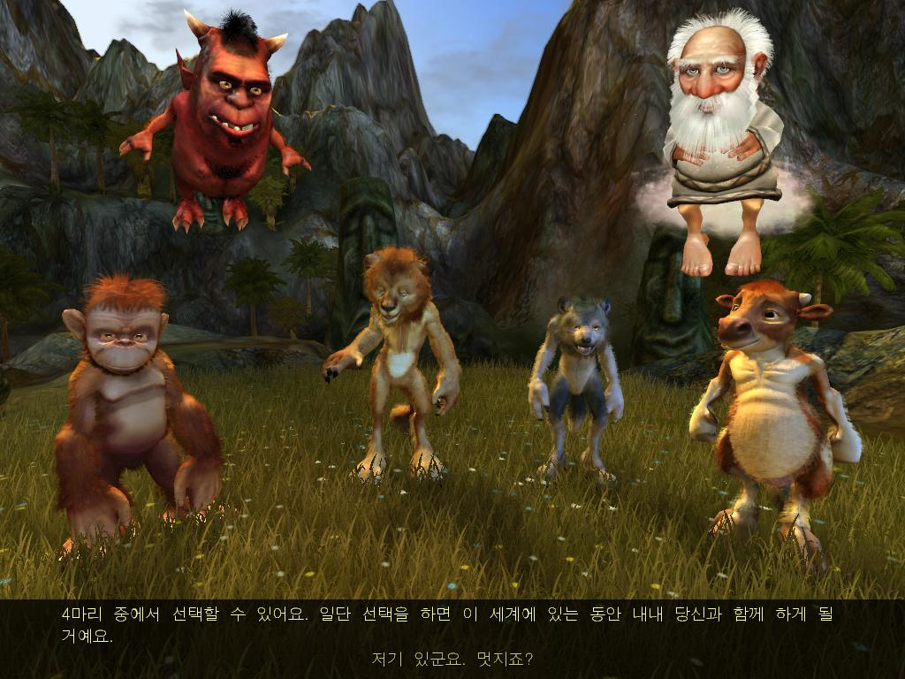
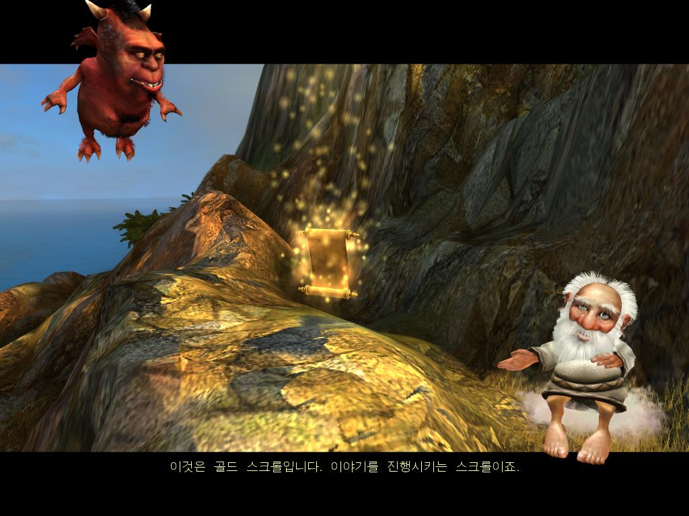
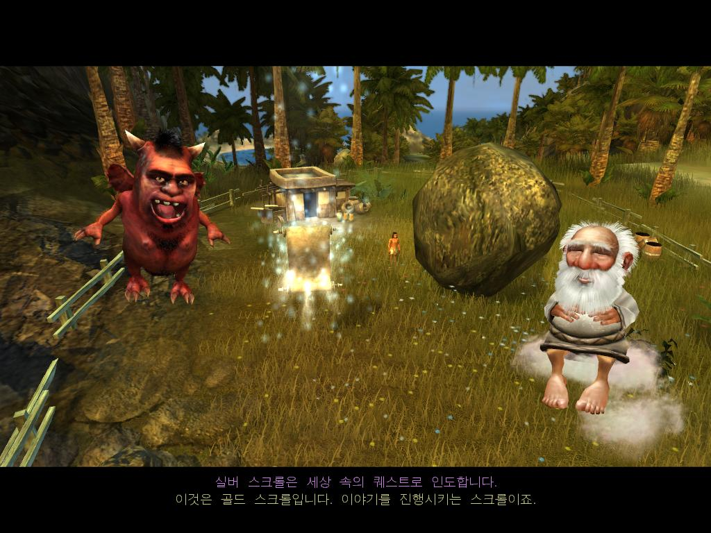
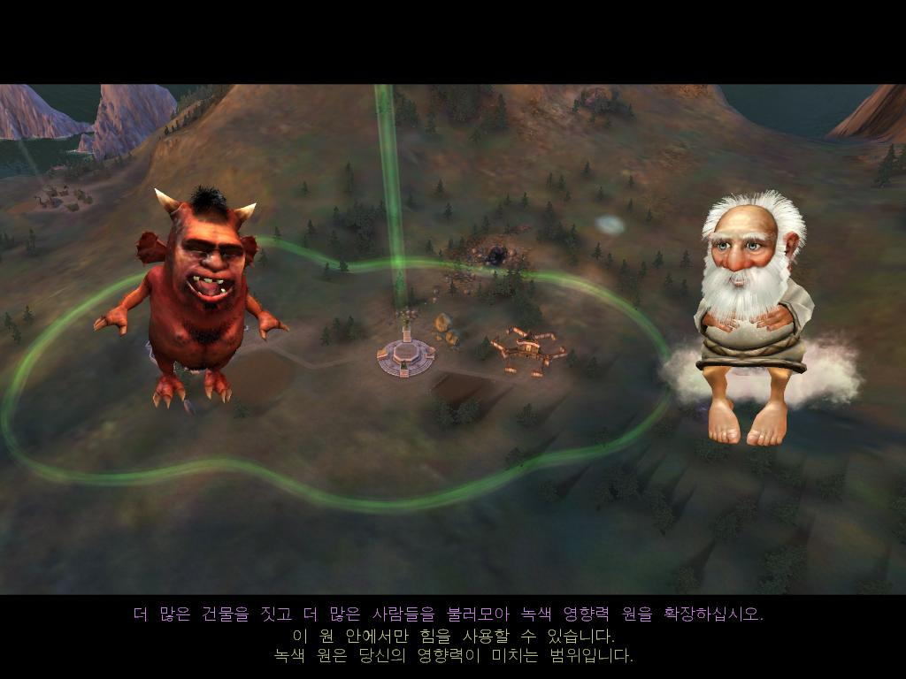
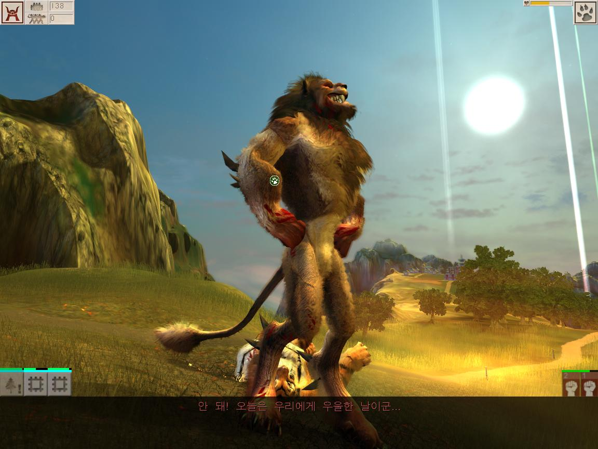

# 오늘 소개할 게임 : 블랙앤화이트2(Black & White2)

과거, P2P가 유행하고 저작권이라는 개념이 모호한 시절 

맛을 봤던 게임이지만 상당히 재미있고 매콤했다.



라이언 헤드 스튜디오에서 만든 PC용 시뮬레이션 게임으로

피터 몰리뉴가 제작한 게임이다. (그 당시에는 모르고 했지만..)


아마 그당시 '신이 되어 어쩌구 저쩌구'라는 문구를 보고 시뮬레이션 게임을 접했던 것 같다.


## 블랙앤 화이트2 내용

어떤 세계에서 신을 갈망하는 목소리가 들리며 우리가 그 세계선으로 가는 것이 큰 스토리다.



선과 악이 존재하며 선택지에 대한 훈수를 두거나 이것저것 알려준다.

마치 TRPG의 진행자같은 느낌이다.




나를 도와줄 크리쳐를 선택할 수 있는데, 이 당시 4개의 크리쳐를 선택할 수 있거나

'타이거패치'를 진행하면 나무 뒤에 호랑이가 서있었다. 


그 당시 약간 동물철권의 진보스느낌이라 타이거패치를 하고 게임을 플레이했다.




게임을 진행하다가 보면 골드 스크롤 이라는 '메인퀘스트'가 있으며 골드스크롤을 누르면 영상씬과 함께

타 마을과 전쟁이 진행된다거나 어떠한 행위를 해야되는 등의 미션을 준다.

가끔 시간 제한 미션을 주거나 상대방이 무력침공을 하면 정신이 나가긴 한다.




이것은 실버 스크롤이라는 것으로 '서브 퀘스트'다

하면 좋고 안해도 좋고 인데 보상이 있고 각 스토리가 있어서 나름 재미있게 했다.


저 사진을 보면 어떤 남자의 집에 커다란 돌맹이가 있다.

저 서브퀘스틑 받으면 저 남자가 집 앞에 큰 돌을 옮겨달라는 간청을 하게 되는데

플레이어가 이를 치워주면 NPC는 감사하면서 보상을 준다.


쭉 스토리를 진행하면 

"아즈텍군사들이 사람들을 학살"이라는 것으로 구해주고 다음 지역으로 넘어간다.




이제 본격적으로 게임이 시작되는데 마을이 있고 초록원은 '신의 힘'이 닿는 범위다.

사람들을 늘리고 건물을 지어 영향력의 원을 늘려나간다.


즉 더 많은 건물, 더 많은 인구로 세력이 커지는 것이다.


번식부, 식량부, 신앙부 등등을 통해서 재료들과 신앙 인구들을 만드는 것이다.


## 게임의 추가요소

이 게임의 특징은 앞서 말한대로

"플레이어는 신이되며 마을의 NPC들에게 숭배를 받으며 숭배는 신앙심이 되고 그 신앙심 모으고 영토를 넓히며 영향력을 넓힌다. "

라는 게임이다.


마우스 커서가 손 모양으로 변하면서 마치 이 손이 내가 신의 영향력을 행사하는 느낌을 들게 할 수 있다.

NPC를 집어서 특정한 일을 하게 시킨다거나 신앙심을 소모해서 기적을 행사하는 것과 같이 말이다.


일단 이 게임의 특이한 점은 선과 악이라는 시스템이 존재한다.


선하게 플레이하면  전쟁이 아닌 대부분 문화력이라는 것으로 상대방을 교화시켜서 스토리를 깨는데

이런 경우 계획도시를 설계해야된다.


범위가 늘어남에 있어서 자원을 효율적으로 배분해서 문화력을 증강시키고 상대방의 침공을 막아야한다.


악하게 플레이하면 전쟁을 통해서 상대방을 무력으로 굴복시켜서 스토리를 진행시킨다.

이런 경우 크리처 강화나 인구수를 통한 도시를 설계한다.




악하게 플레이하면 크리쳐의 모습이 악하게 변하고 몸에 가시가 돋는 점이 은근 신기했다.

크리쳐가 인간을 먹으면 전투능력이 엄청나게 강해지게 되면서 악성향이 늘어난다.


## 게임 플레이 후기

장점과 단점으로 나열해보면


`장점`

첫 번째, 신이라는 것이 조금 느껴질 정도로 맵 전체를 볼 수 있으며 퀘스트 위치를 다 알 수 있다.

두 번째, 크리쳐라는 동물로 인해서 약간 언럭키 동물키우기 게임이 있고 신을 대변해주고 도와준다는 신비한 컨텐츠

세 번째, 커스터마이징이 좀 자유롭다

네 번째, 은근 계획도시가 전략을 잘 짜야된다.

다 섯번째, 선과 악이라는 플레이로 여러번 플레이 할 수 있다.


`단점`

첫 번째, 섬 하나 미는데 너무 오래걸린다.

게임플레이 속도가 너무 느려서 한 챕터 밀면 진이 빠진다.

다회차 플레이에 있어서 마치 스마트폰을 쓰다가 피쳐폰으로 돌아간 느낌도 한몫한다.


두 번째, 나만 리셋 된다.

상대방은 이미 대륙에 자리잡아서 떵떵 거리고 있는데,

나는 리제로부터 시작하는 어쩌구..


세 번째, 성벽이 있는 이유가..?

성벽으로 공성전을 하는 거보다 신앙심을 늘려서 그냥 권능과 크리쳐로 막는게 효율이 좋다.

시뮬레이션인데 성벽없는 성


 네 번째, 엔딩이..

아 슈발꿈! 급의 엔딩이었다..ㅋㅋ


## 마무리

```
평가
"선과 악에 대한 경계를 잘 표현한 신들의 전쟁, 당신은 선인가 악인가"

2005년 당시의 그래픽을 보면 털의 그래픽이라던가 굉장히 잘 표현된 작품이고 노래도 좋았다.
신의 입장에서 게임을 플레이한다는 것을 표현한 시도가 재미있었고 
이것은 시뮬레이션이라는 장르의 새로운 도전이었다.

하지만 블랙앤화이트1과 차별화 된 점이 그렇게 많이 없어서 비운의 작품이라고 생각한다.
그래픽이 발전해도 게임이 전작과 비슷하다면 매력이 없다는 것이다.

새로운 요소들의 조합과 영향의 조합으로 게임에 숨을 불어 넣어야 한다.
그래도 이 게임을 기반으로 신 시점의 게임플레이의 시뮬레이션이 더 발전했으면 한다.
```


추가로  스팀평가에서 재미있던 댓글을 보고 평가하겠다!

`1.가격`

```
□ 그냥 바로 사도 됨
□ 10~20% 세일하면 살만함
□ 25~50% 세일하면 살만함
□ 50~75% 세일하면 살만함
□ 75~90% 세일하면 살만함
□ 무료
□ 내가 오히려 돈을 받아야 하는 수준
■ 구할 수 없음. (현재 플레이하려면 불법다운..)
```

> 옛날 게임이라 윈도우 지원도.. 안되고 구할 수 없다.


`2.그래픽`

```
□ 진짜
□ 아주 멋지고 감탄이나옴
□ 멋짐
■ 괜찮음
□ 못 봐줄 정도는 아님
□ 끔찍함
□ 눈을 세척하고 싶어짐
```

> 당시 그래픽을 생각하면 그래픽은 좋다.


`3.스토리`

```
□ 결정적인 장면에서 소름이 돋고 감탄하면서 이마를 탁 치게됨
□ 탄탄함
□ 무난함
■ 부실함
□ 스토리가 있긴 하냐
□ 기억하고 싶지 않음
□ 전작을 안했으면 이해하기 힘듦
```

> 스토리는 전반적으로 부실했다. A->B라는 일방적인 스토리


`4.난이도(최고 난이도 기준)`

```
□ 사람이 할 짓이 아님
□ 어려워서 화가 남
■ 상당히 어려움
□ 누구나 가볍게 즐김
□ 매우 쉬움
□ 우리집 고양이도 플레이
```

> 마지막 챕터, 싸움 구간이 너무 빡세다. 그 전까지는 쉽다. 빌라앤 화이트2..


`5.사양`

```
□ 게임과 전문 작업 및 방송 등을 위해 맞춘 차세대 컴퓨터 요구
□ 고사양 컴퓨터 요구
□ 대중적인 컴퓨터 요구
□ 낮은사양의 가벼운 컴퓨터도 가능
■ 그냥 컴퓨터가 켜지기만해도 가능
```

> 사양은 옛날 게임이기도 하고 램도 1기가 미만에 팬티엄4 이상이니까..


`6.플레이타임`

```
□ 100시간 이상
□ 50시간 이상
□ 30시간 이상
■ 10시간 이상
□ 5~10시간 내외
□ 1시간 이하
```

> 치트급으로 플레이하면 엄청 짧은데, 서브퀘스트에 이것저것하면 10시간 넘었다.


`7.사운드`

```
□ 그자리에서 지림
□ 훌륭함
■ 괜찮음
□ 질림
□ 계속 듣기 힘듦
□ 귀를 잘라내고 싶음
```

> 괜찮은 정도? 풀더빙도 지린다.
>
> 그 시절 풀더빙..이면..


`8.멀티플레이`

```
□ 세월이 지나도 끄떡없음
□ 아주 활발함
□ 걱정할 것 까진 아님
□ 현재는 활발하나 추후 걱정됨
□ 어떻게 어떻게 할 수는 있음
□ 혼자한다고 봐야함
■ 멀티플레이가 존재하지 않음
```

> 멀티는 없었던 거로 기억한다.


`9.버그`

```
□ 재수없으면 겪는 정도
□ 이정도면 웃어 넘길 수 있음
□ 눈에띄나 플레이에 큰 방해는 없음
■ 플레이가 조금 불편해짐 - (프레임드랍은 기본, 스터터링 및 크래시, 그래픽 깨짐 등)
□ 진행을 할 수가 없음
```

> 성벽지어도 버그로 그냥 뜷고 지나가는 건 좀


`10. 개인적인 게임플레이 느낌`

```
□ 게임이 끝나가는게 아쉬울 정도
□ 처음부터 끝까지 즐거운 플레이
□ 그냥저냥 지루했다가 재밌다가 하는 플레이
■ 반복적이고 단조로운 지루한 플레이
□ 돈아까워서 꾸역꾸역 함
□ 돈이 아까운데도 하기가 싫음
```

> 공략방식이 똑같다. 그나마 서브퀘로 이것저것 보는 맛..


