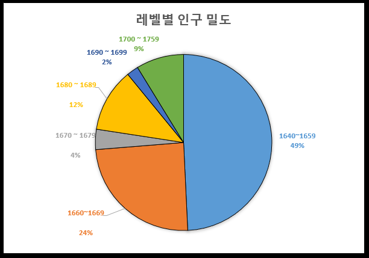
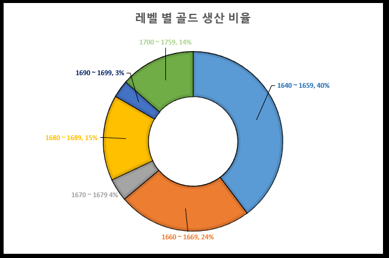
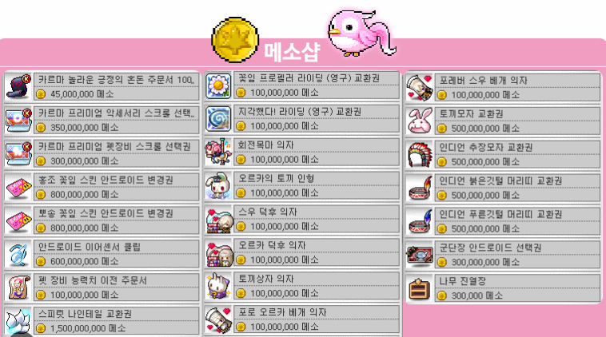
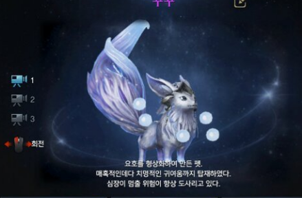
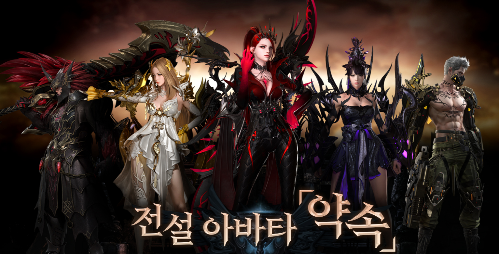

# 로스트아크 현재 내 골드 생산량 및 분석

현재 로스트아크 골드 생산량을 대략적으로 

레벨별구간, 구간별 인구, 레벨별 골드 최저획득, 레벨별 골드 최고획득을 기준으로

평균골드를 산정해서 그 값을 인구 별로 곱한 후 생산량에서 퍼센티지를 구해준다.

이를 통해서 골드생산량 비율에 따른 전재학 디렉터님의 발언이나

로스트아크팀의 이를 해결위한 노력?을 빗대고

마지막으로 나라면..?이라면 느낌으로 해볼 것 같다.

# 로스트아크 인구 밀도 계산

로스트아크 레벨별 인구수는 API를 기준으로 오는 사이트

'로아와'가 있다. 여기서 추출을 한다.

이 표본은 1640 ~ 1759.99까지를 기준으로 한다.

| 레벨대역    | 인원    |
| ----------- | ------- |
| 1640 ~ 1659 | 643,125 |
| 1660 ~ 1669 | 319,256 |
| 1670 ~ 1679 | 48,501  |
| 1680 ~ 1689 | 152,374 |
| 1690 ~ 1699 | 28,185  |
| 1700 ~ 1759 | 114,187 |

위와 같은 레벨대역 인구가 집계된다.

그러면 총 인원에서 레벨대역 인원으로 퍼센티지를 나눠준다.

그러면 인구비율이 산정된다.

| 레벨대역    | 인구비율 |
| ----------- | -------- |
| 1640 ~ 1659 | 49%      |
| 1660 ~ 1669 | 24%      |
| 1670 ~ 1679 | 4%       |
| 1680 ~ 1689 | 12%      |
| 1690 ~ 1699 | 2%       |
| 1700 ~ 1759 | 9%       |

해당 값을 나뉘게 된다면 의 비율이 나오게 된다. 

이 표를 대략적으로 피벗테이블로 바꾸고 피벗테이블을 차트로 바꿔준다.

이러면 위와 같은 차트와 같은 퍼센티지가 나오면서 각 레이드별 인구 비율이 나온다.

# 로스트아크 골드생산비율

위 인구를 나뉜 이유가 이때 나오는데, 

나는 구간별 인구 산정이 아니라 레이드 구간별 얻는 골드량으로 데이터를 나누고자 했다.

즉, 나뉜이유는 간단하다. 골드 산정이 큰 의의가 있기 때문에 레이드 별로 나뉜다.

자 그러면 이제 각 구간별로 최저골드와 최고골드를 산정해준다.

| 레벨대역     | 최저골드 | 최고골드 |
| ------------ | -------- | -------- |
| 1640 ~ 1659  | 40,000   | 52,500   |
| 1660 ~ 1669  | 53,100   | 60.000   |
| 1670 ~ 1679  | 60,000   | 66,500   |
| 1680 ~ 1689  | 71,000   | 80,500   |
| 1690 ~ 1699  | 80,500   | 86,000   |
| 1700  ~ 1759 | 80,500   | 96,000   |

대략적으로 해당구간으로 얻을 수 있는 최저골드와 최고골드를 산정한다.

#### 1640 ~ 1659 : 에키, 카멘, 베히

[최고골드] 하키드나(18500), 하드카멘 1-3(15500), 베히모스(18500) 

=>  52,5000골드가 나온다.

[최저골드] 싱글 에키(11600), 싱글 카멘(8000), 베히모스(18500) 

=> 약 40,000 잡는다 (위 하드4도 미포함한거 있어서)

#### 1660 ~ 1669 : 에키, 베히, 에기르

[최고골드] 에기르(23000), 베히모스(18500), 하키드나(18500)

=>  60,000골드가 나온다.

[최저골드] 에기르(23000), 베히모스(18500), 싱글에키(11600)

=> 53,100골드가 나온다.

#### 1670~1679 : 베히, 에기르, 아브

[최고골드] 아브(25000), 베히(18500), 에기르(23000)

=>  66,500골드가 나온다.

[최저골드] 에기르(23000), 베히모스(18500), 하키(18500) :아브포기형

=> 60,000골드가 나온다.

#### 1680~1689 : 에기르, 아브, 모르둠

[최고골드] 모르둠(28000), 아브(25000), 에기르(27500)

=>  80,500골드가 나온다.

[최저골드] 아브(25000), 에기르(27500), 베히(18500)

=>  71,000 골드가 나온다. (모르둠 포기형)

#### 1690~1699 : 에기르, 아브, 모르둠

[최고골드] 모르둠(28000), 아브(30500), 에기르(27500)

=>  86,000골드가 나온다.

[최저골드] 모르둠(28000), 아브(25000), 에기르(27500)

=>  80,500골드가 나온다.

#### 1700~1699 : 에기르, 아브, 모르둠

[최고골드] 모르둠(38000), 아브(30500), 에기르(27500)

=>  96,000골드가 나온다.

[최저골드] 모르둠(28000), 아브(25000), 에기르(27500)

=>  80,500골드가 나온다.

## 골드 생산량의 계산

자 그러면 1캐릭터당 생산을 알았으니, 해당 최저와 최고골드의 평균골드를 산정해준다.

피벗테이블의 계산필드를 생성한 후 

제목을 '평균골드'로 입력 후 (최고골드+최저골드)/2를 넣어준다.

| 레벨 단위   | 평균골드 |
| ----------- | -------- |
| 1640 ~ 1659 | 46,250   |
| 1660 ~ 1669 | 56,550   |
| 1670 ~ 1679 | 63,250   |
| 1680 ~ 1689 | 75,750   |
| 1690 ~ 1699 | 83,250   |
| 1700 ~ 1759 | 88,250   |

자 이러면 1캐릭터당 생산되는 평균골드가 산정된다.

그러면 우리는 인구수를 뽑았으니, 인구수별로 곱해준다.

그리고 총 골드량과 해당 인구수의 골드량에 대한 %를 구하면 된다.

| 레벨        | 합계 : 골드생산량 |
| ----------- | ----------------- |
| 1640~1659   | 2.9745E+10        |
| 1660~1669   | 1.8054E+10        |
| 1670 ~ 1679 | 3067688250        |
| 1680 ~ 1689 | 1.1542E+10        |
| 1690 ~ 1699 | 2346401250        |
| 1700 ~ 1759 | 1.0077E+10        |

엑셀에서 큰값은 E로 치환되기 때문에 만약 신경쓰인다면 길게 늘리거나 함수위치를 보면된다.

대략 레벨 구간별로 위와 같은 골드 생산량이 되니까

총량은 `5.39616E+11`이라는 값이 된다.

자 그러면, 여기서 각각 비율을 잡아준다.

직접 하면 귀찮으니까 피벗테이블에서 차트를 연결해서 해준다.

대략적으로 계산했다.

| 레벨        | 골드 생산 % |
| ----------- | ----------- |
| 1640~1659   | 40%         |
| 1660~1669   | 24%         |
| 1670 ~ 1679 | 4%          |
| 1680 ~ 1689 | 15%         |
| 1690 ~ 1699 | 3%          |
| 1700 ~ 1759 | 14%         |

라는 비율이 된다. 

# 일반적인 재화 이론

한창 커뮤니티에서 불타는 내용으로 "상위권 보상의 부족"이라는 말도 있고 " 밸런스패치"라는 말도

있으나, 해당 데이터는 상위권 보상 부족?에 대한 부분만을 담을 수 있기에 담아본다.

일단 실시간 라이브 MMORPG게임에서 이상적인 재화생산비율은

게임 설계 디자인, 경제적인 시스템, 개발사 목표(상위지향, 모두가 즐기는 지향)에 따라 다르지만,

대개 일반적인 평균을 기준으로 고려한다면 

이상적인 골드 %생산량은 이렇게 된다.

| 유저권 | 퍼센트 |
| ------ | ------ |
| 하위권 | 30~40% |
| 중위권 | 30~40% |
| 상위권 | 10~20% |

왜 그럴까?

일단 다계정이든, 뉴비든, 흔히 말하는 쌀팔이든 게임사 입장에서는 구분할 수 없기에

사실상 같은 유저라고 판단할 수 밖에 없다.

#### 1.하위권

하위권 골드 목표 : 게임 적응과 성장의 기반을 마련해준다.

재화 생산 비율은 약 30~40%

-1) 재화 흭득량이 낮으면 흔히 말하는 폐사구간이 된다.

ㄴ 하지만 반대로 너무 높으면 인플레이션의 유발이 된다.

#### 2. 중위권

중위권 골드 목표 : 게임의 핵심컨텐츠를 즐기고 상위권 도약을 위한 기반을 마련한다.

재화 생산 비율은 약 30~40%

-1) 중위권은 게임에 적응해서 다양한 컨텐츠를 늘리고, 상위콘텐츠를 준비한다.

-2) 게임 경제 내에서 핵심적인 위치고 게임 시장 활성화에 영향을 줌.

#### 3. 상위권

상위권 골드 목표 : 게임의 최상위컨텐츠를 즐기고 경쟁에서 우위를 점하는 것.

재화 생산 비율은 약 10~20%

-1) 상위권 유저들은 고난이도 콘텐츠를 통해서 희귀한 아이템과 많은 재화를 얻는다.

-2) 상위권의 활동은 최고 수준의 아이템과 재화의 가치 유지하는데 기여한다.

일반적으로 고려해야되는 부분은

1. 인플레이션의 관리 : 생산 비율을 조정한다.
2. 유저 간 재화 격차 : 하위와 상위권의 격차가 너무 크지 않도록 한다.
3. 콘텐츠의 다양성 : 모든 유저가 재화를 생산하고 즐겨야 한다.

라는 일반적인 가이드라인이다.

그래서 각 게임사는 이러한 인플레이션을 잡기 위한 노력을 하고 있다.

# 로스트아크 발언

근래 불타는 의미에서 사람들이 꼬는 의미로 상위권의 골드가 적다. 라는 것이 있다.

아무래도 해당 부분은 카멘 4관문에서 압도적인 골드를 쥐었던 유저들의 경험이 뒷받침 되는게 아닐까?

1.전재학 디렉터님의 모르둠 인플레이션 걱정발언

일단 이 골드 재화 생산량을 봤을때

하위권, 중위권, 상위권 이라는 기준을 어떻게 잡을 것인가?가 중요한데

나는 이 부분을

상위권 = 최상위레이드에 갈 수 있는 스펙 1700 ~

중위권 = 최상위 아랫단계 찍먹 + 다양한 컨텐츠 패러다임 1660~89

하위권 = 완전 뉴비단계에서 캘 수 있는 한계점 1640 

으로 해봤다.

그러면 이론과 더불어서 한번 비교를 해보자.

| 레벨구간    | 구간   | 이론 퍼센트 | 퍼센트 합 | 비고    |
| ----------- | ------ | ----------- | --------- | ------- |
| 1640 ~ 1659 | 하위권 | 30 ~ 40%    | 40%       | MAX     |
| 1660 ~ 1699 | 중위권 | 30 ~ 40%    | 46%       | OVER    |
| 1700 ~ 1759 | 상위권 | 10 ~ 20%    | 14%       | MIIDDLE |

개인적으로 로스트아크에서 추구하는 것은 모두가 즐거운 것이라고 생각한다.

아무래도 그래서 하위권 40~45% / 중위권 40~45% / 상위권  15% 등의

대략적으로 회사에서 정한 구간별 %가 있을 것이다.

사실 상위권의 보상을 늘려주면 세컨드 임팩트로 위와 같은 것이 걱정된다.

1. 중위권 유저 골드 생산량 %를 줄여야한다 => 상위권 도약 기간이 오래 걸린다.
2. 하위권 유저 골드 생산량 %를 줄여야한다 => 뉴비 폐사가 올라간다.

사실 상위권 유저들이 재화를 소모해줘야 되는 역할인데,

소모해주지 않는 것도 답답하다고 느껴질 수도?

해당 부분에서 종막에서 올려야되는데, 너무 인플레이션에 대해서 걱정했다.라고 하셨는데,

아무래도 그 부분에 대해서 최상위권 하드 모르듐 3관문에 대해서 보상을 늘렸다.라고 보여진다.

즉, 카멘처럼 종막에서 보상을 늘려야되는데 인플레이션을 걱정해서 보상이 낮았다.

여기서 유저들은 카멘 4관처럼 벌었던 경험이 있으니까 보상이 상대적으로 적다.고 느껴졌다.

이 부분에 대해서 마이너스 시너지가 벌어졌다고 생각한다.

그렇다고 유저들의 말대로 하위구간의 골드를 쳐내면?

로스트아크는 강화에 들어가는 재화비용이 크다. 

그래서 유저들은 더보기로 시간을 녹여서 귀속 재화로 성장하는 경우가 많고,

그 구간에 오래있게 하면서 인플레이션을 잡는다가 아닐까?

(과거 기준)

1640 ~ 1660 성장비용은 모두 구매하였을 경우,

| 재료   | 개수    | 개당골드 | 총골드  |
| ------ | ------- | -------- | ------- |
| 운파   | 50,683  | 3.3G     | 167,254 |
| 운수   | 152,049 | 0.4G     | 60,820  |
| 운돌   | 3,356   | 20G      | 67,110  |
| 오레하 | 1,998   | 70G      | 139,832 |
| 운파   | 996,667 | 0.16G    | 158,470 |
| 누골   |         |          | 281,895 |

즉, 총비용은 875,380G이다.

1640의 평균골드 `46,250`이라는 골드로 해당 60구간까지 끌어올리려면 약 19주가 걸린다.

단순 계산은 그렇지만

카오스던전의 재화, 가디언 토벌의 재화까지 더해진다면 19주보다 빠르게 올라갈 것이다.

근데 여기서 1660으로 가면 평균골드는 `56,550`골드이다.

기존과 얼마 차이가 나지 않는다. 

무언가 도전의식이 있지 않는 이상은 올리기 힘들다는 느낌이다.

## 만약에 이제 사람들이 재화를 아낀다 라고 한다면?

흔히 사람들이 말하는 쌀값 = 게임재화의 가치는 떨어진다.

게임재화의 가치가 떨어지면 필연적으로 게임내 재료의 가격은 오른다.

그러면 하위권 유저들은 성장에 들어가는 재료 가격이 올라가기 때문에 

성장에 더 오래 걸리게 되고 폐사로 이어지는 악순환을 경험할 수 있다.

여기서 패키지를 내는 것으로 생각이 든다.

악순환을 막기 위해서 재료를 떨어진 게임 재화의 가치에 맞춰서 판다.

왜? 재료를 구매하는 사람들은 필연적으로 레벨을 올리는 사람들이다.

게임사는 이를 통해서 게임 재화의 소거를 이룰 수 있다.

1. 골드를 현금으로 바꾼 후 패키지를 구매하는 사람들
2. 현금으로 패키지를 구매한 후 강화하는 사람들

2가지의 경우다.

1번의 경우는 우편, 거래 수수료에 따른 5%수수료가 들어간다.

100만골드라면 5%인 5만골드가 소실되는 것이다.

2번의 경우는 현금으로 패키지를 구매하고 1번에서 이어질 수 있고,

누적골드를 사용함으로서, 게임 내 재화를 줄인다.

이 부분을 생각해서 근래 패키지를 내는 것이 아닐까? 하는 생각이 든다.

즉, 재화 소각을 시도한 것이다.

그리고 최상위권층 유저의 불만을 위해서 마지막 관문의 골드를 높힌다.

5클의 보상으로 벨가누스의 날개를 보상으로 준다.

는 나름대로 효율적인 방편을 마련한 것이다.

그리고 마지막으로 밸런스 패치를 시도하는 경우로 보인다.

자신의 직업이 강해진 사람들은 강화를 누를 것으로 생각되니까?

# 나라면?

일단 나라면? 이라는 상상의 나래를 펼쳐보도록 하겠다. ㅋㅋㅋ

뭐 개인적으로 재미로 봐달라.

내가 나름대로 생각하고 반박하는 재미로 쓴 것이다.

#### 가디언 투기장

과거 로스트아크가 나오려고 했던 컨텐츠 중 하나로서,

가디언과 가디언끼리 싸우려던 컨텐츠 였던 기억이 있다.

주마다, 일마다 하는 행사로 골드를 걸고 골드를 잃고 얻는 행위?

하는 것은 어떨까 하는 생각이 든다.

확률의 오류라서 해서 48%로 설정해놓으면 결국에 확률에 수렴하게 된다.

그러면 해당 행사를 이용하는 골드 재화가 2%감소한다.

여기서 수수료까지 부과한다면 +@가 되지 않을까?

=> 근데 GTA에서도 홀덤펍같은 게 안되는데 게임 접촉방식과 문제도박에서

정부에서 재제가 내릴 수 있기 때문에 힘들 듯?

#### 극 최상위권 유저

오히려 에스더무기에 대한 재화교환시스템을 도입하는 것은 어떨까?

기존 에스더무기는 에스더의 기운 + 생활재료로 이루어진다.

그리고 에스더 무기를 사용하는 유저들의 말은

'에스더 무기를 쓰면 귀속 재료가 남는다'라는 말이다.

오히려 과거에 성장재화를 에스더의 기운으로 변경해주는 것보다는,

에스더의 기운을 바꾸는 새로운 방식으로 재화를 태우는 것이다.

ex)

운파 N개 + 일정골드로 에스더의 기운을 생산

운수 N개 + 일정골드로 에스더의 기운을 생산

운파+운수+오레하+일정골드로 에스더의 기운을 생산

즉, 인게임내에 사람들이 자주 사용하는 재화를 최상위권 유저가 태울 수 있고

최상위권 유저는 귀속재료를 통해서 만족할 수 있다고 생각한다.

이 부분에 대해서 해당 방식을 썼다면..?

기존에 에스더무기를 쓰는 사람들이

'스마일게이트가 칼들고 협박한다'라는 말이 조금 덜 하지 않았을까

에스더의 기운이 엄청 비싼데

재화 교환을 통한 쌀스더는 물건너갔지만

몇천만원 단위를 소모해도 리턴이 적으니까 말이다.

#### 조금 늦은 감이 있지만, 설계 미스?

상급재련, 재련 등 많은 요소가 나오고 그 사이에 계승이 나오면서

레벨링 문제가 발생한게 아닐까? 라는 생각 든다.

로스트아크를 하는 유저들은 효율을 기반으로 성장한다.

계승 전 상급 제련을 할 수 있는 만큼 해가라.

계승 후 16강 후 상재 10 , 19강 후 상재 20이라는 말이 있다.

현재 중위권으로 가는 방법은 올 16강에 상재 10을 달성하면

노르둠까지 즐길 수 있다.

1680부터는 효율이 증가한다고 체감한다.

왜냐? 

1660 골드 기대값은 57,000 

1670 골드 기대값은 66,500 즉, 주마다 + 9,500골드

1680 골드 기대값은 80,500 즉, 주마다 + 14,000골드

1670 -> 1680 사실 생각보다 어렵다 ㅋㅋㅋ

유저들이 70할바에야 60한다 라는 말이 있듯이 뭔가 체감되는게 있는 걸까 싶다.

단계별 성장이 무언가 박살이 난 기분이다.

70에서 카르마는 솔직히 상당히 많은 재화가 필요하지만,

80에서 도착하면 다시 주차구간의 시작이다.

60 -> 80까지 올라가기 힘들고 동기가 부족하다.

60 -> 80은 장비강화 뿐만 아니라 카르마 강화까지 있어서

오히려 70에서 보상이 늘리고 80에서 적은 폭으로 증가해야되지 않을까?

모르둠의 레벨은 85 ~ 90으로 해서 1강씩 더하세요~ 라고 요즘 당근 주는 느낌으로 하는 것도?

그러면 노르둠을 하기 위해서 조금 더 강화하는데 80 -> 90재화는 엄청나고 

그러면 17도달하는 사람도 많지만

하르둠의 스펙과열로 오히려 골드 생산량을 떨굴지도?

왜냐? 사람들은 딜찍으로 편하게 깨는 것을 좋아하니까.

#### 골드상점의 도입

게임 내 재화인 골드를 소모시켜서 얻을 수 있는 성장에는 관련없는 한정를 내는 것은 어떨까?

유저들에게 중요한 것은

'칼들고 협박하네?' 라고 느끼는 것 보다는

게임사가 전달하는 것이다.

'우리가 이거 냈는데, 필요하면 사도돼~' 라고 느끼게 해서 결국

`본인의 선택`으로 이걸 샀다 라는 것이 중요하다고 생각한다.

특정 아바타, 특정 탈것, 특정 펫을 복귀하는데 게임 내 재화인 골드를 소모한다면?

이라는 생각이 든다.

모바일 가챠 게임에서 나온 것으로 특정 기간에 얻을 수 있는 캐릭터가 복구한다면 

사람들은 살 수 있다. 뭐 가챠는 성능이 들어있어서 그럴 수 있지만

희소성이라는 가치도 있고 게임사에서는 무엇보다 '개발'을 덜 하고 

인플레이션을 잡을 수 있는 하나의 기회라고 생각한다.

예시를 들어보자.

로스트아크 시즌1에서만 얻을 수 있는 요호펫이다. 

현재 게임 내 가치는 매우 비싸며 골드 측정을 게임사에서 측정한다면 나쁘지 않지 않을까?

1. 역경매 시스템으로 실시간으로 할인을 적용한다. 누군가 구매하면 다음 상인이 등장할 때 까지 시간텀이 발생하며 그 펫이 나올 수도 요호가 아닌 다른 펫이 나올 수도 있다. (가격을 높게 설정가능)
2.  모두가 구매할 수 있지만, 합리적인 가격으로 내놓는다 (유저별 필요한 만족 가능)

이거는 게임사에서 시뮬레이션을 통해 확인해야될 것으로 보인다.

아무래도 이 부분에 대해서 펫에 대한 구매 API는 없기 떄문에;;ㅋㅋ

로스트아크 복각 중 하나로는 아바타?가 어떨까 싶다.

사실 이거는 두 가지가 있다. 

기존 유저들이 희소성에 대해서 반발할 수 있으니 => 덧입기용 아바타로 낸다.

글쎄.. 모두가 중요하다 => 그냥 성능이 달린 전압으로 낸다.

해당 골드 소거 방법으로는

1.확률

: 약속 항아리는 '골드'만 구매할 수 있다. 해당 항아리는 캐쉬보다 %가 (낮다 or 똑같다)

2.옷감

: 약속 항아리의 옷감은 기존의 옷감을 사용할 수 (있다 or 없다) 

없는 경우에는 골드로 구매하는 옷감으로만 사용 할 수 있다.

3.거래횟수

: (2회 거래가능 OR 1회 거래가능 OR 거래불가) 로 지급된다.

개인적으로 1회로 만드는게 좋을 수도?

이렇게 희귀한 거를 '복귀'시키지만 골드를 소모시키는 거라면?

1.게임사는 리소스를 재탕할 수 있다. 

2.유저는 필요한 아바타를 살 수 있다.

3.하지만 선택은 유저의 몫이다 라는 느낌으로 소통한다면? 좋은 반응을 얻을 수 있지 않을까 싶다.

더 많은 생각이 있지만,

여기서 줄인다.

지금까지 골드생산량부터 파생되는 것에 대해서 봐준것에 감사합니다.

(--)(__)(--)

