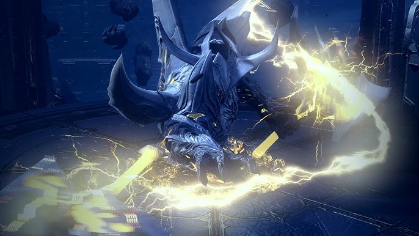

# 모르둠 분석

이 글은 이론적인 부분과 경험을 기반으로 분석해보고자 한다.

주관적인 의견이 들어가서 틀린부분이 있을 수 있지만 그냥 재미삼아 본다고 생각하자.

# 모르둠

카제로스 레이드 3막의 보스로서 

스토리로는 카제로스의 재육체 과정으로 성을 지키는 수호자 역할이다.

이 부분에서 플레이하면서 얘가 왜 나오는지?에 대한 것은 모르겠다.

기존의 군단장레이드에 대해서는 아 얘네들 이구나! 하면서

스토리라는 채소와 함께 먹는 드레싱이 나왔다면.

1막(에기르), 3막(모르둠)은 약간 이런 드레싱적인 부분이 부족하지 않나..? 

라는 느낌이다.

기타로 2관문, 3관문에 대한 것을 적어본다.

## 특징

[1관]

1관문은 카멘이지만 약간 에피타이저 느낌으로 과거 카멘보다는 압력이 덜하다. 

아마 카제로스의 강함을 부각시키려고 카멘을 약화시킨 것이 아닌가? 하는 느낌이다.

[2관]

2관문은 나이트레아로 과거에 플레이 했던 가디언의 스타일을 모방하고 

나이트레아의 고유스킬을 합쳐서 만드는 마인부우 같은 느낌의 보스다.

[3관]

과거 아르카디아의 느낌을 이어져온 느낌이있다.

상당히 번거롭네? 라는 느낌이 있고 강력하다는 첫 인상이 있다.

기존 레이드의 경우 특정 패턴때 뎀감, 회피, 공중이동 같은 것인데 이번에는 딜링이 계속 가능하다.

그 상태이상을 무시하는 전기기둥이 움직이면서 그때 딜을 우겨 넣을 수 있다.

일단 딜링이 계속 되는것은 시간이 지나서 숙련도가 높아지면 수월해질거기에 

아마 게이머들의 숙련도 상승하면 클리어타임에 대한 그래프가 하향 될 것으로 보인다.

[나이트레아]

나이트레아는 크게 3가지 형태가 있다.

1. 엘버하스틱 : 가디언 중에서 엘버하스틱의 패턴을 그대로 쓰고 카운터 패턴이 많다.
2. 요호 : 요호의 불쾌함 뺀 느낌의 합체다.
3. 벨가 : 과거 시민권 벨가누스의 패턴을 계승하고 짤페가 상당히 괴랄하다.

모르둠은 크게 노말은 2가지의 형태 / 하드는 3가지의 형태가 있다.

[모르둠]

1. 파괴전 : 패턴이 되게 무난하고 '나 이런 패턴을 써'라는 느낌의 쉬운 도전을 준다.
2. 지파후 : 패턴은 동일하지만 공격지형의 감소로 낙사라는 리스크가 생긴다.
3. 발악: 무난하고 사실 버텨!! 메타다.

플레이하는 영상이나 플레이 경험으로 비추면 모르둠은 상당히 깍으면 좋은 레이드다.

당장은 어렵지만 숙련도에 따라서 난이도가 쉬울 것으로 보인다.

이 부분에 대해서 장점, 단점, 아쉬운 점을 나뉘보고자 한다.

## 장점

1. 기존의 로아라는 다른 느낌의 스타일이다. 

   =약간 와우, 엔씨식 RPG게임의 향이 느껴진다. 깍이면 깍을 수록 편한 레이드

2. 전조가 확실하다.

   = 모션이 잘 보이는 패턴이 많고 전조만 알고 있다면 이후 딜부족이 날 걱정도 없으며 상재효율이 좋아서 몇주만 기다리면..

# 단점

1. 레이드의 불쾌감이 있다.

   = 기존의 상태이상을 스페로 씹는 것이 가능했지만 면역을 무시한다. 아무래도 이부분이 게이머들에게 있어서 기존의 지식과는 다른 것이 불쾌감으로 다가오는 것이 아닐까? 

   아니면 모르둠의 전기는 어떻다라고 해서 무언가 납득이 되는 스토리 전개를 보강했다면 하는 아쉬움이 있다.

   

2. 로스트아크의 어려운 난제 : 연대기믹

   = 과거 금강선 디렉터 시절, 사이버유격이라는 말이 나왔다. 아마 그 안에는 내 잘못이 아니더라도 타인이 실수하면 내가 죽을 수 있다. 라는 감정이 부정적인 시선을 다시 일으켰던 것이 아닐까? 게임에서 죽는다라는 개념은 끝난 느낌이고 이제 다시 게임을 할 수 있는 원동력을 주어야하지만 개인의 실수가 아닌 타인의 실수로 죽는다에 대한 반항이 크다고 생각한다.

   그래서 아마 이부분에 대해서 일리아칸은 죽으면 나머지 고통을 분담한다. 라는 느낌이 있었다고 한다.

   

3.  아쉬운 빌드업

   = 스토리에 연관이 있거나 작은 단서들을 통해서 레이드를 진행하면서 몰입감이라는 것이 생기는데 에기르 부터 이런 느낌이 적어졌다. 아무래도 출시 속도는 빠르지만 이러한 충분한 시간이 부족했던 것이 아닌가? 라는 생각이 들면서도 잘 모르겠다.

   게임 속에서 게이머들과의 소통부족이라고 할 수 있을수도..

## 관점

게임기획의 관점에서 바라보면 모르둠은 새로운 레이드의 형태를 취하는 도전이다.

처음에 약하게 쉬운 패턴이 자주 나오면서 플로우 이론의 작은 몰입을 주기 시작한다.

그리고 몰입이 쌓이기 시작할 때 425줄의 벽에서 자신이 아닌 타인의 의해서 실패를 당한다.

왜? 생각보다 딜량이 빡빡하다는 생각에 바로 재시작을 누르는 것이다.

이러면 이제 흔히 로아에서 말하는 '전구갈이'라 나오게 된다고 생각한다.

플로우이론에서 몰입에 대한 부분이있다.

몰입을 하면 시간을 가는 것을 모르는 자아를 잃는 상태로 바뀐다고 한다.

게임은 시작과 동시에 많은 도전을 극복시키고 몰입이라는 형태로 낳는다.

몰입여부는 사용자의 실력과 게임의 난이도 사이의 밸런스에 있다.

이러한 기준을 잡는 것은 좋은 느낌이다.

아마도 그래서 2막 아브렐슈드 1관 나로크에서 기간에 따른 난이도 차이를 내서

첫 주차는 어렵다! 하지만 다음 주부터는 괜찮아 라는 느낌의 안도감을 주었다.

이번에는 나이트레아는 약간 그 부분에서 아쉬웠다.

전용 배틀 아이템의 소비가 애매하네? 라는 느낌이 강했다.

2관문 나이트레아의 감염패턴은 타인이 잘못해도 내가 커버해주면 돼! 같은데

아니면 타인이 잘못하고 나도 약간의 실수 하면 죽어. 느낌이다.

3관문 모르둠은 패턴이 나름 재미있지만 번개공격이 지금과 다른 불쾌감이 있다.

일단 무조건 적인 무시로 감전이 들어가기에 이에 대한 설명이 뒷받침 되어있지 않기도 하고

2관문과 마찬가지로 체력 통이 크고 체력 압박이 심해지는 지속 데미지도 발생하기에

타인에 의한 죽음이 불쾌감을 일으킨다고 생각한다

오히려 이 부분에 대해서 나이트레아의 달리기 패턴, 감염 패턴의 불쾌감을 만져주는 것이 나쁘지 않다고 생각했다.

헤드딜러가 있을 때의 불쾌감과 쾌감이 상대적으로 다르기 떄문에 직업적인 차별도 존재할 수 있다고 판단하기에

달리기 패턴은 오히려 제외하거나 좀 더 쉽게 만들거나 (먼저가면 데미지로 사망)

ex) 그냥 앞으로 달려가는데 딜 타임을 뺏긴다 정도의 리스크를 감내하는 것?

감염 패턴은 개인의 리스크 강화가 좀더 좋지 않을까? 라는 느낌이다.

ex) 스타크래프트 디바우러의 액시드 스포어 같은 방어력 깍기, 카멘의 받뎀증 느낌의 디버프 부여

이렇게 하고 2관문을 유연하게 하고 3관문에서 힘을 주는 2가지 방법에 대해서 고민했다.

1. 특정 기간이 지나면 나오는 배틀아이템으로 번개를 무력화 시킬 수 있는 아이템
2. 스토리 상으로 NPC가 주는 특정 아이템을 장착하면 번개가 스페이스에 면역이 걸리는 시스템

아무래도 2번은 약간 모두의 마블 느낌이라서 애매할 수도 있다. 

ex) 막기 -> 막기 뜷기 -> 막기 뜷은것 막기 이런느낌..

그리고 명예보상의 차이를 지급해서 주는 것도 좋다고 생각한다.

최근 라이브방송에서 전재학 디렉터의 보상강화 소식이 있었다.

이 부분에 대해서 아마 로스트아크도 하위골드를 마구잡이로 쳐낼 수는 없다고 생각한다.

하위골드를 쳐내는 것은 결국 뉴비들의 골드를 쳐내는 것과 비슷하기에 리스크가 많이 크다. 

오히려 상위권과 중위권에게 메리트를 주는 것이 필요하다. 

상위권에서 보상이 문제라고 한다면, 눈을 다른 곳으로 돌려본다,

내가 생각한 기획은 이거다

1. 첫 주차는 골드를 얼마를 주고 이후 떨어져서 어느정도 완성되는 시스템 (3만골 -> 2만골 ... -> 생각했던 측정골드)

   = 근거 : 빠르게 클리어할 수 있다면 그에 대한 보상을 얻을 수 있는 시스템이고 후발주자들은 아쉬울 수 있다. 

   ​              약간의 차별을 주지만 하위층은 어차피 못들어가기에 어느정도의 갈증을 채울 수 있지 않을까?

2. 주차별 난이도를 예측하여 명예보상을 지급하는 시스템

   = 1주차에는 A날개를 지급하여 1주차임을 알아볼 수 있고 2주~N주차 B날개, 그 외는 C날개를 지급하여 한정을 기반으로

   ​    목표를 채워넣어준다. 배틀아이템 없이 클리어한 첫주차, 배틀아이템이 있이 클리어한 2주차... 

   ​    기간을 넣어서 차등보상을 지급해준다면 목표를 넣어줄 수 있지 않을까?

3. 스토리 적인 보강

   = 모르둠의 번개가 상태이상을 막는 힌트가 스토리에 녹아지기? 

   ​    모르둠이 어떠한 존재로 과거 사슬전쟁 시기의 에스더들의 증언이라던가,

   ​    전기를 플라스크에 담아서 현자들에게 주었더니 이 전기는 풀리지 않는다. 라는 식의 전개성을 부여하여

   ​    새로운 시스템에 대한 반감을 줄여볼 수 있지 않을까?

선발대 골드흭득 문제, 목표부여, 스토리성 3가지의 시점으로 기획을 해보았고,

아마 많이 부족할 수도 있지만 3관 모르둠의 간단 기획과 후기는 이렇게 작성한다.

끝.