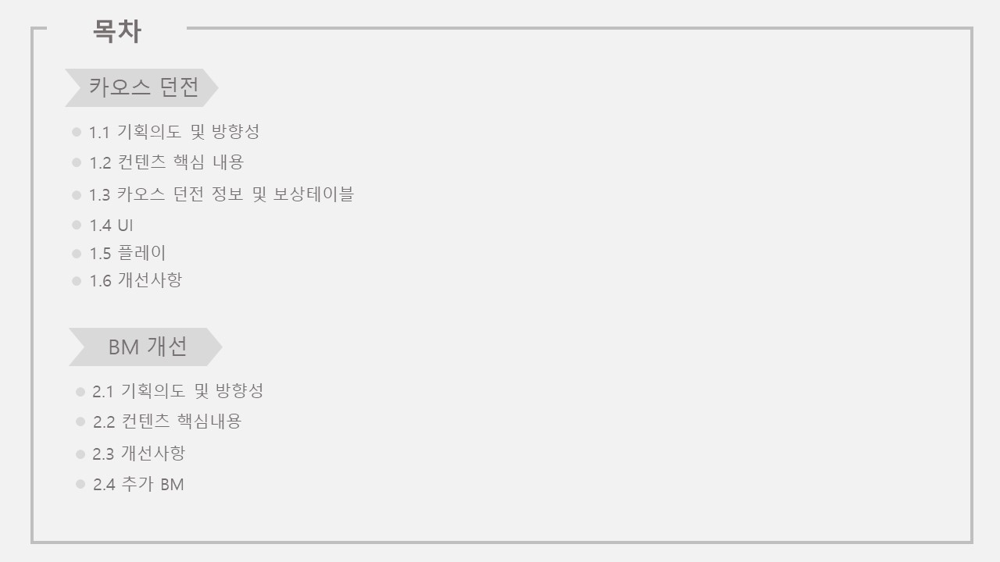
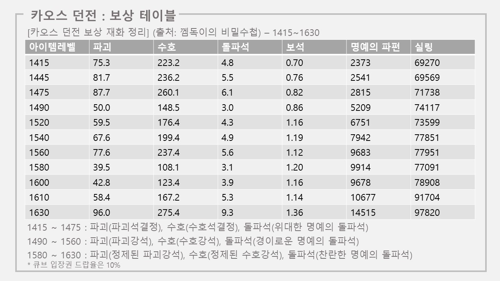
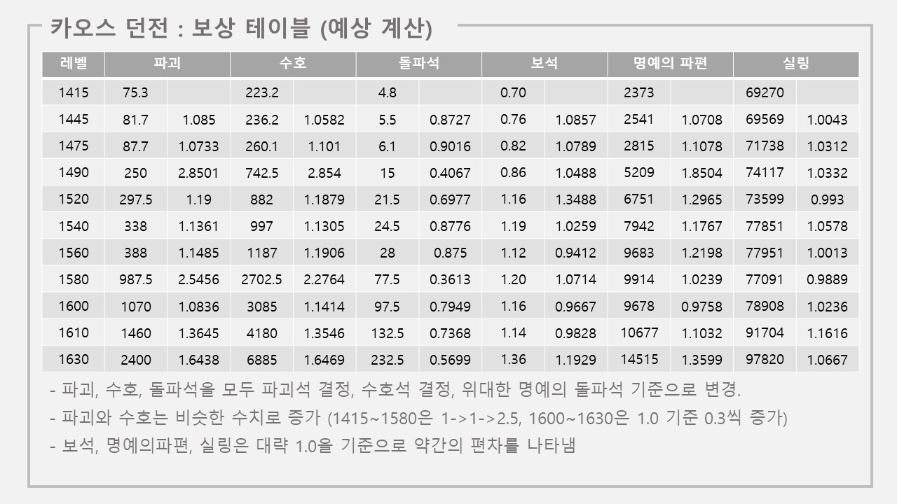
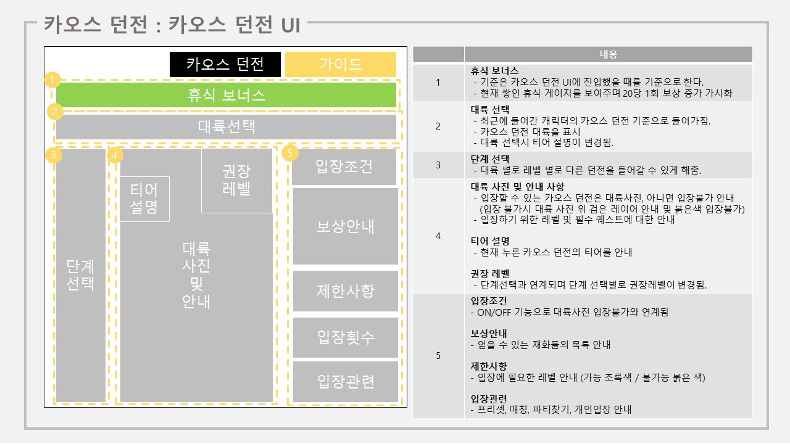
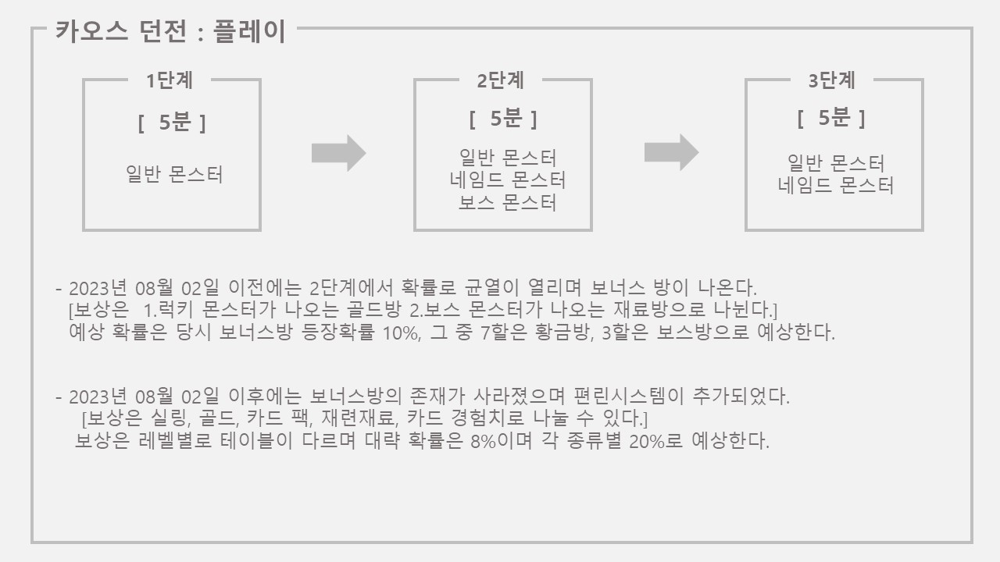
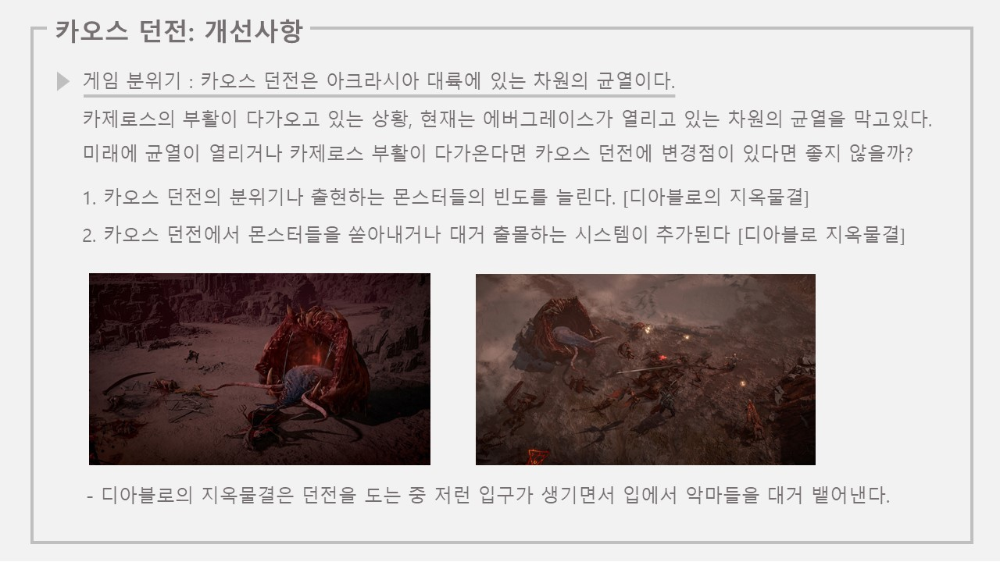
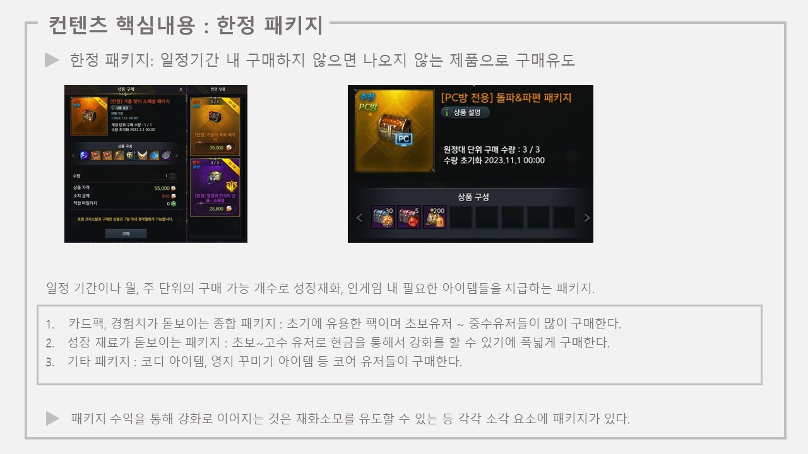
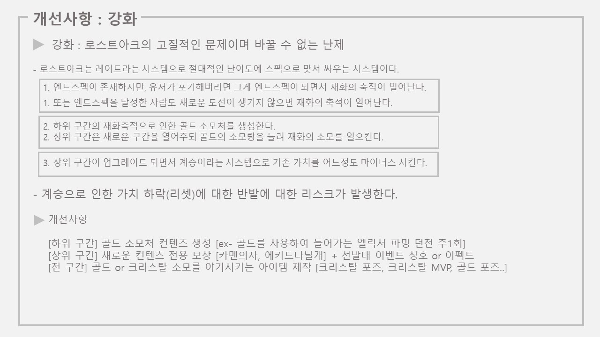
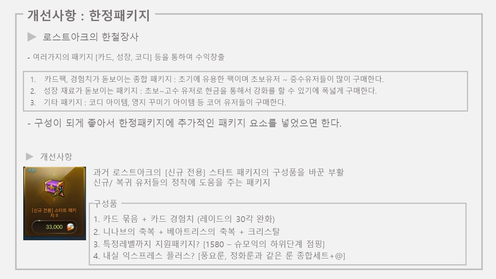

## 로스트아크의 카오스던전과 비즈니스 모델 역기획서 

로스트아크는 시즌2 발탄부터 시작하여 재미있게 즐기는 게임으로서, 나중에 로스트아크의 개발자? 기획?이 되었으면 좋겠다는 생각으로 

로아생각 시리즈를 만들어보고자 한다! 

그냥 로스트아크를 하면서 느끼는 점이라던가, 로스트아크를 하면서 이건 좀 바뀌었으면 하는 점이라던가

아니면 스마일게이트도 유저도 윈윈하는 것에는 무엇이 있을까?

사진과 더불어서 부가설명을 더하는 형식으로 시작하려고 한다!

로스트아크의 카오스 던전 그리고 BM(business model)이라는 사업아이디어를 설명하고 그거를 개선하거나 추가할만한 방향을 설명하고자 한다.

추가로 07월 02일로 넣으면 오류가 나서 07월 1일로 넣었다.

## 목차

목차는 크게 카오스던전과 BM에 대해서 넣었다.

카오스 던전으로는 카오스 던전의 기획의도와 방향성, 핵심내용, 정보 및 보상테이블, UI, 카오스 던전의 플레이와 그에 대한 개선사항

BM으로는 기획의도 및 방향성(?), 핵신매용, 개선사항, 추가적으로 나올 사업아이디어다.

## 기획의도 및 방향성

**카오스 던전이란 무엇일까?**

로스트아크의 카오스 던전은 "세상을 혼돈으로 몰고가는 차원의 뒤틀림이다."

로스트아크의 세계관에 과거 신들의 전쟁으로 인한 상흔으로 아크라시아에 남겨진 균열로 그 균열에서 악마들이 나오기 때문에

이를 토벌해주는 것이 컨셉이다.

**카오스 던전의 기획방향성과 의도**

(1) 유저들의 보상을 평균화하기 위한 던전

(2) 그리고 또한 골드 방과 보스 방이 있었으나 삭제가 되며 편린 시스템이 추가되어 일확천금의 재미와 성장기회를 주었다.

**카오스 던전의 컨텐츠 내용**

(1) 보유하고 있는 캐릭터마다 카오스 던전에 들어가서 나오는 몬스터들을 잡으며 단계별로 진행하여 성장재료 아이템을 제공한다.

(2) 던전의 단계는 레벨이라는 개념으로 나누어진다.

(3) 기획방향성에 맞게 평균적인 보상을 얻을 수 있으며, 편린 시스템을 통한 추가적 성장요소를 제공한다.

## 카오스 던전의 지역별 정보

조금 허접할 수 있지만 각 대륙별로 레벨별로 던전이 나뉘어져있다.

원래는 다 넣으려고 했지만 표가 너무 난잡해져서 1~n 으로 짧게 정리하였으며 대륙이 추가될수록 X축은 늘어간다.

X축은 대륙 Y축은 던전의 단계다.

## 카오스 던전의 보상 테이블

카오스 던전의 공식적인 자료는 아니지만 대략적인 자료다.

이렇게 보면 주고있는 성장재화가 감이 잠 오지않는다. 

왜냐하면 1415~1475 /1490~1560 /1580~1630의 성장재화에 대한 재화의 가치가 다르기 때문에

이 표를 통해서는 레벨이 오를때 마다 성장테이블이 늘어난다. 

그리고 큐브 입장권의 드랍율은 대략 10%정도 라는 점이다.

## 카오스 던전의 보상 테이블 수치

보상 테이블을 수치화 시켜서 비교해보았다. 상위재료의 가치를 최하위 가치로 내려서 테이블을 계산했다.

1415의 파괴를 기준으로 보면 75.3라는 보상을 얻을 수 있으며 1445가 되면 81.7의 보상을 얻는다.

1415에서 1445가 되면 1.085정도의 비율로 올랐다는 것이다.

이를 통해서 알 수 있는 것은 보석, 명예의 파편, 실링은 변동이 크게 오지 않는다.

하지만 **파괴와 수호는 테이블이 확 커지는 구간**이 있으며 돌파석은 들쭉날쭉 한것 같다.

파괴와 수호를 들여다보면 **급격하게 오르는 구간은 1490과 1580**이다.

이는 계승을 해야되는 구간에서 테이블이 확 늘어났다는 것을 알 수 있다.

**성장 초반에 높은 성공률을 기반으로 빠른 강화 속도를 통해서 캐릭터를 쉽게 성장하여 재미를 붙히기 위한 것으로 보인다!**

## 카오스 던전 UI

카오스 던전의 UI는 대충 이런 모양이며 설명은 우측에 적어놨다!

UI부분은 설명을 넣어놨기 때문에 따로 설명하지 않겠다.

## 카오스 던전: 플레이

카오스 던전의 경우 플레이 형식은 1단계, 2단계, 3단계라는 시스템으로 진행된다.

카오스 던전은 동일하게 단계별로 5분이라는 타이머가 있으며 타이머가 지날 때 까지 다음 단계로 가지 못하면 실패된다.

만약 카오스 던전을 하다가 급한 일이 생기면 다음 단계로 진입한 후 아무것도 누르지 않는다면 타이머는 작동하지 않는다.

**카오스던전은 2023년 08월 02일 이전과 이후로 나뉘게 된다.**

(1) 2023년 08월 02일 이전의 카오스던전

​	-1) 2단계에서 몬스터를 잡으면 확률로 보너스 단계가 출몰하게 된다. 

​	-2) 보너스 단계는 2가지로 나뉜다. (1) 황금방 (2)보스방이며 황금방은 골드가 나오고 보스방은 재료가 나왔다.

​	-3) 당시 예상 확률은 보너스 방은 10% 7할은 황금방 3할은 보스방이라고 생각한다.

(2) 2023년 08월 02일 이후의 카오스 던전

​	-1) 기존의 보너스 방이 사라졌으며 일확천금이라는 편린시스템이 추가되었다.

​	-2) 편린시스템의 보상은 골드, 실링, 카드, 재련재료, 카드경험치로 나눌 수 있으며 레벨에 따라 최대 보상이 다르다.

​	-3) 편린의 등장확률은 약 8%정도로 보이며 각 보상의 테이블은 20%씩 분할 될것으로 추측된다.

생각보다 보너스방에서 황금방에서 나오는 골드량이 많았으나 그 흭득량이 적어 유저들이 체감이 되기 힘들었지만

편린을 통해서 1500골드 ~ 20만 골드까지 나오는 보상으로 통해 재미가 추가 되었으며 성장재료까지 나오게 된다.

편린으로 통해서 나오는 골드가 많지만 보너스방보다 편린의 확률이 낮다.

오차를 계산하여 편린을 10%라고 해놓고 그중 20%가 골드라고 치면

0.1에 20%를 곱하여 0.1*0.2 = 0.02가 되기 때문에 약 2%정도다.

8%기준으로 치면 1.6%가 된다.

기존 보너스방의 황금방인 10%에  70%황금방이면 약 7%인데

아마 기존에 나오던 보상의 파이 확률을 분산시켜 재미있게 만들었다고 생각한다.

## 카오스 던전: 개선사항

내가 생각하는 카오스 던전은 로스트아크를 하는 유저가 제일 많이 체감하는 컨텐츠라고 생각한다.

군단장과 같은 레이드는 캐릭터당 3회라서 1주일에 1캐릭터당 약 1시간 ~ 1시간 30분 정도의 시간을 거치하여 주 3회는 가끔이지만

카오스던전과 가디언토벌은 로스트아크 유저가 마주치는 **'일상'**이다.

사실 카오스 던전의 편의성은 증가되어 편해졌지만 그렇다고 해서 카오스 던전의 즐겁냐?는 조금 어렵다고 생각한다.

어떻게 꾸민들 솔직하게 매일 해야된다 라는 것은 우리가 아침에 알람을 아무리 좋아하는 노래를 설정해도 듣기 싫듯이

카오스 던전을 어떻게 꾸며도 만족스럽지 않을 수 있다.

하지만 알람도 매일 듣는 알람이 아닌 새로운 알람으로 들으면 그 날의 기분이 바뀌 듯 바뀌지 않을까?

여기서 생각해낸 것이 카오스 던전의 **이벤트화**다.

카오스 던전은 악마가 생성된다 -> 악마를 잡는다 -> 다음 단계로 간다. 라는 순서로 흘러가지만

최근 디아블로에는 지옥물결이라는 것으로 많은 수의 악마가 끊임없이 나오고 가끔 지옥문이 바닥에서 튀어나와

유저에게 긴장감을 주며 그 안에서 많은 양의 악마를 뱉어내는 컨셉이 나왔다.

로스트아크의 세계관은 카제로스 부활이 다가오며 에버그리스가 벌어지는 균열을 막고 있다.

미래에 균열이 열리거나 확장된다면 이러한 분위기 변환을 통해서 유저에게 단순하게 나마 새로운 바람을 한번 불어주는건 어떨까?

## 비즈니스 모델

로스트아크의 BM은 나에게 있어 신선했다.

블레이드앤소울, 아이온, 메이플, 던전앤파이터, 디아블로3, 씰온라인, 야채부락리 등등..을 했지만

이렇게 비즈니스 모델이 되는구나 라는 생각이 들었다.

내가 생각하기에 로스트아크의 비즈니스 모델은 5가지가 있다고 생각한다.

1. 강화/재련 2.골드거래 3.뽑기 4.아크패스 5.한정패키지다. 

밑에서 추가적으로 하나씩 설명을 해보고 개선사항을 적어본다.

## 비즈니스 모델 내용 : 강화

로스트아크는 비즈니스모델이 연결되어있는 곳이 있다. 

로스트아크의 심지이며 강화시스템이다.

강화를 통해서 실패를 하면 골드, 성장재료, 오레하 재료, 숨, 명예의 파편 , 실링 등 재화들이 한번에 소각시킬 수 있다.

이렇게 태워진 유저들은 재료를 사거나 캐쉬 아이템을 통하여 추가적으로 수급할 수 있고 이는 수익으로 이어진다.

재료를 사면 판매자 <-> 구매자 사이에 수수료라는 것이 빠져나가 소각이 되고 실패하면 추가적인 재료가 소각된다.

그리고 골드를 먹는 귀신인 엘릭서다.  아마도 현재 하위레이드에서 많은 생긴 골드를 삭제시키기 위함과

계승으로 인하여 가치하락이 계속 발생하던 상황에서 하나의 추가 강화가 생기면서 만족시켰다.

일단 나는 서포터를 주력으로 키워서 선각자 40을 2개 가지고 있는데 엘릭서의 거대한 진입장벽 '옵션'이다. 

골드를 많이 먹지만 그 과정이 불쾌한 감정이 얼마냐 드는가?에 대해서 조금 많이 불쾌했다.

일단 엘릭서가 있어도 옵션이 나오지 않으면 일단 엘릭서는 버려진다.

만약 내가 깍으려는 옵션이 운좋게 나왔지만 그 엘릭서가 제대로 깍이지 못하면 버리게 된다. 

아마도 대부분 5/2 ~ 5/3 급 엘릭서 밑은 분해되는 것 같다.

마치 5/5가 깍이면 좋지만 그 확률이 낮고 마치 불닭볶음면과 같은 매운맛이다.

그리고 엘릭서 다음으로 나온 카멘의 초월시스템이다.

초월로 인하여 유저는 확정적 강함을 얻을 수 있으며 솔직하게 초월이 좀 복잡하지만.. 초파고 님님 << 덕분에.. 쉬웠다.

그래도 초월은 초파고라는 API가 있어서 불쾌함이 덜했다.

왜냐면 아 초월이 안된 책임을 전가시킬 수 있었다. 

"아 초파고가 이걸", "아 기계도 안되는 걸 내가 운이 모자랐다"처럼 화살이 다른 곳으로 향했다.

엘릭서가 불닭볶음면이면 초월은 라면볶이 정도 일까?

여기는 대부분 **소각의 과정을 통해서 이윤을 창출**한다고 생각한다.

## 비즈니스모델 : 거래소

로스트아크의 합법적 연금술(?)이다.  마치? 배틀짱이라는 애니처럼 "현금을 골드로 바꾸는 힘!!"같은 거랄까..

화폐거래소를 한마디로 정리하자면 **"환전소"**다.

우리가 은행에 가서 100만원을 달러로 바꾸면 80%~90%로 비율로 환전해주며 그 사이 환전수수료를 은행이 가져가듯

로스트아크가 은행역할을 해주는 것이다.

하지만 조금 다른 점은 골드는 다시 현금으로 바꿀 수 없다는 것이다. 

애초에 이게 되면 도박겜...

현금을 충전하여 골드를 얻으려는 사람은 로열크리스탈이라는 현금과 1:1의 가치를 갖는 캐쉬재화로 바꾼다.

그러면 판매하고 싶은 수량을 입력하여 골드를 얻는다.

이때 반대편에는 골드로 크리스탈을 사려는 사람이 있다. 이 사람의 골드가 로열크리스탈의 사람에게 전해지며 크리스탈을 받는다. 

하지만 여기서 크리스탈은 게임내에서만 사용할 수 있는 화폐로 현금과는 교환이 불가능하다.

화폐거래소는 환전소처럼 변환을 통한 소각으로 얻는 이윤이다.

## 비즈니스모델 : 아바타

어떤 게임이든 있는 것..으로서 아바타 가챠다.

하지만 로스트아크의 경우 그저 룩이 아닌 게임에서 어느정도의 스펙업을 까지 들어가있다. (물론 서폿은...?)

시스템은

옷감을 항아리에 넣어서 거기서 뽑는다!라는 것으로

옷감 = 아바타를 분해해서 얻거나 패키지에서 옷감을 팔 때 살 수 있다.

항아리 = 크리스탈로 분해하거나 패키지에서 같이 들어있다.

가끔 옷감과 항아리의 개수가 맞지 않아서 아바타를 사서 분해한 적이 있다.

솔직히 전압을 하나도 못뽑았다는 **감정에 매몰되서 카드슬래쉬와 골드를 쓰는 것일지도..**

이것은 패키지를 통한 수익과 전압에 실패했을 때 얻은 이익, 그리고 나처럼 갑자기 감정에 매몰된 사람이

아바타를 구매해서 옷감을 구했을 때, 수수료와 시중에 아바타 매물 제거효과가 있다.

## 아크패스

로스트아크의 MZ 아크패스다.

스팀게임의 라이브 게임을 보면 대부분 시즌패스를 통해 구매자에게 확실한 보상을 주고 수익을 거둬간다.

이용자가 많을 수록 수익은 배가 되지만 로스트아크는..글쎄..?!

아크패스는 3가지가 있다.

1. 기본패스[무료] : 기본으로 지급되며 기본 보상을 주는 기본 아크패스
2. 프리미엄 아크패스 [19.600] : 성장재료를 추가적으로 지급해주는 아크패스
3. 슈퍼 프리미엄 아크패스 [49,200] : 아바타, 크리스탈, 코디 아이템을 추가적으로 지급하는 아크패스

=> 좋은 보상으로 확실한 수익을 얻는 시즌패스 개념이다. 

혜자라서 계속 결제했지만 성장동력이 사라졌을 때는 구매하지 않은 적이 한 번 있었다.

프리미엄 ... 슈퍼프리미엄.. 뭔가 좀 더 스토리에 관련된 아크패스 이름이면 재미있을 지도

아크라시아 패스, ... 아니다 점핑 패스권 같은 이름이네요

## 비즈니스 모델 : 한정 패키지

로스트아크의  지역축제와 같은 한철장사

일정 기간동안 판매하거나 월, 주 단위를 통해서 인게임 재화를 판매하는 패키지다.

대표적으로 3가지가 있다!

1. 카드 팩, 카드 경험치를 주는 종합 패키지 : 초기유저 ~ 중수 유저 이며 대부분 카드를 맞추지 못한 사람들이 구매한다.
2. 성장 재료가 돋보이는 패키지 : 초기유저 ~ 고수 유저까지 사며 캐릭터를 성장시키기 위해서 사는 패키지기에 폭넓게 구매한다.
3. 기타 패키지 : 코디, 아이템, 영지 꾸미기들 코어유저를 위한 패키지.

카드는 수익이 생기다가 아마 캐릭터들이 어느정도 안정화되면 안산다. 

실제로 세구 암구 남바 창달 + 시즌4 준비로 토바절 뇌바절 수바절 화바절 거의다 완료되었다.

## 개선사항: 강화

로스트아크의 강화는 로스트아크의 고질적인 문제이며 바꿀 수 없는 난제다!

여기서 강화는 좋은거 아닌가? 라고 생각하지만..

로스트아크라는 게임은 애초에 레이드라는 시스템 절대적 난이도에 스펙으로 맞서 싸우는 시스템이다.

강화라는 건 마치 마검에 가깝다는거다.

(1차적)

-1) 앤드스펙이 존재한다. 하지만 유저가 안올라갈래 ㅠ 하면 그게 그 유저의 엔드가 되면서 재화의 축적발생

-2) 앤드스펙을 달성하고 나서는 새로운 도전이 없으면 숙제화 되며 재화의 축적이 발생한다.

(2차적)

-1) 하위 구간의 재화축적으로 인한 골드 소모처의 생성 : 사실 어렵다

-2) 상위 구간은 새로운 구간을 열어주되 골드의 소모량을 늘려 재화의 소모를 일으킨다 : 엘릭서와 초월의 느낌이 아닐까

(3차적)

유저들이 어느정도 상위구간으로 올라오거나 전체적인 레벨이 올라가면 메인 시스템인 강화를 시작해야된다.

그러면 초월, 엘릭서 같은 나생문을 만들거나 계승을 통해서 가치를 떨어뜨려 다시 한번 강화를 하는 리스크를 져야한다는 것이다.

사실 시즌이 바뀔 때 마다 리스크를 강행한다는 것은.. 엄청난 무서움이 아닐까

이것에 대한 개선사항으로는 3가지가 있다.

[하위구간]

- 하위구간은 골드소모처의 생성이 제일 부작용이 적을 것 같다. [ex- 엘릭서를 파밍하는 입장료 골드인 던전]

[상위구간]

- 상위구간은 새로운 컨텐츠 전용보상 강화이다. [ex- 선발대 이벤트 칭호, 이벤트, 아바타: 대표적으로 던파의 안개신이벤트]

[전구간]

- 골드와 크리스탈의 소모를 야기시키는 아이템을 제작한다. [크리스탈로 구매하는 포즈, 크리스탈로 구매하는 mvp, 골드로 구매하는 포즈]

## 개선사항 : 화폐거래소

화폐거래소는 솔직히 많이 생각나지 않지만... 화폐거래소는 결국 현금을 골드로 충전하는 사람과 골드로 크리스탈을 구매하는 사람이 있어야 돌아간다.

크리스탈의 소모처를 증가시키면 골드의 크리스탈화, 현금의 크리스탈화를 노릴 수 있으며 크리스탈 수요가 늘어나면 현금의 가치가 높아지니

둘다 증가하지 않을까한다.

사실 화폐거래소의 문제는 너무 어렵다.

나도 뉴비일때 화폐거래소가 너무 헷갈리게 해놔서 이걸 어떻게 쓰는지도 감이 안잡혀서

파란크리스탈을 구매해서 골드로 안바뀌길래 로열크리스탈이라는 것으로 해야된다는 것을 알고 좌절해서 2중 충전을 한적이 있다.

조금 더 쉽게 꾸밀 수 있으면 좋을 것 같다... 은행 환전 어플 처럼 간단하게

즉. 크리스탈 소모처 증가 와 화폐거래소의 UI 변화다.

## 개선사항 : 아크패스

사실 솔로잉이 나오면서 크게 메리트가 있을까? 라는 생각이 들지만 조금 유의미 하지 않을까 한다.

로스트아크의 시즌패스는 대체적으로 혜자다. 무료만 받아도 이득이고 질러도 이득이다.

하지만 로스트아크의 아크패스 아바타가 "아 좀 별로네.."하면 솔직히 손이 안간다.

실제로 내가 버서커를 키웠을 떄 프리미엄까지만 ...;; 슈샤 코디가..주르륵

아크패스의 구매층이 좀 더 있을 수 있도록 변화시키면 어떨 까 싶다.

예로는 던전앤파이터의 시즌패스인 아라드 패스다.

아라드패스는 패스에 캐릭터를 지정하여 성장을 지원하며, 자신이 보유한 캐릭터 중 하나에 기간제 지원상자를 준다.

여기서 로스트아크에 접목시켜본다면..

아크패스를 통해서 지정캐릭터를 추가하여 매일 접속하는 것으로 귀속 재화를 소소하게 준다.

아크패스를 캐릭터를 지정하여 기간제 보석[아크패스 결제일 ~ 아크패스 끝날 때 까지]을 준다.

아크패스의 혜자성을 높히는 것 이지만 후자인 기간제 보석을 통해서 솔로잉 컨텐츠를 어렵게 하는 사람들도 있을 것이다.

아마 레이드 구간별로 코인 드랍이 다를 것으로 예측되는데 기간제 보석을 통해서 원정대캐릭터가 부족한 사람들이

일시적으로 나마 부캐릭터에 도움이 되지 않을 까 싶다. [ex- T3 7멸홍 기간제 보석 지원]

## 개선사항 : 한정패키지

로스크아크의 한철장사 한정패키지다.

사실 한정패키지에는 딱히 생각이 떠오르지 않지만 신규유저와 복귀유저의 상시패키지로 무언가 있었으면 한다.

과거 1만골이 들어있던 신규전용 스타트 패키지 처럼..

구성품으로

1. 카드묶음 + 카드경험치 (레이드 30각 빠른 도달)
2. 니나브의 축복 + 베아트리스의 축복 (영지와 캐릭터 레벨 + 비프로스트를 통한 빠른 성장)
3. 특정레벨까지 지원패키지 (슈모익보다 아래점핑을 통해 캐릭터 육성 다양화 및 재미부여)  
4. 내실 익스프레스 플러스 (익스프레스의 룬 의외에 추가적으로 필보룬 + 정화룬 + 풍요룬과 같은 껴주는 것으로 레이드 빠른 합류)

정도로 생각할 수 있을 것 같다.

스타터 패키지를 통한 추가수입과 뉴비들이 정착하는 데 도움을 준다면 좋지 않을까..?

설마 작업장들이 저거 다 사지는..

## 추가사항 : 비즈니스 모델

로스트아크에 없는 추가적인 비즈니스 모델을 생각해봤다.

첫 번째, 캐릭터 정보의 코디 기능 추가다.

로스트아크 유저는 솔직하게..! 캐릭터 정보창을 많이 본다. 레이드 받을 때도 돋보기 -> 보석 -> 카드 장비레벨 -> 특성 스윽

이 부분에 대해서 코디할 수 있는 기능이 있다면 좋지 않을까?

남들에게 자주 보이는 부분이라서 코디할 사람도 있을 것이며 크리스탈 배경이나 골드 배경과 같은 것을 도입하면 구매할 사람도 있을 것이다.

또한 아크패스에 접목시켜서 아크패스 전용 배경이면 슈퍼프리미엄 아크패스의 비중도 늘어나지 않을까 한다.

두 번째, 비즈니스 모델일지 모르겠지만 피시방 이벤트 혜택의 변경이다.

PPT가 작아서 잘 들어가지 않았지만,  현재 로스트아크의 피시방 혜택은... "흠 그정돈가?"라고 생각한다.

로스트아크의 기본 피시방 혜택

만찬증정, 선박스킨대여, 스퀘어홀 무료, 경험치120%증가, 비프로스트 +@이며 이벤트때는 추가적으로 보상을 준다.

하지만 PC방 이벤트가 없을 때 굳이 PC방에 가서 해야될까 싶기는 하다.. 

대부분 코디보상으로 코디가 떙기지 않으면 ..

아무튼! 피시방 점유율은 내가 생각하기에 어느정도 유의미한 지표라고 생각한다.

물론 실 유저수와 피시방 유저수는 다르다. 하지만 보여지는 지표인 것 만큼

보통 RPG에서 아 이제 RPG할거없는데 하면 랭킹에서 스윽 보면서 RPG를 시작하는 경향의 사람도 있다는 것이다.

실제로 던전앤파이터는 PC방 혜택을 유저의 매일하는 부분에 있어서 강화했다.

던전앤파이터의 스펙업 부분에 대해서 더 돌 수 있는 기회와 천장 게이지 2배 상승 등이다.

이렇듯 로스트아크의 유저는 레이드가 다 끝나도 카오스 던전과 가디언은 하려고 들어간다.

어떻게 보면 로스트아크가 제일 많이 마주하는 것은 카오스 던전과 가디언이다.

이 부분에 대해서 강화를 해주면 PC방 점유율이 올라가지 않을까 한다.

특정 시간이상 PC방에 있으면 카오스 던전 휴식게이지 물약을 주거나, 카오스 던전을 더 돌 수 있거나

가디언의 영혼이 한 개가 더 떨어진다는 등의 메리트가 있으면 좋지 않을까 싶다.

근데 PC방일때 가디언의 영혼이 한개 더 떨어진다.. 구현이 어려울 수 도 있으려나..

유저의 일상적인 부분을 강화시켜주면 점유율이 올라가서 RPG을 하고자하는 사람들이 어느정도 유입되지 않을까 생각한다.

이상 로스트아크 생각 1편 : 역기획서편이었다!

