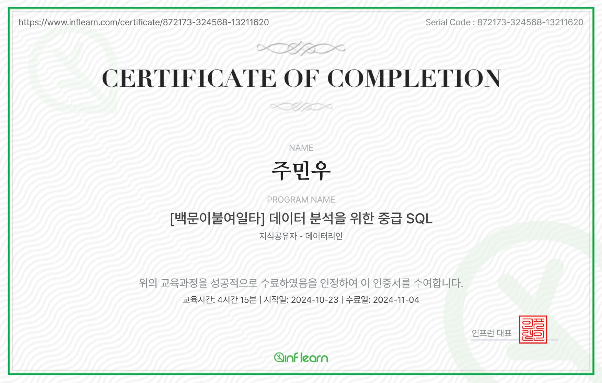

## 수료



중급 수강을 하였는데 대부분 학교에서 들었던 내용을 실습하고 개념을 복습하는 기분이라 좋았다.

근데 마지막 문제는 조금 어려웠을지도?


## 간단내용

SQL중급반은 기존의 기초반과 같이 SQL이론을 설명 후 코딩 테스트를 통한 실습을 진행한다.


중급반은 추가적으로 리트코드 사이트를 추가적으로 진행할 것이고

해커랭크에서 부족한 부분을 리트코드 사이트로 보완한다.


목표는 프로그래머스 고득점 kit에 있는 SQL 문제들을 쉽게  풀 수 있도록 한다.

플러스 문제 풀이 팁이나 SQL작성 요령들을 공유해주시는 듯하다.


일단 섹션을 통해서

COUNT - 요약통계

GROUP BY - 그룹화 

HAVING - 조건추가

이후 문제풀이

그리고 SQL조건문인 case .. if의 사용이다.


일단 현업에서 테이블을 한개 만 쓰는 경우는 거의 없기 떄문에

이번에는 두 가지 이상의 테이블을 쓸 것이고

JOIN을 통해서 테이블과 테이블을 묶어줄 것이다.

이 부분에서 리트코드를 사용한다. 해커랭크는 JOIN문제가 적다.


추가적으로 UNION을 통한 데이터 붙히기와 고급반 안내다.


일단 강의를 리마인드 하기 좋게 Cheat Sheet를 이용하자.

Pandas 계열이 Cheet Sheet가 잘 나온다고 한다.


## 집계함수

집계함수는 통계량을 뽑는것으로 요약통계를 보여로서

데이터를 요약하는 숫자들이다.


이러한 SQL에도 집계함수가 있는데


#### COUNT 개수체크

```sql
SELECT COUNT(*)
FROM Table
-- 레코드 개수 (excel과 같음)
```

여기서 Count(Price)를 했을 떄 값이 77개가 나왔다.

그 이유는 내가 실험했던 사이트에서 NULL값이 없었기 떄문에 같았다.


Null값이 존재하면 제외하고 카운터를 해주고 (*)은 널 포함을 의미한다.

중복 제거는 `DISTINCT column`을 써준다.


#### SUM 합계

Excel와 비슷하고 SUM은 간단하다.

COUNT자리에 SUM이 들어가고 그 안에 컬럼이 들어가는 것이다.

```sql
SELECT SUM(column, column)
FROM Table
-- 레코드 개수 (excel과 같음)
```

이렇게 말이다.


#### AVG 평균값

AVG도 그냥 엑셀과 똑같은데 NULL값에 주의해야된다는 점이 있다.

(*)값이 있고 (column)일때 NULL에 따라서 값이 다르기 때문이다


예를 들어보면

`SELECT AVG(Visits) FROM Sample:`이 있다고 해보면 

샘플테이블에 있는 자료중 방문자의 평균을 알고있다는 것인데


방문자가 1+2+3+5/4 라고 했을때 

위와같은 경우는 NULL값을 제외하는 (column)형 이기 떄문에

Vistis컬럼이 1,2,3,5,Null의 5가지 값이 있다고 한다면

1+2+3+5+NULL / 5가 되는 것이 아닌 NULL값을 제외한

1+2+3+5/4 = 11/4 = 2.75가 된다는 것이다.


만약 NULL까지 카운트 하고 싶다면?

`SUM(column)/Count(*)`이다.


IF)만약 위에 예시를 모두 출력한다면?

```sql
SELECT COUNT(A), SUM(B), AVG(C), ...
		,MIN(A), MAX(B) ..
```

이렇게 SELECT절에 넣어주면 된다.


## 그룹과 조건

기존에 우리는 테이블 전체를 요약했는데

```sql
SELECT SUM(Price)
FROM Products
```

이런 구문이 있다고 하지만 현업에서는 이렇게 쓰지 않는다고함.


총 얼마를 팔았는가?에 대한 문제보다는 이 매출이 어떠한 기준으로 근거를 삼아서 보기떄문이다.

ex) 지역, 나이, 성별, ...


```sql
SELECT column, column2
FROM table
GROUP BY  column
```

이 예문을 보면 GROUP BY에 있는 column은 SELECT절에 세트로 들어가야있어야함.

왜냐면 묶어놨는데 출력을 안할리는 없으니까.


만약 가독성을 높히고 싶다면?

```sql
SELECT column
       ,column2
       ,column3
FROM table
GROUP BY  column
```

이렇게 사용해서 컬럼의 내용을 위 아래로만 훑어서 볼 수 있게 하기.

ms-sql은 GROUP BY 1,2도 가능하다고 함.

이것은 SELECT절의 첫번째와 두번쨰를 해라라는 의미.

하지만 가독성이 구려지기 때문에 지양함.


추가,

they're lazy = 숫자는 게으르다.

it's not self-documenting = GROUP BY를 보고도 어떤 것을 기준으로 했는지 알아야하는데 불가능

it's brittle = 서비스나 비즈니스에서 활용할 때 마다 끊임없이 수정을 해줘야함. 

만약 column값이 계속 바뀌면? 숫자는 애매해지기 때문에 숫자가 아닌

'명확하게'제시 해주자.


오름차순과 내림찬순은 GROUP BY뒤 ORDER BY를 사용한다.

기본형은 ASC인 오름차순이고 내림차순은 DESC로 한다.


IF)만약 AVG가격이 100불 이상인 경우를 보고싶다고 하면?

```sql
WHERE AVG(price) >= 100 --?
GROUP BY  column
```

=이렇게 하면 불가능하다.

왜냐면 SQL은 C처럼 절차지형언어 느낌이기 떄문에

가져온 다음에 GROUP을 하는 것으로 컴퓨터는 느낀다.


```sql
--WHERE AVG(price) >= 100 --?
GROUP BY  column
HAVING AVG(price) >= 100
```

이렇게 하면 가능하게 된다. 왜냐면 그룹화를 진행 후 조건을 걸었기 때문이다.


여기서 만약 출력할때 컬럼명을 바꾸고 싶다면 별명인 AS를 쓰자.

```sql
SELECT AVG(price) AS avg_price
...
HAVING avg_price >= 100
```

이러면 출력될떄 avg_price밑에 어쩌구가 뜬다.

약간 별명를 붙혀서 포인터 느낌으로 써주는 느낌..?


## 집계함수 문제풀이

```sql
-- 문제: Revising Aggregatuons - Averages
SELECT AVG(population)
FROM city --table
WHERE district = "California"
```

SELECT에 집계함수 출력할 것.

WHERE은 조건절 / FROM에는 그냥 테이블

을 이용해서 그대로 넣어줌.


```sql
-- Revising Aggregatuons - The sum Function
SELECT SUM(population)
FROM city
WHERE district = "California"
```

위의 문제와 조건은 같은데

집계함수만 바꾸면 되는 문제라서 패스.


```sql
-- Average Population

```


