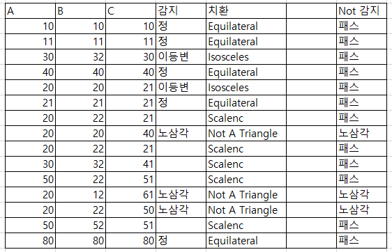
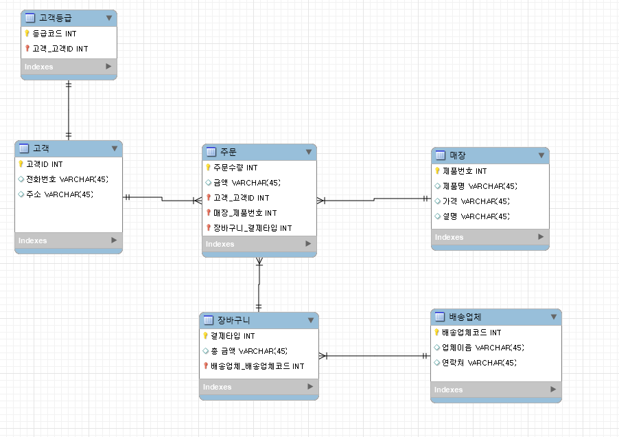
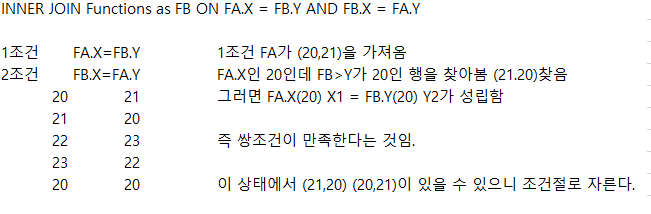

## 수료


중급 수강을 하였는데 대부분 학교에서 들었던 내용을 실습하고 개념을 복습하는 기분이라 좋았다.

근데 마지막 문제는 조금 어려웠을지도?


## 간단내용

SQL중급반은 기존의 기초반과 같이 SQL이론을 설명 후 코딩 테스트를 통한 실습을 진행한다.


중급반은 추가적으로 리트코드 사이트를 추가적으로 진행할 것이고

해커랭크에서 부족한 부분을 리트코드 사이트로 보완한다.


목표는 프로그래머스 고득점 kit에 있는 SQL 문제들을 쉽게  풀 수 있도록 한다.

플러스 문제 풀이 팁이나 SQL작성 요령들을 공유해주시는 듯하다.


일단 섹션을 통해서

COUNT - 요약통계

GROUP BY - 그룹화 

HAVING - 조건추가

이후 문제풀이

그리고 SQL조건문인 case .. if의 사용이다.


일단 현업에서 테이블을 한개 만 쓰는 경우는 거의 없기 떄문에

이번에는 두 가지 이상의 테이블을 쓸 것이고

JOIN을 통해서 테이블과 테이블을 묶어줄 것이다.

이 부분에서 리트코드를 사용한다. 해커랭크는 JOIN문제가 적다.


추가적으로 UNION을 통한 데이터 붙히기와 고급반 안내다.


일단 강의를 리마인드 하기 좋게 Cheat Sheet를 이용하자.

Pandas 계열이 Cheet Sheet가 잘 나온다고 한다.


## 집계함수

집계함수는 통계량을 뽑는것으로 요약통계를 보여로서

데이터를 요약하는 숫자들이다.


이러한 SQL에도 집계함수가 있는데


#### COUNT 개수체크

```sql
SELECT COUNT(*)
FROM Table
-- 레코드 개수 (excel과 같음)
```

여기서 Count(Price)를 했을 떄 값이 77개가 나왔다.

그 이유는 내가 실험했던 사이트에서 NULL값이 없었기 떄문에 같았다.


Null값이 존재하면 제외하고 카운터를 해주고 (*)은 널 포함을 의미한다.

중복 제거는 `DISTINCT column`을 써준다.


#### SUM 합계

Excel와 비슷하고 SUM은 간단하다.

COUNT자리에 SUM이 들어가고 그 안에 컬럼이 들어가는 것이다.

```sql
SELECT SUM(column, column)
FROM Table
-- 레코드 개수 (excel과 같음)
```

이렇게 말이다.


#### AVG 평균값

AVG도 그냥 엑셀과 똑같은데 NULL값에 주의해야된다는 점이 있다.

(*)값이 있고 (column)일때 NULL에 따라서 값이 다르기 때문이다


예를 들어보면

`SELECT AVG(Visits) FROM Sample:`이 있다고 해보면 

샘플테이블에 있는 자료중 방문자의 평균을 알고있다는 것인데


방문자가 1+2+3+5/4 라고 했을때 

위와같은 경우는 NULL값을 제외하는 (column)형 이기 떄문에

Vistis컬럼이 1,2,3,5,Null의 5가지 값이 있다고 한다면

1+2+3+5+NULL / 5가 되는 것이 아닌 NULL값을 제외한

1+2+3+5/4 = 11/4 = 2.75가 된다는 것이다.


만약 NULL까지 카운트 하고 싶다면?

`SUM(column)/Count(*)`이다.


IF)만약 위에 예시를 모두 출력한다면?

```sql
SELECT COUNT(A), SUM(B), AVG(C), ...
		,MIN(A), MAX(B) ..
```

이렇게 SELECT절에 넣어주면 된다.


## 그룹과 조건

기존에 우리는 테이블 전체를 요약했는데

```sql
SELECT SUM(Price)
FROM Products
```

이런 구문이 있다고 하지만 현업에서는 이렇게 쓰지 않는다고함.


총 얼마를 팔았는가?에 대한 문제보다는 이 매출이 어떠한 기준으로 근거를 삼아서 보기떄문이다.

ex) 지역, 나이, 성별, ...


```sql
SELECT column, column2
FROM table
GROUP BY  column
```

이 예문을 보면 GROUP BY에 있는 column은 SELECT절에 세트로 들어가야있어야함.

왜냐면 묶어놨는데 출력을 안할리는 없으니까.


만약 가독성을 높히고 싶다면?

```sql
SELECT column
       ,column2
       ,column3
FROM table
GROUP BY  column
```

이렇게 사용해서 컬럼의 내용을 위 아래로만 훑어서 볼 수 있게 하기.

ms-sql은 GROUP BY 1,2도 가능하다고 함.

이것은 SELECT절의 첫번째와 두번쨰를 해라라는 의미.

하지만 가독성이 구려지기 때문에 지양함.


추가,

they're lazy = 숫자는 게으르다.

it's not self-documenting = GROUP BY를 보고도 어떤 것을 기준으로 했는지 알아야하는데 불가능

it's brittle = 서비스나 비즈니스에서 활용할 때 마다 끊임없이 수정을 해줘야함. 

만약 column값이 계속 바뀌면? 숫자는 애매해지기 때문에 숫자가 아닌

'명확하게'제시 해주자.


오름차순과 내림찬순은 GROUP BY뒤 ORDER BY를 사용한다.

기본형은 ASC인 오름차순이고 내림차순은 DESC로 한다.


IF)만약 AVG가격이 100불 이상인 경우를 보고싶다고 하면?

```sql
WHERE AVG(price) >= 100 --?
GROUP BY  column
```

=이렇게 하면 불가능하다.

왜냐면 SQL은 C처럼 절차지형언어 느낌이기 떄문에

가져온 다음에 GROUP을 하는 것으로 컴퓨터는 느낀다.


```sql
--WHERE AVG(price) >= 100 --?
GROUP BY  column
HAVING AVG(price) >= 100
```

이렇게 하면 가능하게 된다. 왜냐면 그룹화를 진행 후 조건을 걸었기 때문이다.


여기서 만약 출력할때 컬럼명을 바꾸고 싶다면 별명인 AS를 쓰자.

```sql
SELECT AVG(price) AS avg_price
...
HAVING avg_price >= 100
```

이러면 출력될떄 avg_price밑에 어쩌구가 뜬다.

약간 별명를 붙혀서 포인터 느낌으로 써주는 느낌..?


## 집계함수 문제풀이

```sql
-- 문제: Revising Aggregatuons - Averages
SELECT AVG(population)
FROM city --table
WHERE district = "California"
```

SELECT에 집계함수 출력할 것.

WHERE은 조건절 / FROM에는 그냥 테이블

을 이용해서 그대로 넣어줌.


```sql
-- Revising Aggregatuons - The sum Function
SELECT SUM(population)
FROM city
WHERE district = "California"
```

이거는 위의 문제랑 비슷한데 그냥 집계함수만

변경하면되는 문제다.


```sql
-- Average Population
SELECT FLOOR(AVG(population))
FROM city
```

이거는 SELECT AVG부분에 내림을 하는 것으로

FLOOR을 해준다.

소수점이 몇이든 무조건 적으로 내림인듯? Excel이랑 사용이 비슷.


```sql
-- Population Density Difference
SELECT MAX(population)-MIN(population)
FROM city
```

이거는 문제를 보면 그냥 MAX에서 MIX을 빼달라는 내용이다.


```sql
-- Weather Observation station 4
SELECT COUNT(city) - COUNT(DISTINCT city)
FROM station
```

중복을 제거한 City를 전체 City에서 뺴줘.

즉 중복된 City이름을 알려달라는거다.

COUNT(DISTINCT *)이다.


### GROUP BY 

```sql
-- Top Earners
조건을 살펴보자.

(1)총수입을 월수입으로 계산한다. 그것은 salary x months
이고 총수입은 Employee table에 있음.

총수입 + 최대수입직원을 구하고싶어.

조건은 공백으로 구분 되어 진 2개의 정수.
ㅁ ㅁ 이렇게 인듯.
```

```sql
SELECT salary * months AS earnings
FROM Employee
GROUP BY earnings
ORDER BY earnings DESC 
LIMIT 1
```

이렇게 문제를 풀었는데 여기서 옆의 직원의 수를 어떻게 뽑아서 쓸지 감이 잘 안왔음.


```sql
SELECT salary * months AS earnings
        , count(*)
FROM Employee
GROUP BY earnings
ORDER BY earnings DESC 
LIMIT 1
```

추가적으로 count(*)을 통해서 low출력시킨 듯.

그리고 별명을 지정한다. 이름 다 쓰기 귀찮으니까.

그룹화시킨 후 차순정리를 위해서 OREDER BY..

그리고 최고 출력이니까 리밋


## 조건문

Excel의 if처럼 if then의 중첩이다.

`case when 조건 AND then 참반환` 이다.

```sql
SELECT case 
	when categoryid = 1 then '음료' 
-- 조건의 True 1
    when categoryid = 2 then '조미료' 
-- 조건의 True 2
    ELSE '기타'
    END
FROM Products
```

이렇게 조건 + ELSE의 불만족시 걸어주고 END를 통해서 컴퓨터에게 조건문이 끝남을 암시하는 듯하다.

추가로 별명을 하려면 AS하고 나머지 출력은 ELSE에 ,*을 한다.


```sql
SELECT case 
	when categoryid = 1  AND when supplierid = 1  then "음료"
    when categoryid = 2 then "조미료"
    ELSE "기타" 
    END as "name" -- ,*
FROM Products
```

여기서 *을 쓰면 오류가 나는거 봐서는 아마

데이터의 불일치 가능성 때문에 출력이 안되나..?봄.


추가적으로 위에서 그룹화를 진행한다면?

```sql
SELECT CASE
        WHEN categoryid = 1 THEN '음료'
        WHEN categoryid = 2 THEN '소스'
       ELSE '이외'
       END AS new_category, avg(price)
FROM Products
GROUP BY new_category
```

SELECT에 GROUP BY절을 넣어주지만 여기서는 AS를 통해서 별명을 지정했으니

별명을 넣어준다. 

이를 통해서 가시성과 편리성을 업그레이드 하는 듯하다.


### CASE문 해커랭크 문제풀이

```sql
-- Type of Triangle
-조건 체크
(1) 삼각형의 표가 있는데 3개의 변의 길이를 사용해서 레코드 유형을 식별하는 쿼리를 작성하기.
(2) 등삼각형, 정사각형, 삼각형이 아님, 다 다른 삼각형?
(3)4가지 케이스설명

-1) 이등변삼각형 : 20 20 23 A=B
-2) 등변 : 20 20 20 A=B=C
-3)스칼렌 : 20,21,22 A=!B=!=!C
-4)삼각x: 13,14,30 A+B<C
```

```
Sample Input에서 찾아보자!

일단 코드 조회해서 내부 쿼리를 확인해봤음.
조건문 삽입이니까 CASE 수식의 사용
WHEN 조건 THEN '출력물'
```

```sql
SELECT CASE 
WHEN A=B OR B=C OR C=A  THEN 'Isosceles' 
WHEN A=B AND B=C THEN 'Equilateral' 
WHEN A+B <= C OR A+C <= B OR B+C <= A THEN 'Not A Triangle'
        ELSE 'Scalene'
        END
FROM Triangles
```

이렇게 하니까 오류가 난다. why? 

결과 값을 확인하니까 상단에 있는 것이 우선조건이 되는 형식인듯 하다.

조건문을 할때는 큰개념부터 시작해서 작은개념으로 좁혀가는 것이 중요할듯 하다.

```sql
SELECT CASE 
            WHEN A=B AND B=C THEN 'Equilateral' 
            WHEN A+B <= C OR A+C <= B OR B+C <= A THEN 'Not A Triangle'
            WHEN A=B OR B=C OR C=A  THEN 'Isosceles' 
        ELSE 'Scalene'
        END
FROM Triangles
```

조건이 가장 좁은거 부터 큰거로 뻗어가는 형식으로 바꿔본다.


검증이 잘 안될거 같으니 Excel을 통해서 한번 검증을 해보자.



내용물과 출력된 값에 대한 분류를 적어둔 다음에

`=IF(E6="정","Equilateral",IF(E6="이등변","Isosceles",IF(E6="노삼각","Not A Triangle","Scalenc")))`

을 통해서 치환시켜준다. 값을 어떤 삼각형인지.


그리고 Not a Triangle의 확인용으로

`=IF(B6+C6<=D6,"노삼각",IF(C6+D6<=B6,"노삼각",IF(D6+B6<=C6,"노삼각","패스")))`

을 걸어주고 2차 체크를 하면 이상없음을 알 수 있다.


### Case를 이용한 테이블 피봇 (난이도 상)

기존에는 ID따로 avg(price)의 따로의 형식으로 진행되었으나

각 카테고리별로 avg값을 출력하는 방식으로 바꿔볼 것이다.

ㄴ Excel의 피벗테이블과 유사한 기능인것 같다.

```sql
SELECT CASE
		WHEN categoryid = 1 THEN price 
        ELSE NULL 
        END as category1_price
FROM Products
```

이렇게 했을 때 평균값으로 변경하고 싶다면?


```sql
SELECT AVG(CASE WHEN categoryid = 1 THEN price ELSE NULL END) as category1_price
FROM Products
```

AVG를 END까지 감아주면된다. 

하나의 조건문에 대한 AVG를 감아주는 거라고 생각하면 된다.


만약 추가적으로 카테고리별로 한다면 SELECT 부분에 id=2.. id=3..를 추가해서 준다.

```sql
,AVG(CASE WHEN categoryid = 2 THEN price ELSE NULL END) as category2_price
```

이렇게 세로로 늘려서 가독성을 늘리고 편하게 보게 해준다.


여기서 ELSE NULL 이 있는데 이러면  NULL값이 결과 값에 들어가게 된다.

NULL은 공백의 값이다 0이 아님..


### CASE를 활용한 테이블 피봇  리트코드 문제풀이

여기서 강의에서 이야기가 있는데 좋은것 같다.

Q: 어려운 것은 어떻게 공부해야되는가?

A: 어려운 것은 어렵게 공부하는 수밖에 없다.


요즘 말하면 MBTI 너 T야? 이런거 같지만 어렵게 배워야하는건 어렵게 배워야하는게 맞다..!


즉, 일단 풀어보고 해보라는 것이다. 

마치 공부할 때처럼 답안지를 보고 푸는 것이 아니라, 직접 풀어보고 답안지를 보는 것은

하늘과 땅 차이 인것 처럼 말이다.


```sql
-- Reformat Department Table
문제체크
매월 부서ID 수익 컬럼을 출력하도록 한다.,
결과 테이블은 순서대로 반환하되, 결과형식은 예제를 따른다.

단, apr4월 Dec12월까지의 수익은 무효가 되고
결과표에는 13개 열이 있게 된다.
(부서 ID 1개 + 12개) = 13개

이를 통해서 체크되는건.
1. Department의 모든 정보 탐색 id,revenue,month순서
2. 이 Revenue가 월별 수익에 해당하는 Colum인듯?
3. 결과 값을 보면 각 월 별로 출력하되 빈값은 null로 한다.
4. id는 쌩으로 나머지는 CASE문으로
```

```sql
SELECT 
    id,
    CASE
        WHEN month='Jan' THEN Revenue ELSE NULL END as 'Jan_Revenue',
        WHEN month='Feb' THEN Revenue ELSE NULL END as 'Feb_Revenue',
        WHEN month='Mar' THEN Revenue ELSE NULL END as 'Mar_Revenue',
        WHEN month='Apr' THEN Revenue ELSE NULL END as 'Apr_Revenue',
        WHEN month='May' THEN Revenue ELSE NULL END as 'May_Revenue',
        WHEN month='Jun' THEN Revenue ELSE NULL END as 'Jun_Revenue',
        WHEN month='Jul' THEN Revenue ELSE NULL END as 'Jul_Revenue',
        WHEN month='Aug' THEN Revenue ELSE NULL END as 'Aug_Revenue',
        WHEN month='Sep' THEN Revenue ELSE NULL END as 'Sep_Revenue',
        WHEN month='Oct' THEN Revenue ELSE NULL END as 'Oct_Revenue',
        WHEN month='Nov' THEN Revenue ELSE NULL END as 'Nov_Revenue',
        WHEN month='Dec' THEN Revenue ELSE NULL END as 'Dec_Revenue',           
FROM Department
```

맞는 것 같은데 구동이 안된다. 

앞에는 ID로 묶어주고 뒤에는 이름을 변경한 상태에서 각 월의 수익을 보고 싶은것 아닌가?


[문제풀이후]

```
Table를 가로로 펼쳐줘라
기존에 우리가 Categoryid then Price문과 비슷하게 사용

여기서 부서별로 나눠야되니까 GROUP BY를 넣어줘야했다.
예산을 보여줘야되니까 집계함수인 SUM을 사용해야했다.

Month를 기준으로 옆으로 쭈욱 펼쳐주는 과정으로서
SELECT id뿐 아닌 id를 그룹화 시켜야된다.

하지만 피벗팅의 경우 ms-sql보다는 orcle이 더 좋다고 한다.
```

```
나의 문제점)
1. 맨 처음에 "jan_Revenue"하면 나왔으나, 맨 앞에 id를 1 2 3 을 넣어줘야되거 부서별로 해줘야되니까 
그룹화 ID별로 해줘야되기 때문에 GROUP BY + SELECT id추가
2. 부서별 예산이기 때문에 그냥 출력이 아닌 SUM출력

- 문제 해석 이해 부족, 그룹화 미스
```

```sql
 SELECT id
        ,SUM( CASE WHEN month='Jan' THEN Revenue ELSE NULL END )as 'Jan_Revenue'
        ,SUM( CASE WHEN month='Feb' THEN Revenue ELSE NULL END )as 'Feb_Revenue'
        ,SUM( CASE WHEN month='Mar' THEN Revenue ELSE NULL END )as 'Mar_Revenue'
        ,SUM( CASE WHEN month='Apr' THEN Revenue ELSE NULL END )as 'Apr_Revenue'
        ,SUM( CASE WHEN month='May' THEN Revenue ELSE NULL END )as 'May_Revenue'
        ,SUM( CASE WHEN month='Jun' THEN Revenue ELSE NULL END )as 'Jun_Revenue'
        ,SUM( CASE WHEN month='Jul' THEN Revenue ELSE NULL END )as 'Jul_Revenue'
        ,SUM( CASE WHEN month='Aug' THEN Revenue ELSE NULL END )as 'Aug_Revenue'
        ,SUM( CASE WHEN month='Sep' THEN Revenue ELSE NULL END )as 'Sep_Revenue'
        ,SUM( CASE WHEN month='Oct' THEN Revenue ELSE NULL END )as 'Oct_Revenue'
        ,SUM( CASE WHEN month='Nov' THEN Revenue ELSE NULL END )as 'Nov_Revenue'
        ,SUM( CASE WHEN month='Dec' THEN Revenue ELSE NULL END )as 'Dec_Revenue'           
FROM Department
GROUP BY id
```

거의다 맞았는데 SUM으로 덮어주는 과정과 그룹화 과정이 빠졌다.

부서별 (그룹) + 수익최총(SUM) 기억하자.


여기서 입사를 하게 된다면 팀바팀이지만, 팀마다 스타일이 다르다.

1. 주석이 없어도 알 수 있게끔 코드를 짜는 것이 좋다.
2. 제작자 말고는 의도를 정확하게 파악할 수 없으니 주석을 쓰는 것이 좋다.

팀에 맞춰서 잘 적응하자.


추가로 한다면

> SUM을 사용하는 이유: 
>
> department테이블의 모든 행을 하나씩 확인하여
>
> 해당 행의 month값이 무엇인지에 따라 revenue 값 또는 NULL을 차례대로 반환한다


Department의 첫 번째 행 month가 Feb가 아니면,

output의 첫 번째 행은 NULL이 되는 것이다.


그런데 피벗테이블의 여러 개의 행(Null또는 다른 값)을

필요로 하는 게 아니라  id 당 하나의 행만 갖도록 만들고 싶기에


여러 값을 하나로 요약하려면 집계함수를 써야되니까 그 중 하나 SUM을 사용하는 것이다.

피봇테이블 전체가 아니라 집계된 자료를 봐야하기 때문에

집계함수를 넣는다.


여기서 집계된 자료는 예산의 총합을 나타낸다.


## JOIN 테이블의 연결

JOIN은 A테이블과 B테이블의 연결을 하는 것으로

보통 테이블을 하나만 가지고 하는 경우는 적을 것이다.

즉, 두 개 이상의 테이블을 PPAP 하는 것이다.


RDB = 관련성 있는 테이블을 나눠서 저장하는 시스템이다.

관계성에 초점을 맞춘 Relational Data Base..?


Data의 중복은 효율적이기 않기 때문에 제거하기 위한 방법으로서

쪼개서 관리하고 이 둘을 연결시켜서 중복을 제거하는 것이다.


즉 이렇게 하려면 연결과정이 필요하기 때문에 JOIN을 쓴다.


#### INNER JOIN

[고대의 유물 기법]

User에 Data가 있고 Orders에 Data가 있다고 하자.

FROM절에 Table에 복수를 적으면 모든 경우의 수를 출력하게 된다.

```sql
SELECT
FROM Users, Orders
WHERE User.Id = Orders.usersId
```


예시를 보면 WHERE 절을 통해서 연결시킬 것을 걸어준다.

FROM절에서 모든 경우의 수를 걸어주고 WHERE절에서 거름망을 해주는 형식이다.


[신식군대- 임오군란 st]

```sql
SELECT * FROM Users
INNER JOIN Orders ON Users.Id = Orders.userId
INNER JOIN A ON B 이다.
```

"Orders에 붙힐 건데 기준은 ON뒤에 있는 id들이 같을 때"

SQL Joins Visualizer 에 들어가면 볼 수 있음. (시각화)


INNER JOIN은 마치 교집합을 구하는 것과 같다.

그러기 때문에 A와 B 두 개가 존재해야지

교집합이 생성되기 때문에 양쪽의 정보가 필요하다.


 [예문]

주문ID가 있다고 하면 그 주문 ID에 관련된 것을 보고싶다면?

WHERE ID = Number하면 거기 있는 사람의 정보를 알 수 있음.


하지만 이렇게 하면 한명 한명 찾아보는데 비효율적이기에 조인을 쓰게 된다.

```sql
SELECT *
FROM Orders
     INNER JOIN Customers ON
     Orders.CustomerID = Customers.CustomerID
```

이렇게 하면 좌측은 Orders 테이블이고

뒤에는 Customers 테이블이 붙는 것을 확인가능하다.

좌측은 FROM에 우측은 INNER JOIN 뒤에다.


즉, FROM과 JOIN뒤는 Table

ON 뒤에는 Colum이 들어간다.


그러면 두번도 가능할까?

```sql
SELECT *
FROM Orders
     INNER JOIN Customers ON
     Orders.CustomerID = Customers.CustomerID
     INNER JOIN Shippers ON
     Orders.ShipperID = Shippers.ShipperID
```

가능하다.

Orders - Customers - Shippers 순서로 오른쪽으로 하나씩 붙힌다.


주의)

문제는 조인을 쓸 수 없는 Colum인지 알 수가 없는 상황 발생

만약) A는 A.Apple인데 B는 Apple라는 것으로 하면 조인하는 컬럼에 대해서 이름이 다르면...?

 

=> ERD라는 것을 통해서 테이블 간의 관계를 파악한다.

SQL의 도식화. 예전에 해본거.. 



옛날에 대학교에서 ERD관련해서 직접 설계해본 경험이 있는데

아마 이거로 연결되는 키와 관계를 통해서 아는 것 같다.


### OUTER JOIN

기존 INNER JOIN은 A∩B

OUTER JOIN은 약간 INNER JOIN 제외는 OUTER라고 생각하면 된다.


**LEFT JOIN (왼쪽을 기존으로 데이터 연결)**

- 왼쪽 table 데이터있고 오른쪽이 없는 경우

기존 INNER JOIN은 교집합이라서 

두개 다 부합해야만 나오는데 왼쪽의 데이터는 다 출력하고 교집합 붙히려면 LEFT.

왼쪽에 두고 싶은건 FROM절에 두면된다.

그리고 `LEFT JOIN 오른쪽 ON 조건 `을 한다.


만약 USER에 ID 1,2,3 ORDERS에 ID 1,2만 있다고하면

INNER면 1,2만 나오고

LEFT를 USER에 두고 연결하면 1,2,3출력이라는 것.

 

만약 추가적으로 조건을 달고싶으면

WHERE절에 조건을 추가적으로 한다.

 

만약 한번도 주문하지 않는 사람을 출력하고 싶다면?

`WHERE coulum IS NULL`로 하면

기준컬럼이 널로 출력되니까.

주문하지 않은 사람만됨.


**RIGHT JOIN**

은 그냥 오른쪽이 기준이 되는 것으로..

 

보통 LEFT JOIN을 씀

why? FROM절과 LEFT JOIN colum 위치를 바꾸면

결국 LEFT RIGHT가 되기 때문이다.

 

즉 조인을 왼쪽 오른쪽 섞어서 쓰면 헷갈리기 떄문에

대부분 LEFT JOIN을 사용한다.

 

아까 INNER 제외는 다 OUTER기 때문에

LEFT JOIN = LEFT OUTER JOIN과 같음.


### JOIN 문제풀이

```sql
-- African Cities
문제: 도시와 국가 테이블의 대륙이 아프리카인 것들의 출력한다.
+ City.Country와 Country.code가 주요열과 일치
즉 이 두개는 기준이 되는 컬럼이다.
```

```sql
-- 첫번쨰는 출력을 통해서 city와 country를 확인 후 조인실행했음. 쭈욱 나오고 조건절을 추가해야될듯?

SELECT *
FROM city
    INNER JOIN country ON city.countrycode = country.code
```

```sql
SELECT *
FROM city
    INNER JOIN country ON city.countrycode = country.code
WHERE country.continent = 'Afirca'
```

왜 안나오지..? 응답이 없다고 함. *이라고 너무 큰가

아 스펠링 틀림 'Africa' ㅋㅋ 항상 단어 오타에 주의하자..


```sql
SELECT city.name
FROM city
    INNER JOIN country ON city.countrycode = country.code
WHERE country.continent = 'Africa'
```

마지막으로 city.name을 잡아준다. 

연결 후 조건으로 Africa 출력은 City 이름이다.


```sql
-- Aisan Population
-문제: 기존문제와 같은듯? populations을 더하고 조건은 continent에서 asia조건을 달아줘야됨.
그리고 결합은 city.country 와 country.code임.
```

```sql
SELECT sum(city.population) --출력이름
FROM city
    INNER JOIN country ON city.countrycode = country.code
WHERE country.continent = 'Asia'
```

이거는 비슷한데 조금 다른거 정도인것 같다.


```sql
-- Average Population of Each Continent
-문제: 모든 대륙의 이름 출력인듯?(country.continent)
그것에 대해서 average city populations이고 내림 해줘라.

그리고 키는 city.countrycode 와 country.code다.
```

```sql
SELECT country.continent
       ,FLOOR(AVG(city.population))
FROM city
     INNER JOIN country ON city.countrycode = country.code
GROUP BY country.continent
```

거의 다 완성하긴 했는데 여기는

GROUP BY를 생각하지 못했고 WHERE로 해결하려고 했다.

위에 이름 출력이라고 걸어줬으니 그룹인것 같다.


### LEFT JOIN 리트코드 문제풀이

```sql
-- Customers Who Never Order
문제 : id는 PK이다. 각 row행은 ID와 이름
customer id는 외부키. 똑같이 row행 동일
즉 id끼리 연결됨.
아무것도 주문하지 않은 고객을 찾아야함.
```

```sql
SELECT Customers.name 
FROM Customers
    LEFT JOIN Orders ON Customers.id = Orders.customerid
WHERE Orders.id IS NULL
```

1차 시도를 했는데 정답은 출력됐는데 답이 틀렸다고 한다..

문제를 자세히 보니 출력을 Customers로 이름하고싶다고하니 as로 별명으로 바꾸면될듯..?


```sql
SELECT Customers.name as Customers
FROM Customers
    LEFT JOIN Orders ON Customers.id = Orders.customerid
WHERE Orders.id IS NULL
```

문제 없이 된다.


[문제풀이 강의후]

```sql
SELECT Customers.name AS Customers
FROM Customers AS c
    LEFT JOIN Orders AS o ON C.id = O.customerid
WHERE O.id IS NULL
```

AS를 통한 별명지정으로 앞으로 영어단어를 적게 쓰는 것으로 효율 좋은듯. 

근데 AS많이쓰면 메모리 영역에 문제는 없나? <- 질문으로 남겨봤다.


#### Self Join 리트코드 문제풀이

SELF JOIN은 내 테이블을 나한테 조인하는 상태

재귀같은 느낌인듯? 나 x 나 느낌?


```sql
-- Employees Earning More Than Their Managers
문제: Emplyee Table에는 모든 직원을 포함된다.
각 직원은 ID를 지니고 있으며 추가로 직원별로 담당 매니저는 Managerid가 부여되고 있음.

여기서 찾아야하는데. 매니저보다 Salary를 더 많이 버는 경우를 찾아야 됨.

아마 자기테이블 x 자기테이블 이니까
조인이 되는 기준은.. 매니저 ID로 구분해야되니까
매니저 ID로 합친다음에 조건 월급을 넣어줘야되는듯?
```

```sql
SELECT Employee.Name AS Employee
FROM employee 
      INNER JOIN employee as Manager ON Employee.managerid = Manager.id
WHERE Employee.Salary > Manager.Salary
```

잘 모르겠어서 강의를 봤음.

재귀조인같은 느낌인데 ON 부분을 어떻게 할지 감이 안왔다.

예상한게 맞는 듯 하다 ON을 ID끼리 묶어주고 조건절에 월급을 걸어주는 거다.

```sql
FROM employee 
      INNER JOIN employee as Manager ON Employee.managerid = Manager.id
```

여기서 왼쪽 테이블을 지정 후 오른쪽 테이블은 AS를 통해서 이름을 바꿔 헷갈리지 않도록 함.

```sql
WHERE Employee.Salary > Manager.Salary
```

이 구분을 통해서 매니저보다 월급 높은것을 소거시킬 수 있었음.


#### SELF JOIN 리트코드 2 +MS SQL 날짜데이터

```sql
-- Rising Temperature
-문제: 날씨테이블이 있고. 전날보다 온도가 올라간 날 출력한다.

그러면 재귀 조인이 될 것이고.
아마 전날이 되는 것과 오늘이 되는 날을 AS로 구분을 해줌.

그리고 어제를 기준으로 오늘을 연결하고
조인하는 키는 RecordDate를 기준으로 맞추는 것도?
RecordDate +1 은 = 오늘이 되니까?
근데 이거 +1해도되나..?

찾아보니까 DATE_ADD( 기준, INTERVAL 숫자 초/분/,,)
이라고 하니까 DAY로 하면될듯?

DATE_ADD(어제컬럼, INTERVAL 1 DAY?)
근데 빼는건 DATE_SUB군..


잘 모르겠으면 SELECT 구문에 AS를 부여해서 잘 보이게
그리고 조건절을 추가해본다.

어제보다 오늘이 Temperature가 더 큰 경우?
```

```sql
SELECT yesterday.id
FROM Weather AS yesterday
    INNER JOIN Weather AS today ON DATE_SUB(today.recorddate, INTERVAL 1 DAY) = yesterday.recorddate
WHERE yesterday.temperature > today.temperature
```

답이 자꾸 1,3이 나오거나 2만 나오게 된다. 왜지?

어제의 온도가 오늘보다 높은 경우 어제 id값을 반환하는게 아닌

오늘의 id값을 반환해야되지 않을까?


```sql
SELECT today.id
FROM Weather AS yesterday
    INNER JOIN Weather AS today ON DATE_SUB(today.recorddate, INTERVAL 1 DAY) = yesterday.recorddate
WHERE today.temperature > yesterday.temperature;
```

정답이다.


[문제풀이후]

```sql
SELECT today.id
FROM Weather AS today
    INNER JOIN Weather AS yesterday ON DATE_ADD(yesterday.recorddate, INTERVAL 1 DAY) = today.recorddate
WHERE today.temperature > yesterday.temperature
```

이거인데 결과적으로 같은데 접근법이 다른 듯하다.


문제풀이를 통해서 알게 되었는데 이 문제에서

날씨 테이블의 id로 접근하면 테스트 파일 데이터는 id별로 record가 올라가는 것이 아닌

내려가는 것으로 되어있어서 id를 기준으로 잡고 하는건 방지가 되어있다고 한다.


## UNION, UNION ALL

UNION 집합연산

-우리가 기존에는 JOIN을 통해서 옆으로 테이블을 붙히는 것 이었다. 기준을 잡고 추가로 왼쪽이나 오른쪽으로 붙힘.

 

이번에는 위로 아래로 데이터를 붙히는 작업이다.

옛날의 테이블까지 붙혀서 년도별로 보는 경우는

세로로 붙혀야 되기 때문이다.

ㄴ 이거는 중복값을 제거 한 경우를 보여줌

 

UNION ALL은 중복값이 있어도 출력된다.

ALL은 중복값의 유무다.

 

SELECT를 보면 우리는 중복을 제거 할때

DISTINCT를 쓰면 중복가 제거가 되고 아니면 다 보여주는데

SELECT는 ALL이 디폴트값이고

UNION은 DISTINCT가 디폴트값이라는거다.


>MS-SQL이 아닌 경우의 설명

```
-- MSSQL은 아니지만 UNION 쓰는법
-- 문제 : product 테이블에서 Price가 10이하 200이상인 상품들 출력
SELECT *
FROM Products
WHERE price <= 10
OR price >= 200
```

```
-- SQL
SELECT *
FROM Products
WHERE price <= 10

UNION

SELECT *
FROM Products
WHERE Price>=200
```

예약어를 2개 해주고 샌드위치 식으로 UNION을 껴줌.

 

뺴고 싶다면 EXCEPT

오라클이면 MINUS로 됨

위 아래에 교집합은 INTERSECT


**FULL JOIN**

A와 B의 원이 있을 때 가운데 INNER

왼쪽은 LEFT 오른쪽은 RIGHT

이지만 모두 다 보고 있으면 FULL OUTER JOIN

하지만 MS SQL은 안됨.

그래서 LEFT와 RIGHT 구현 후 UNION 묶기.

```
SELECT *
FROM Customers
      lEFT JOIN orders ON Customers.CustomerID = Orders.CustomerID

-- Customers 기준으로 조인을 함.
-- Orders는 데이터가 있으나 Customer가 없을 수 있음. [비회원같음] 주문은 있으나 고객은 없음
-- 이런 경우는 LEFT와 RIGHT를 섞어서 씀

UNION

SELECT *
FROM Customers
	RIGHT JOIN Orders ON Customers.CustomerID = Orders
    -- 주문은 있으나 고객은 없을 때 
```

LEFT + RIGHT를 PPAP 해주는거다.


## UNION 문제풀이 난이도 상

```sql
-- Symmetric Pairs
모든 지식을 다 써야 한다고 하셨음.
HAVING ORDER BY GROUP BY UNION INNERJOIN
Difficulty : Medium

일부여도 좋으니 경험을 쌓자.

문제: 
표가 주어지는데 이는 대칭쌍의 형태를 한다.
X1 = Y2 , X2 = Y1으로 쌍이라고 한다.

쿼리를 통해 대칭 쌍을 X값만큼 오름차순으로 출력한다.
이는 X1 <= Y1이다.

테이블은 Functions고 컬럼은 X,Y
```

```sql
SELECT FA.X, FA.Y
FROM Functions as FA
    INNER JOIN Functions as FB ON FA.X = FB.Y AND FB.X = FA.Y
WHERE FA.X < FA.Y 

UNION

SELECT FA.X, FA.Y
FROM Functions as FA 
WHERE FA.X = FA.Y
GROUP BY X,Y
HAVING count(*) > 1
ORDER BY X
```

정답이다.  조금 어렵지만 밑에 셀렉은 굳이 FA 지정을 안했어도 될 것 같다.


일단 풀이를 이야기하자면

위에는 INNER JOIN을 통해서 셀프조인을 시켜서 자기자신과 비교하게 함.

이 구문은 대칭쌍(X1=Y2 X2=Y1)에서 시작되는데

FA.X에서 (20)가져온 후 그 20 값을 만족하는 Y값을 FB에서 가져온다. 이는 Y2인 (20)이다.

그리고 그 반대의 경우도 가져온다. 그러면 쌍 조건을 만족하게 된다. (X1=Y2, Y1= X2)

그리고 WHERE조건절로 X가 큰 상황을 잘라낸다



대충 이런 느낌으로 보면 될 것같다. 

잘 몰라서 Excel로 하나 대입해서 봤다.


그러면 남은건 X=Y가 같은 경우인데.

출력은 같고 WHERE 절을 통해서 X와 Y가 같은 값을 찾는다.

그 것을 X,Y로 그룹화를 시켜서

(X,Y)의 조건이 동일 행이 1개 초과만 출력하는 것이다.

즉 (20,20) (20,20)이 여러개 존재할 수 있으니 Cut같은 개념이다.

(20,20) (21,21)은 WHERE에 부합한다.

GROUP BY를 해서 (20,20)쌍은 2번 나타나게 되고 (21,21)쌍은 1번이다.

HAVING Count(*)>1을 하면 (20,20)은 포함된다 2개이상(1개초과)니까.

하지만 (21,21)은 1개니까 제거된다.

즉 무결성의 보장이다


```sql
[문제풀이 후]
SELECT F1.X, F1.Y
FROM Functions as F1
    INNER JOIN Functions as F2 ON F1.X = F2.Y AND F1.Y = F2.X
WHERE f1.X < f2.Y 
ORDER BY X

UNION

SELECT X, Y
FROM Functions  
WHERE X = Y
GROUP BY X,Y
HAVING count(*) = 2
```

문제풀이는 이렇게 하고 ORDERBY가 달랐고

HAVING 부분이 조금 달랐다.


이 부분에 대해서는 다른 사람의 풀이 방법을 봐야할 것 같다.

아까보니까 UNION을 사용하지 않고 하는 방법도 있는 것 같다.


## 마지막으로

추가적으로 했으면 좋은 것은

프로그래머스(해커랭크랑 비슷함)

SQL 고득점 Kit를 풀어주기 중급반까지 들었다고 하면 어렵지 않게 풀 수 있을 것라고 하신다.


일단 SQLD를 준비하면서 짬짬히 다 풀어보자


자유자재로 풀수있다 정도까지 올라가보자!

추가적으로 하면 좋은 것은 Cheat Sheer이다.

종이 치트키 (약간 요약본)

 

SQL고급강의의 컬리큘럼은

SELECT를 기준으로 배웠고

 

INSERT, UPDATE, DELETE같은

DML이라고 해서 우리가 데이터를 넣고 업데이트하고 삭제하는 것까지.

약간 엔지니어 과정까지 해보는 느낌?


데이터분석가가 직접 쌓을일이 거의 없긴하지만

약간 엔지니어까지 겸해야되는 경우면

알고 하는거랑 모르고 하는거랑은 차이가 있기 떄문에.

Data Manipulation Lauage라고 배워야한다


그리고 ERD를 잘 읽어야한다!

이것이 몇백개가 펼쳐져 있고

그 안에서 필요한 데이터를 골라내려면 ERD를 잘 뽑아내야한다.

어떻게 하면 그려볼 수 있는지 체크한다.

(옜날에 학교에서 배운 ERD인듯)?

 

그리고 쿼리안에 쿼리를 한번 더 써서

서브쿼리를 하는것

추가로 쿼리로 복잡한 것을 추가로 하기 위한

윈도우함수라는 것을 다뤄보자.

 

추가적으로 해커랭크 리트코드의 고난이도의 문제들까지

챌린지 형식으로 시도 해보기!


## 후기

정말 좋은 강의였고 아마 SQLD를 시험을 보고 난 후 

프로그래머스 SQL kit를 풀고 고급반을 들을 것 같다.

아니면 마저 C언어 조금 더 파볼 수도..?